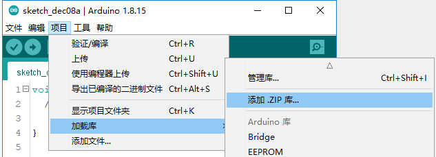
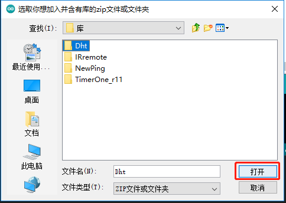
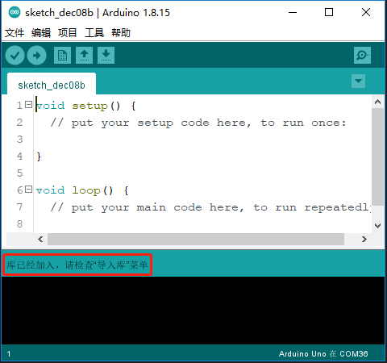
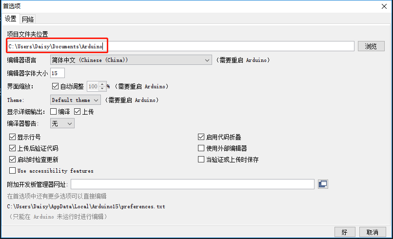
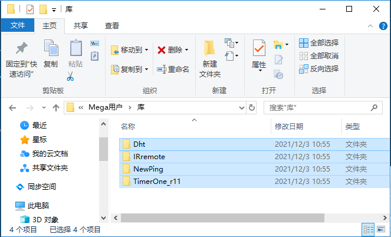
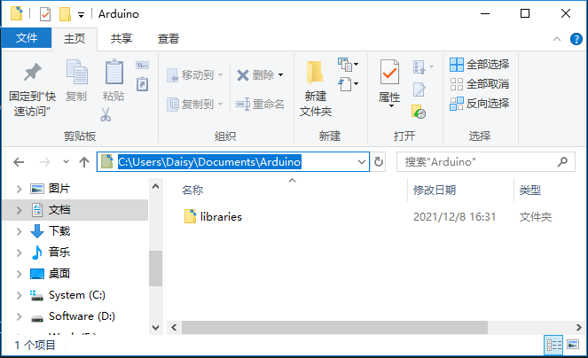
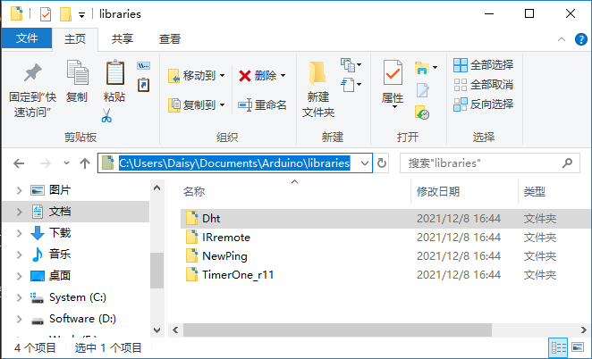
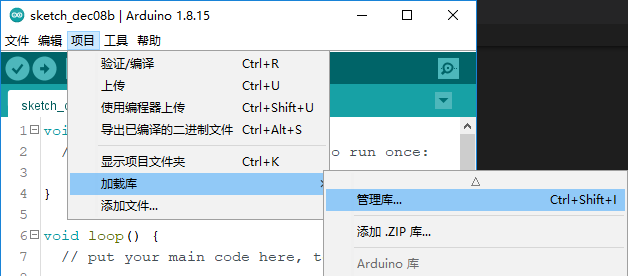
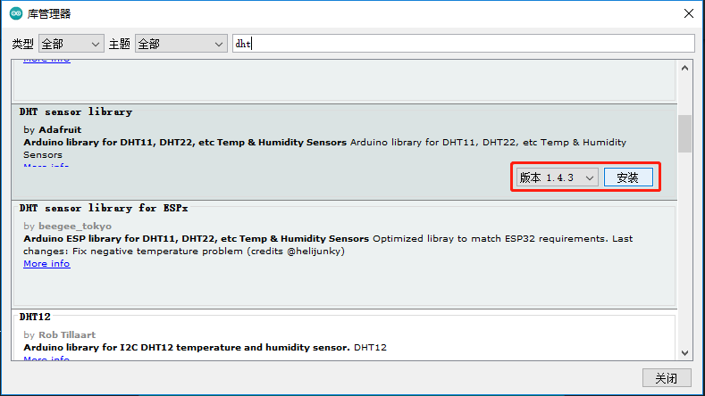

Add Libraries
=================

What is Library?
----------------------------

A library, gathering some function definitions and header files, usually
contains two files: .h (header file, including function statement, Macro
definition, constructor definition, etc.) and .cpp (execution file, with
function implementation, variable definition, and so on). When you need
to use a function in some library, you just need to add a header file
(e.g. #include <dht.h>), and then call that function. This can make your
code more concise. If you don't want to use the library, you can also
write that function definition directly. Though as a result, the code
will be long and inconvenient to read.

Add libraries
--------------------

Some libraries are already built in the Arduino IDE, when some others
may need to be added. So now let's see how to add one. There are 3
methods for that.

Method 1
^^^^^^^^^

Directly import the library in Arduino IDE (take Dht as an example
below). The advantage of this method is easy to understand and operate,
but on the other hand, only one library can be imported at a time. So it
is inconvenient when you need to add quite a lot of libraries.

**Step 1**: Select **Sketch** -> **Include Library** -> **Add ZIP
Library**.

**Step 2**: Find *SunFounder Mega Kit\Library*, Click **Open**.

**Step 3**: When you see “Library added to your libraries. Check
"Include library" menu”, it means you have added the library
successfully. Please use the same method to add other libraries then.

Method 2
^^^^^^^^^^^^^

Directly copy the library to libraries/Arduino path. This method can
copy all libraries and add them at a time, but the drawback is that it
is difficult to find libraries/Arduino.

**Step 1**: Click **File** -> **Preferences** and on the pop-up window
you can see the path of the libraries folder in the text box as shown
below.

**Step 2**: Copy all Libraries in the **Library** folder.

**Step 3**: Go to the path above and you will see there is a *libraries*
folder, click to open it.

**Step 4**: Paste all the libraries copied before to the folder. Then
you can see them in libraries folder.

Method 3
^^^^^^^^^^^

Using the Library Manager to install a new library into the Arduino IDE.

**Step1:** Click **Sketch** -> **Include Library** ->\ **Manage
Libraries**

**Step2:** Input a library name to search it, such as dht, you can
choose the latest version to install.

Once it has finished, you can close the library manager.