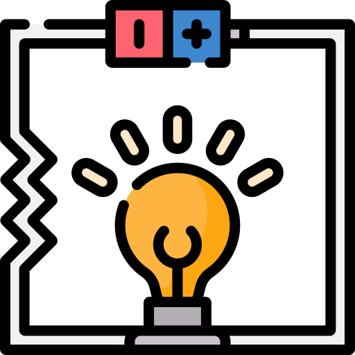
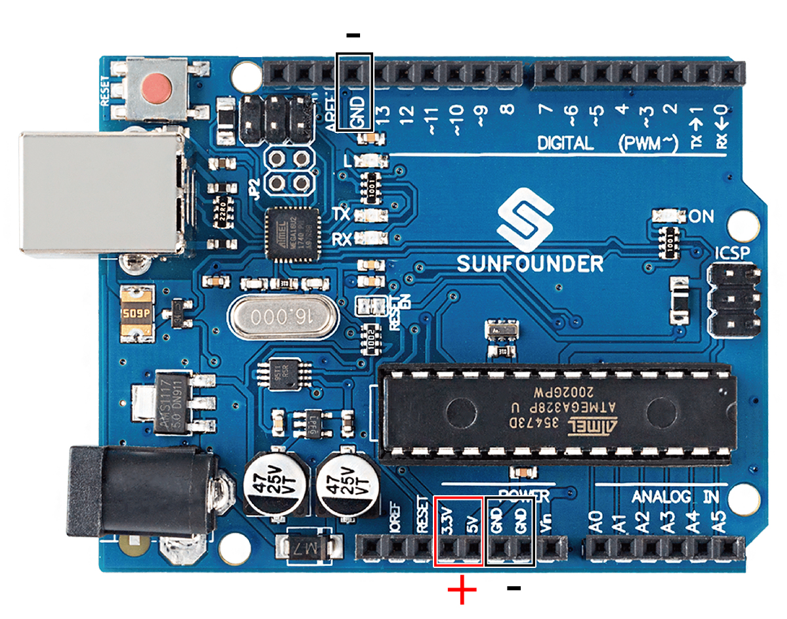
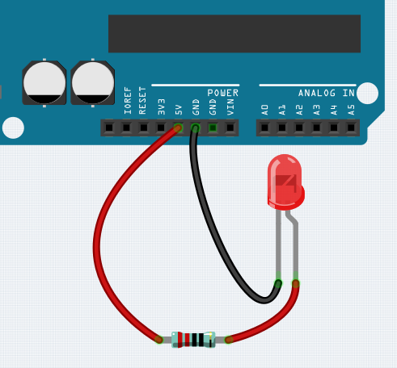
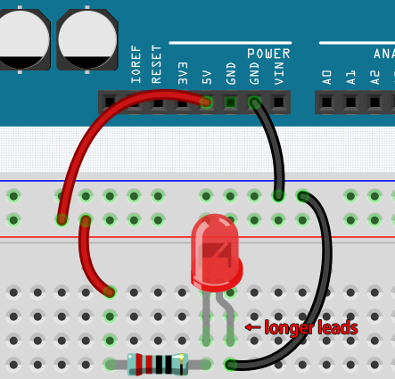
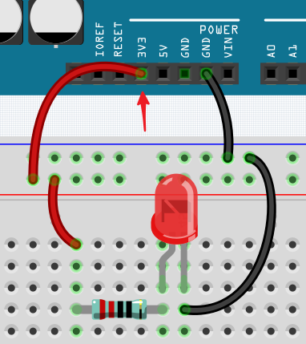

How to Build the Circuit
========================

Many of the things you use every day are powered by electricity, like the lights in your house and the computer you're reading.

To use electricity, you must build an electrical circuit. Basically, a circuit is a path through which electricity flows, or an electronic circuit, and is made up of electrical devices and components (appliances) that are connected in a certain way, such as resistors, capacitors, power supplies, and switches.

A circuit is a closed path in which electrons move to create an electric current. To flow current, there must be a conducting path between the positive terminal of the power supply and the negative terminal, which is called a closed circuit (if it is broken, it is called an open circuit.) .

The Arduino Board has some power output pins (positive) and some ground pins (negative).
You can use these pins as the positive and negative sides of the power supply by plugging the power source into the board.

With electricity, you can create works with light, sound, and motion.
You can light up an LED by connecting the long pin to the positive terminal and the short pin to the negative terminal.
The LED will break down very quickly if you do this, so you need to add a 220* resistor inside the circuit to protect it.

The circuit they form is shown below.

You may have questions this time: how do I build this circuit? Hold the wires by hand, or tape the pins and wires?

In this situation, solderless breadboards will be your strongest allies.

.. _bc_bb:

Hello, Breadboard!
------------------------------

A breadboard is a rectangular plastic plate with a bunch of small holes. 
These holes allow us to easily insert electronic components and build electronic circuits. 
Breadboards do not permanently fix electronic components, so we can easily repair a circuit and start over if something goes wrong.

.. note::
    There is no need for special tools to use breadboards. However, many electronic components are very small, and a pair of tweezers can help us to pick up small parts better.

On the Internet, we can find a lot of information about breadboards.

* `How to Use a Breadboard - Science Buddies <https://www.sciencebuddies.org/science-fair-projects/references/how-to-use-a-breadboard#pth-smd>`_

* `What is a BREADBOARD? - Makezine <https://cdn.makezine.com/uploads/2012/10/breadboardworkshop.pdf>`_

Here are some things you should know about breadboards.

#. Each half-row group (such as column A-E in row 1 or column F-J in row 3) is connected. Therefore, if an electrical signal flows in from A1, it can flow out from B1, C1, D1, E1, but not from F1 or A2.

#. In most cases, both sides of the breadboard are used as power buses, and the holes in each column (about 50 holes) are connected together. As a general rule, positive power supplies are connected to the holes near the red wire, and negative power supplies are connected to the holes near the blue wire.

#. In a circuit, current flows from the positive pole to the negative pole after passing through the load. In this case, a short circuit may occur.

**Let us follow the direction of the current to build the circuit!**

1. In this circuit, we use the 5V pin of the board to power the LED. Use a male-to-male (M2M) jumper wire to connect it to the red power bus.
#. To protect the LED, the current must pass through a 220 ohm resistor. Connect one end (either end) of the resistor to the red power bus, and the other end to the free row of the breadboard.

    .. note::
        The color ring of the 220 ohm resistor is red, red, black, black and brown.

#. If you pick up the LED, you will see that one of its leads is longer than the other. Connect the longer lead to the same row as the resistor, and the shorter lead to the other row.

    .. note::
        The longer lead is the anode, which represents the positive side of the circuit; the shorter lead is the cathode, which represents the negative side. 

        The anode needs to be connected to the GPIO pin through a resistor; the cathode needs to be connected to the GND pin.

#. Using a male-to-male (M2M) jumper wire, connect the LED short pin to the breadboard's negative power bus.
#. Connect the GND pin of board to the negative power bus using a jumper.

Beware of short circuits
------------------------------
Short circuits can occur when two components that shouldn't be connected are "accidentally" connected. 
This kit includes resistors, transistors, capacitors, LEDs, etc. that have long metal pins that can bump into each other and cause a short. Some circuits are simply prevented from functioning properly when a short occurs. Occasionally, a short circuit can damage components permanently, especially between the power supply and the ground bus, causing the circuit to get very hot, melting the plastic on the breadboard and even burning the components!

Therefore, always make sure that the pins of all the electronics on the breadboard are not touching each other.

Direction of the circuit
-------------------------------
There is an orientation to circuits, and the orientation plays a significant role in certain electronic components. There are some devices with polarity, which means they must be connected correctly based on their positive and negative poles. Circuits built with the wrong orientation will not function properly.

If you reverse the LED in this simple circuit that we built earlier, you will find that it no longer works.

In contrast, some devices have no direction, such as the resistors in this circuit, so you can try inverting them without affecting the LEDs' normal operation.

Most components and modules with labels such as "+", "-", "GND", "VCC" or have pins of different lengths must be connected to the circuit in a specific way.

Protection of the circuit
-------------------------------------

Current is the rate at which electrons flow past a point in a complete electrical circuit. At its most basic, current = flow. An ampere (AM-pir), or amp, is the international unit used for measuring current. It expresses the quantity of electrons (sometimes called "electrical charge") flowing past a point in a circuit over a given time.

The driving force (voltage) behind the flow of current is called voltage and is measured in volts (V).

Resistance (R) is the property of the material that restricts the flow of current, and it is measured in ohms (Ω).

According to Ohm's law (as long as the temperature remains constant), current, voltage, and resistance are proportional.
A circuit's current is proportional to its voltage and inversely proportional to its resistance. 

Therefore, current (I) = voltage (V) / resistance (R).

* `Ohm's law - Wikipedia <https://en.wikipedia.org/wiki/Ohm%27s_law>`_

About Ohm's law we can do a simple experiment.

By changing the wire connecting 5V to 3.3V , the LED gets dimmer.
If you change the resistor from 220ohm to 1000ohm (color ring: brown, black, black, brown and brown), you will notice that the LED becomes dimmer than before. The larger the resistor, the dimmer the LED.

.. note::
    For an introduction to resistors and how to calculate resistance values, see :ref:`cpn_resistor`.

Most packaged modules only require access to the proper voltage (usually 3.3V or 5V), such as ultrasonic module.

However, in your self-built circuits, you need to be aware of the supply voltage and resistor usage for electrical devices.

As an example, LEDs usually consume 20mA of current, and their voltage drop is about 1.8V. According to Ohm's law, if we use 5V power supply, we need to connect a minimum of 160ohm ((5-1.8)/20mA) resistor in order not to burn out the LED.

Control circuit with Arduino
--------------------------------

Now that we have a basic understanding of Arduino programming and electronic circuits, it's time to face the most critical question: How to control circuits with Arduino.

Simply put, the way Arduino controls a circuit is by changing the level of the pins on the board. For example, when controlling an on-board LED, it is writing a high or low level signal to pin 13.

Now let's try to code the Arduino board to control the blinking LED on the breadboard. Build the circuit so that the LED is connected to pin 9.

.. image:: img/wiring_led.png
    :width: 400
    :align: center

Next, upload this sketch to the Arduino development board.

.. code-block:: C

    int ledPin = 9;
    int delayTime = 500;

    void setup() {
        pinMode(ledPin,OUTPUT); 
    }

    void loop() {
        digitalWrite(ledPin,HIGH); 
        delay(delayTime); 
        digitalWrite(ledPin,LOW); 
        delay(delayTime);
    }

This sketch is very similar to the one we used to control the blinking of the on-board LED, the difference is that the value of ``ledPin`` has been changed to 9.
This is because we are trying to control the level of pin 9 this time.

Now you can see the LED on the breadboard blinking.
