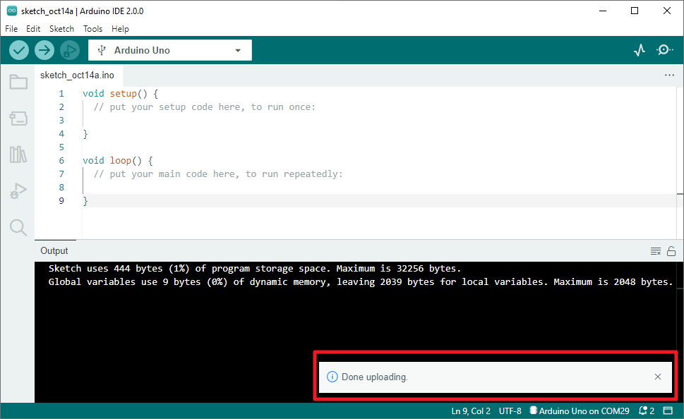

How to upload Sketch to the Board?
=============================================

In this section, you will learn how to upload the sketch created previously to the Arduino board, as well as learn about some considerations.

**1. Choose Board and port**

Arduino development boards usually come with a USB cable. You can use it to connect the board to your computer.

Select the correct **Board** and **Port** in the Arduino IDE. Normally, Arduino boards are recognized automatically by the computer and assigned a port, so you can select it here.

    .. image:: img/board_port.png

If your board is already plugged in, but not recognized, check if the **INSTALLED** logo appears in the **Arduino AVR Boards** section of the **Boards Manager**, if not, please scroll down a bit and click on **INSTALL**.

    .. image:: img/upload1.png

Reopening the Arduino IDE and re-plugging the Arduino board will fix most of the problems. You can also click **Tools** -> **Board** or **Port** to select them.

**2. Verify the Sketch**

After clicking the Verify button, the sketch will be compiled to see if there are any errors.

    .. image:: img/sp221014_174532.png

You can use it to find mistakes if you delete some characters or type a few letters by mistake. From the message bar, you can see where and what type of errors occurred. 

    .. image:: img/sp221014_175307.png

If there are no errors, you will see a message like the one below.

    .. image:: img/sp221014_175512.png

**3. Upload sketch**

After completing the above steps, click the **Upload** button to upload this sketch to the board.

    .. image:: img/sp221014_175614.png

If successful, you will be able to see the following prompt.

At the same time, the on-board LED blink.

.. image:: img/1_led.jpg

The Arduino board will automatically run the sketch after power is applied after the sketch is uploaded. The running program can be overwritten by uploading a new sketch.

