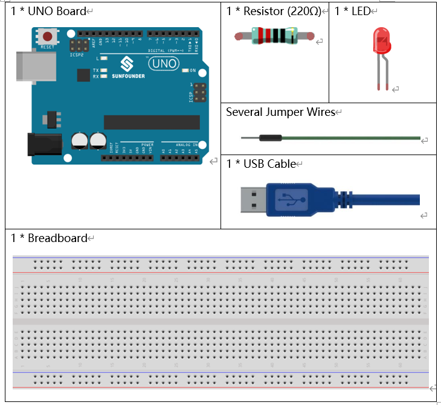
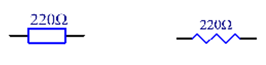
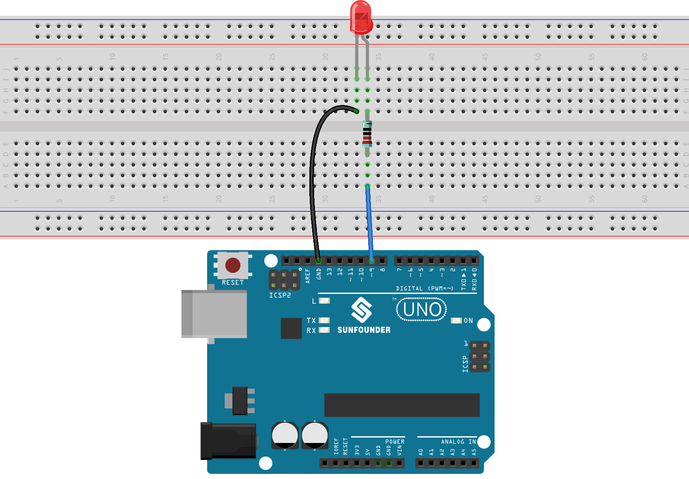
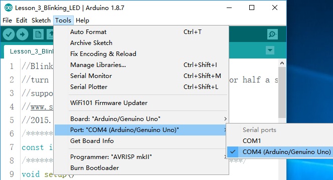
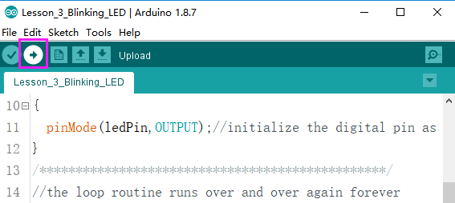

Blinking LED Uno
==============================

Introduction
--------------------

You should've learnt how to install Arduino IDE and add libraries
before. Now you can start with a simple experiment to learn the basic
operation and code in the IDE.

Components
--------------------

Components Introduction
---------------------------

Breadboard
^^^^^^^^^^^^^^^^^^

A breadboard is a construction base for prototyping of electronics. It
is used to build and test circuits quickly before finalizing any circuit
design. And it has many holes into which components like ICs and
resistors as well as jumper wires mentioned above can be inserted. The
breadboard allows you to easily plug in and remove components.

This is the internal structure of a full+ breadboard. Although there are
holes on the breadboard, internally some of them are connected with
metal strips.

.. image:: media_uno/image40.jpeg
   :alt: breadboard_MPJA_type
   :width: 8.64792in
   :height: 3.00486in

Resistor
^^^^^^^^^^^^

Resistor is an electronic element that can limit the branch current. A
fixed resistor is one whose resistance cannot be changed, when that of a
potentiometer or variable resistor can be adjusted.

The resistors in this kit are fixed ones. It is essential in the circuit
to protect the connected components. The following pictures show a real
220Ω resistor and two generally used circuit symbols for resistor. Ω is
the unit of resistance and the larger includes KΩ, MΩ, etc. Their
relationship can be shown as follows: 1 MΩ=1000 KΩ, 1 KΩ = 1000 Ω, which
means 1 MΩ = 1000,000 Ω = 10^6 Ω. Normally, the resistance is marked on
it. So if you see these symbols in a circuit, it stands for a resistor.

.. image:: media_uno/image41.jpeg
   :alt: IMG_256
   :width: 5.32292in
   :height: 0.48958in
   :align: center

The resistance can be marked directly, in color code, and by character.
The resistors offered in this kit are marked by different colors.
Namely, the bands on the resistor indicate the resistance.

When using a resistor, we need to know its resistance first. Here are
two methods: you can observe the bands on the resistor, or use a
multimeter to measure the resistance. You are recommended to use the
first method as it is more convenient and faster. If you are not sure
about the value, use the multimeter.

As shown in the card, each color stands for a number.

.. image:: media_uno/image44.jpeg
   :width: 5.45417in
   :height: 5.81875in

LED
^^^^^^^

Semiconductor light-emitting diode is a type of component which can turn
electric energy into light energy via PN junctions. By wavelength, it
can be categorized into laser diode, infrared light-emitting diode and
visible light-emitting diode which is usually known as light-emitting
diode (LED).

.. image:: media_uno/uno02.png
    :align: center

Diode has unidirectional conductivity, so the current flow will be as
the arrow indicates in figure circuit symbol. You can only provide the
anode（longer pin）with a positive power and the cathode(shorter pin)
with a negative. Thus the LED will light up.

There is fixed forward voltage drop in the LED, so it cannot be
connected with the circuit directly because the supply voltage can
outweigh this drop and cause the LED to be burnt. . Most LEDs can
withstand a maximum current of 20 mA, so we need to connect a current
limiting resistor in series.

The formula of the resistance value is as follows:

R = (V\ :sub:`supply` – V\ :sub:`D`)/I

R stands for the resistance value of the current limiting resistor,
Vsupply for voltage supply, VD for voltage drop and I for the working
current of the LED.

If we provide 5 voltage for the red LED, the minimum resistance of the
current limiting resistor should be: (5V-1.8v)/20mA = 160Ω. Therefore,
you need a 160Ω or larger resistor to protect the LED. You are
recommended to use the 220Ω resistor offered in the kit.

Jumper Wires
^^^^^^^^^^^^^^

Wires that connect two terminals are called jumper wires. There are
various kinds of jumper wires. Here we focus on those used in
breadboard. Among others, they can be inserted into the breadboard,
without soldering, in the particular slots that need to be connected in
the specific prototype.

There are three types of jumper wire:

.. |image5| image:: media_uno/image47.png

Male-to-Female\ |image5|

.. |image6| image:: media_uno/image48.png

Male-to-Male\ |image6|

.. |image7| image:: media_uno/image49.png

Female-to-Female\ |image7|

More than one type of them may be used in a project. The color of the
jump wires is different but it doesn’t mean their function is different
accordingly; it's just designed so to better identify the connection
between each circuit.

Schematic Diagram
-----------------------

Connect one end of the 220ohm resistor to pin 9 of the Uno and the other
end to the anode (the long pin) of the LED, and the cathode (the short
pin) of the LED to GND. When the pin 9 outputs high level, the current
gets through the current limiting resistor to the anode of the LED. And
since the cathode of the LED is connected to GND, the LED will light up.
When pin 9 outputs low level, the LED goes out.

.. image:: media_uno/image50.png
    :align: center

Experimental Procedures
------------------------

**Step 1:** Build the circuit (the pin with a curve is the anode of the
LED).

Then plug the board into the computer with a 5V USB cable.

**Step 2**: Open the Lesson_3_Blinking_LED.ino code file in the path of
*SunFounder Uno Kit\Code\Lesson_3_Blinking_LED*

**Step 3:** Select the Board and Port

Before uploading the code, you need to select the **Board** and
**Port**. Click **Tools** ->\ **Board** and select **Arduino/Genuino
Uno**.

.. image:: media_uno/image52.png
   :width: 6.76042in
   :height: 3.52083in
   :align: center

Then select **Tools** ->\ **Port**. Your port should be different from
mine.

**Step 4:** Upload the sketch to the SunFounder Uno board

Click the **Upload** icon to upload the code to the control board.

If "Done uploading" appears at the bottom of the window, it means the
sketch has been successfully uploaded.

.. image:: media_uno/image55.png
   :width: 5.94792in
   :height: 1.65625in
   :align: center

You should now see the LED blinking.

.. image:: media_uno/image56.jpeg
   :alt: \_MG_0255
   :width: 7.95486in
   :height: 5.02361in
   :align: center

Code
-------

.. raw:: html

    <iframe src=https://create.arduino.cc/editor/sunfounder01/e074c00b-6edf-461a-9d6e-38c20d6da95a/preview?embed style="height:510px;width:100%;margin:10px 0" frameborder=0></iframe>

Code Analysis
------------------

**Code Analysis 3-1 Define variables**

.. code-block:: arduino

    const int ledPin = 9; //the number of the LED pin

You should define every variable before using in case of making
mistakes. This line defines a constant variable *ledPin* for the pin 9.
In the following code, *ledPin* stands for pin 9. You can also directly
use pin 9 instead.

**Code Analysis 3-2** **setup() function**

A typical Arduino program consists of two subprograms: *setup()* for
initialization and loop() which contains the main body of the program.

The *setup()* function is usually used to initialize the digital pins
and set them as input or output as well as the baud rate of the serial
communication.

The *loop()* function contains what the MCU will run circularly. It will
not stop unless something happens like power outages.

.. code-block:: arduino

    void setup()

    {

        pinMode(ledPin,OUTPUT);//initialize the digital pin as an output

    }

The setup() function here sets the *ledPin* as OUTPUT.

**pinMode(Pin)**: Configures the specified pin to behave either as an
input or an output.

The void before the setup means that this function will not return a
value. Even when no pins need to be initialized, you still need this
function. Otherwise there will be errors in compiling.

**Code Analysis 3-3** **loop function**

.. code-block:: arduino

    void loop()

    {

        digitalWrite(ledPin,HIGH);//turn the LED on

        delay(500); //wait for half a second

        digitalWrite(ledPin,LOW); //turn the LED off

        delay(500); //wait for half a second

    }

This program is to set *ledPin* as HIGH to turn on the LED, with a delay
of 500ms. Set *ledPin* as LOW to turn the LED off and also delay 500ms.
The MCU will run this program repeatedly and you will see that the LED
brightens for 500ms and then dims for 500ms. This on/off alternation
will not stop until the control board runs out of energy.

**digitWrite**\ (Pin): Write
a `HIGH <https://www.arduino.cc/en/Reference/Constants>`__ or
a `LOW <https://www.arduino.cc/en/Reference/Constants>`__ value to a
digital pin. When this pin has been set as output in *pinModel()*, its
voltage will be set to the corresponding value: 5V (or 3.3V on 3.3V
boards) for HIGH, 0V (ground) for LOW.

Experiment Summary
--------------------------

Through this experiment, you have learned how to turn on an LED. You can
also change the blinking frequency of the LED by changing the *num*
value in the delay function *delay (num)*. For example, change it to
**delay (250)** and you will find that the LED blinks more quickly.
