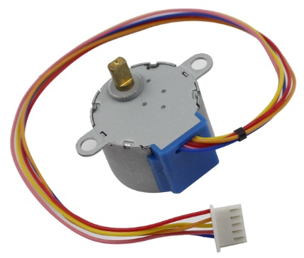

步进电机
=========================

.. image:: img/stepper.png
    :align: center

步进电机由于其独特的设计，可以在没有任何反馈机制的情况下进行高精度控制。步进电机的轴上装有一系列磁铁，由一系列电磁线圈控制，这些线圈按特定顺序带正负电，以小“步”精确地向前或向后移动。

**原理**

步进电机有两种类型，单极和双极，了解你使用的是哪种类型非常重要。在本实验中，我们将使用单极步进电机。

步进电机是四相电机，使用单极性直流电源。只要按适当的时序给电机的所有相绕组通电，就可以使其逐步转动。四相无功步进电机原理图：

图中，电机的中间是一个转子——一个齿轮状的永磁体。在转子周围，0到5是齿。再往外，有8个磁极，每两个相对的磁极通过线圈绕组相连。所以它们从A到D形成四对，称为相。它有四根引线连接开关SA、SB、SC和SD。因此，电路中四相并联，一相的两个磁极串联。

**以下是 4 相步进电机的工作原理：**

开始时，开关SB通电，开关SA、SC、SD断电，B相磁极对准转子的0、3齿。同时，齿 1 和齿 4 产生 C 相和 D 相极的交错齿。齿 2 和 5 生成具有 D 和 A 相极的交错齿。当开关SC通电时，开关SB、SA、SD断电，转子在C相绕组的磁场和1、4齿之间的磁场作用下旋转。此时1、4齿与C-的磁极对齐相绕组。而0号和3号齿产生A、B相磁极的交错齿，2、5号齿产生A、D相磁极的交错齿。类似的情况还在继续。依次给A、B、C、D相通电，转子按A、B、C、D的顺序转动。

.. image:: img/image220.png
   :align: center

四相步进电机有单四步、双四步、八步三种运行方式。单四步和双四步的步距角相同，但单四步的驱动力矩较小。八步的步距角是单四步和双四步的一半。因此，八步工作模式可以保持较高的驱动扭矩，提高控制精度。在这个实验中，我们让步进电机工作在八步模式。

**ULN2003 模块**

.. image:: img/uln2003.png
    :align: center

要将电机应用到电路中，需要使用驱动板。步进电机驱动器- ULN2003 (`数据表 <https://www.st.com/resource/en/datasheet/uln2001.pdf>`_) 是一个 7 通道逆变器电路。即当输入端为高电平时，ULN2003的输出端为低电平，反之亦然。如果我们给IN1提供高电平，给IN2、IN3和IN4提供低电平，那么输出端OUT1为低电平，其他所有输出端都为高电平。于是D1亮，开关SA通电，步进电机转一圈。类似的情况不断重复。因此，只要给步进电机一个特定的时序，它就会一步一步地转动。这里的 ULN2003 用于为步进电机提供特定的时序。

**示例**

* :ref:`stepper_mega` (Mega板项目)
* :ref:`stepper_uno` （R3板项目）