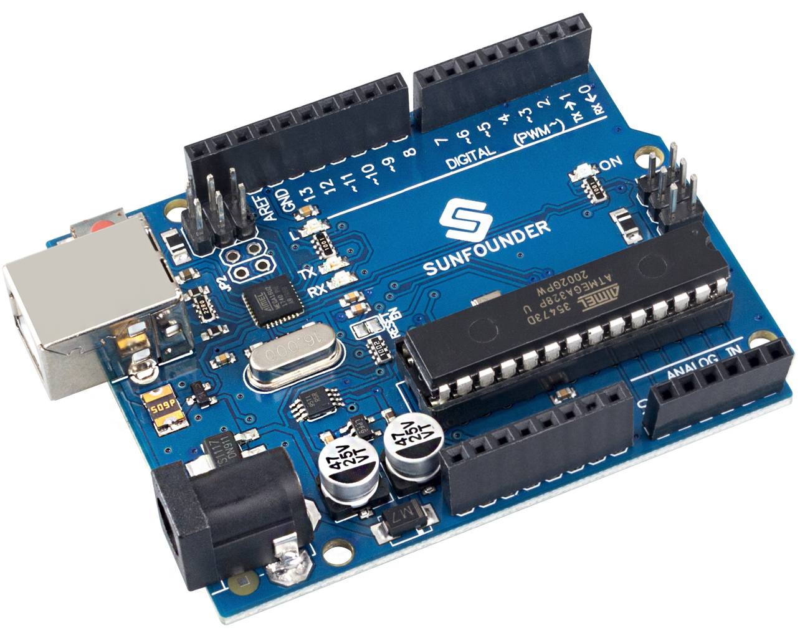
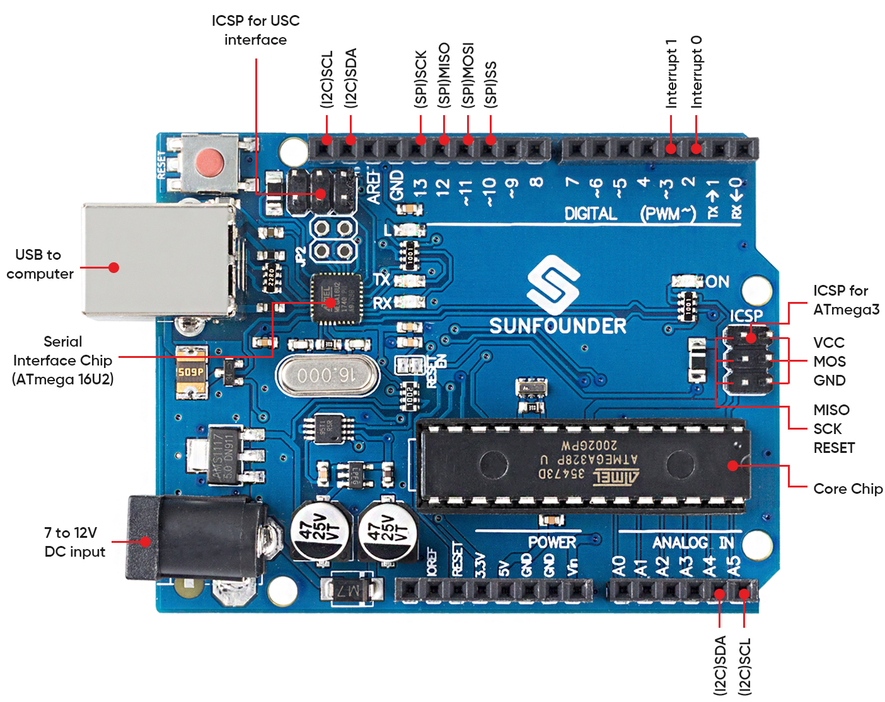

SunFounder R3 Board
===========================

.. note::

    The SunFounder R3 board is a mainboard with almost the same functions as the `Arduino Uno <https://store.arduino.cc/products/arduino-uno-rev3/>`_, and the two boards can be used interchangeably.

SunFounder R3 board is a microcontroller board based on the ATmega328P (`datasheet <http://ww1.microchip.com/downloads/en/DeviceDoc/Atmel-7810-Automotive-Microcontrollers-ATmega328P_Datasheet.pdf>`_). It has 14 digital input/output pins (of which 6 can be used as PWM outputs), 6 analog inputs, a 16 MHz ceramic resonator (CSTCE16M0V53-R0), a USB connection, a power jack, an ICSP header and a reset button. It contains everything needed to support the microcontroller; simply connect it to a computer with a USB cable or power it with a AC-to-DC adapter or battery to get started.

**Technical Parameters**

* MICROCONTROLLER: ATmega328P
* OPERATING VOLTAGE: 5V
* INPUT VOLTAGE (RECOMMENDED): 7-12V
* INPUT VOLTAGE (LIMIT): 6-20V
* DIGITAL I/O PINS: 14 (0-13, of which 6 provide PWM output(3, 5, 6, 9-11))
* PWM DIGITAL I/O PINS: 6 (3, 5, 6, 9-11)
* ANALOG INPUT PINS: 6 (A0-A5)
* DC CURRENT PER I/O PIN: 20 mA
* DC CURRENT FOR 3.3V PIN: 50 mA
* FLASH MEMORY: 32 KB (ATmega328P) of which 0.5 KB used by bootloader
* SRAM: 2 KB (ATmega328P)
* EEPROM: 1 KB (ATmega328P)
* CLOCK SPEED: 16 MHz
* LED_BUILTIN: 13
* LENGTH: 68.6 mm
* WIDTH: 53.4 mm
* WEIGHT: 25 g
* Port: A4(SDA), A5(SCL)

**What's More**

* `Arduino IDE <https://www.arduino.cc/en/software>`_
* `Arduino Programming Language Reference <https://www.arduino.cc/reference/en/>`_
* :ref:`Install and Introduce Arduino IDE`
* `ATmega328P Datasheet <http://ww1.microchip.com/downloads/en/DeviceDoc/Atmel-7810-Automotive-Microcontrollers-ATmega328P_Datasheet.pdf>`_

