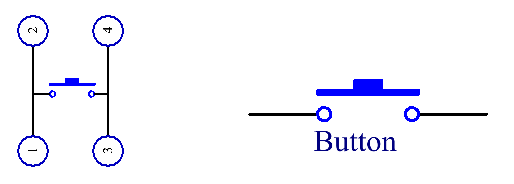
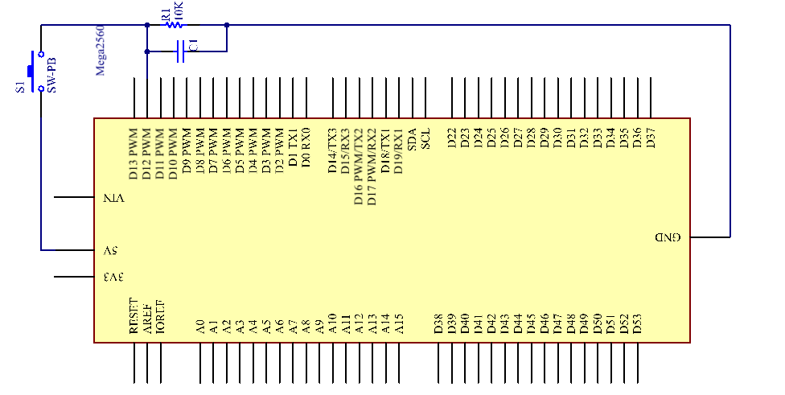
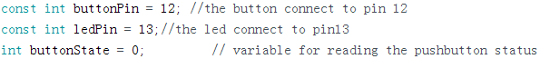
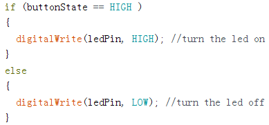

Lesson 5 Controlling LED by Button
=====================================

Introduction
----------------

In this experiment, we will learn how to turn on/off an LED by using an
I/O port and a button. The "I/O port" refers to the INPUT and OUTPUT
port. Here the INPUT port of the Mega 2560 board is used to read the
output of an external device. Since the board itself has an LED
(connected to Pin 13), you can use this LED to do this experiment for
convenience.

Components
----------------

.. image:: media_mega2560/mega05.png

Experimental Principle
------------------------------

Button
^^^^^^^^

Buttons are a common component used to control electronic devices. They
are usually used as switches to connect or break circuits. Although
buttons come in a variety of sizes and shapes, the one used here is a
6mm mini-button as shown in the following pictures.

Pin 1 is connected to pin 2 and pin 3 to pin 4. So you just need to
connect either of pin 1 and pin 2 to pin 3 or pin 4.

.. image:: media_mega2560/image75.png
    :align: center

The following is the internal structure of a button. The symbol on the
right below is usually used to represent a button in circuits.

Since the pin 1 is connected to pin 2, and pin 3 to pin 4, when the
button is pressed, the 4 pins are connected, thus closing the circuit.

Principle:
^^^^^^^^^^^^^

Connect one end of the buttons to pin 12 which connects with a pull-down
resistor and a 0.1uF (104) capacitor (to eliminate jitter and output a
stable level when the button is working). Connect the other end of the
resistor to GND and one of the pins at the other end of the button to
5V. When the button is pressed, pin 12 is 5V (HIGH). Set the pin 12 as
High level by programming and pin 13 (integrated with an LED) as High at
the same time. Then release the button (pin 12 changes to LOW) and pin
13 is Low. So we will see the LED lights up and goes out alternately as
the button is pressed and released.

The schematic diagram：

Experimental Procedures
---------------------------------

**Step 1:** Build the circuit

.. image:: media_mega2560/image79.png
   :alt: Controlling LED by Button_bb
   

**Step 2:** Open the code file.

**Step 3:** Select the **Board** and **Port.**

**Step 4:** Upload the sketch to the board.

Now, press the button, and the LED on the mega2560 board will light up.

.. image:: media_mega2560/image80.jpeg

Code
--------

.. raw:: html

    <iframe src=https://create.arduino.cc/editor/sunfounder01/823bb97c-55c3-492d-9853-62ba474aafb4/preview?embed style="height:510px;width:100%;margin:10px 0" frameborder=0></iframe>

Code Analysis
^^^^^^^^^^^^^^^^^

**Code Analysis 5-1 Define variables**

Connect the button to pin 12. LED has been connected to pin 13. Define a
variable *buttonState* to restore the state of the button.

**Code Analysis 5-2 Set the input and output status of the pins**

.. image:: media_mega2560/image82.png

We need to know the status of the button in this experiment, so here set
the *buttonPin* as INPUT; to set HIGH/LOW of the LED, we set *LedPin* as
OUTPUT.

**Code Analysis 5-3** **Read the status of the button**

.. image:: media_mega2560/image83.png

buttonPin(Pin12) is a digital pin; here is to read the value of the
button and store it in *buttonState*.

**digitalRead (Pin)**: Reads the value from a specified digital pin,
either HIGH or LOW.

**Code Analysis 5-4 Turn on the LED when the button is pressed**

In this part, when the **buttonState** is High level, write *ledPin* as
High and the LED will be turned on. As one end of the button has been
connected to 5V and the other end to pin 12, when the button is pressed,
pin 12 is 5V (HIGH). And then determine with the *if*\ (conditional); if
the conditional is true, then the LED will light up.

*Else* means that when the if(conditional) is determined as false, run
the code in *else*.

Experiment Summary
^^^^^^^^^^^^^^^^^^^^^^^^^^^^^

You can also change the code to: when the button is pressed, if
(buttonState=HIGH). The LED goes out (digitalWrite(ledPin, LOW)). When
the button is released (the else), the LED lights up
((digitalWrite(ledPin, HIGH)). You only need to replace the code in
**if** with those in **else**.