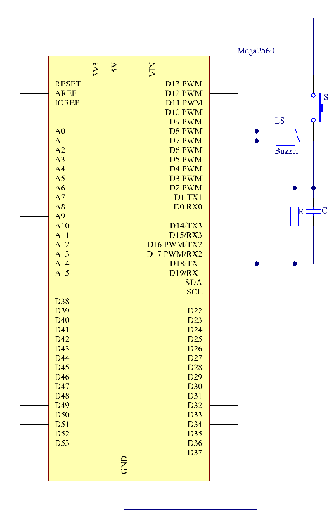
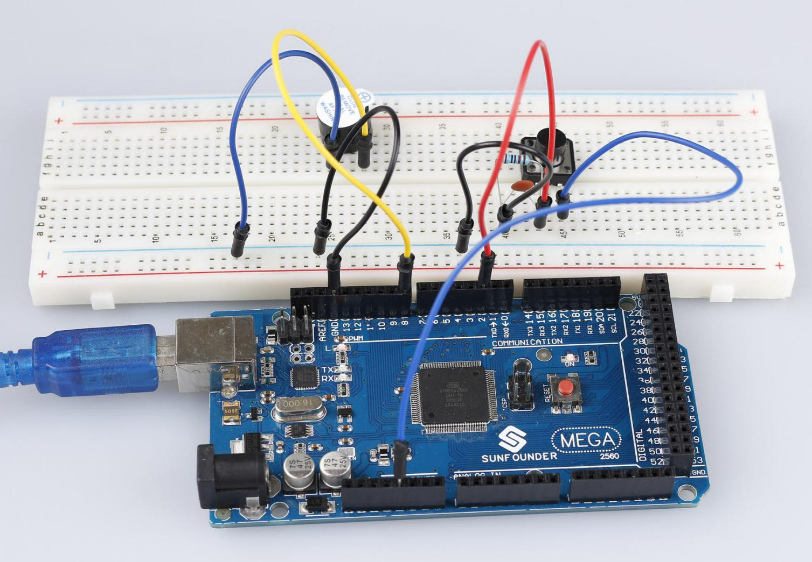
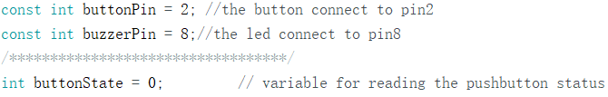

Doorbell
==============

Introduction
--------------

A buzzer is a great tool in your experiments whenever you want to make
some sounds. In this lesson, we will learn how to drive an active buzzer
to build a simple doorbell.

Components
----------------

.. image:: media_mega2560/mega08.png
    :align: center

Experimental Principle
-------------------------

As a type of electronic buzzer with an integrated structure,
buzzers, which are supplied by DC power, are widely used in computers,
printers, photocopiers, alarms, electronic toys, automotive electronic
devices, telephones, timers and other electronic products for voice
devices. Buzzers can be categorized as active and passive ones (see the
following picture). Turn the pins of two buzzers face up, and the one
with a green circuit board is a passive buzzer, while the other enclosed
with a black tape is an active one.

The difference between an active buzzer and a passive buzzer:

.. image:: media_mega2560/image87.png

An active buzzer has a built-in oscillating source, so it will make
sounds when electrified. But a passive buzzer does not have such source,
so it will not tweet if DC signals are used; instead, you need to use
square waves whose frequency is between 2K and 5K to drive it. The
active buzzer is often more expensive than the passive one because of
multiple built-in oscillating circuits.

In this experiment, we use an active buzzer.

The schematic diagram：

Experimental Procedures
-------------------------------

**Step 1:** Build the circuit (Long pins of buzzer is the Anode and the
short pin is Cathode).

.. image:: media_mega2560/image88.png

**Step 2:** Open the code file.

**Step 3:** Select the **Board** and **Port.**

**Step 4:** Upload the sketch to the board.

Now, you should hear the buzzer beep.

Code
--------

.. raw:: html

    <iframe src=https://create.arduino.cc/editor/sunfounder01/fc823eca-3e0a-48b5-b2d4-bc8ed33ac6f1/preview?embed style="height:510px;width:100%;margin:10px 0" frameborder=0></iframe>

Code Analysis
^^^^^^^^^^^^^^^^^^^^

**Code Analysis 6-1 Define variables**

Connect the button to pin 2 and buzzer to pin 8. Define a variable
*buttonState* to restore the state of the button.

**Code Analysis 6-2 Set the input and output status of the pins**

.. image:: media_mega2560/image91.png

We need to know the status of the button in this experiment, so here set
the *buttonPin* as INPUT; to set HIGH/LOW of the buzzer, we set
*buzzerPin* as OUTPUT.

**Code Analysis 6-3** **Read the status of the button**

.. image:: media_mega2560/image83.png

buttonPin(Pin2) is a digital pin; here is to read the value of the
button and store it in *buttonState*.

**digitalRead (Pin)**: Reads the value from a specified digital pin,
either HIGH or LOW.

**Code Analysis 6-4 Turn on the LED when the button is pressed**

.. image:: media_mega2560/image92.png

In this part, when the **buttonState** is High level, then let the
buzzer beeping in different frequency which can simulate the doorbell.