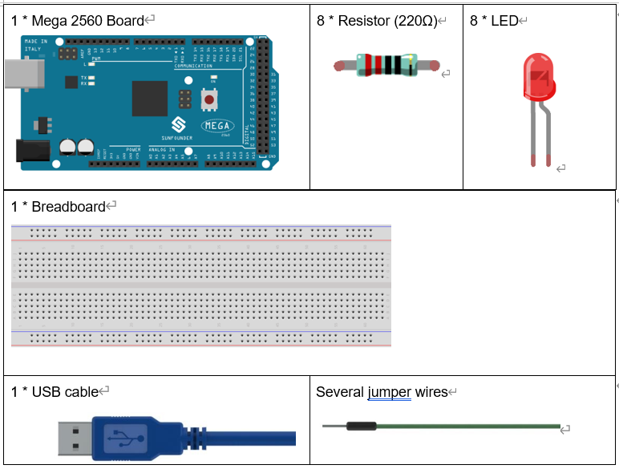
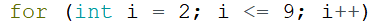
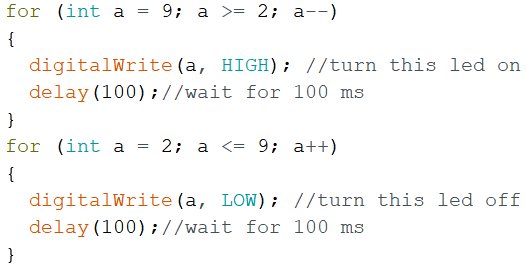

Lesson 4 Flowing LED Lights
===============================

Introduction
-----------------

In this lesson, we will conduct a simple yet interesting experiment –
using LEDs to create flowing LED lights. As the name suggests, these
eight LEDs in a row successively light up and dim one after another,
just like flowing water.

Components
----------------------

Experimental Principle
---------------------------

The principle of this experiment is simply to turn on eight LEDs in
turn. The eight LEDs are connected to pin 2-pin 9 respectively. Set them
as High level and the corresponding LED at the pins will light up.
Control the time of each LED brightening and you will see flowing LED
lights.

The schematic diagram:

.. image:: media_mega2560/image64.png
    :align: center

Experimental Procedures
------------------------------

**Step 1:** Build the circuit

.. image:: media_mega2560/image65.png
    :align: center

**Step 2:** Open the code file.

**Step 3:** Select the **Board** and **Port.**

**Step 4:** Upload the sketch to the board.

Now, you should see eight LEDs brighten one by one from the LED
connected to pin 2 to that to pin 9, and then dim in turn from the LED
at pin 9 to the one at pin 2. After that, the LEDs will light up from
the LED at pin 9 to that at pin 2 and dim from the LED at pin 2 to that
at pin 9. This whole process will repeat until the circuit is power off.

.. image:: media_mega2560/image66.jpeg
    :align: center

Code
--------

.. raw:: html

    <iframe src=https://create.arduino.cc/editor/sunfounder01/0bbeb938-b857-40fd-beeb-74dfbd5eddb3/preview?embed style="height:510px;width:100%;margin:10px 0" frameborder=0></iframe>    

Code Analysis
^^^^^^^^^^^^^^^^

**Code Analysis** **4-1** **for() statement**

|image21|//8 LEDs are connect to pin2-pin9, When i=2, which accords with
the condition i<=9, then run the code in the curly braces, set the pin2
to OUTPUT. After that run i++(here in i = i + 1, the two "i"s are not
the same, but i\ :sub:`now` = i\ :sub:`before` + 1). Use the for()
statement to set pin 2-pin 9 as output respectively.

.. image:: media_mega2560/image68.png
   :width: 6.17708in
   :height: 0.8125in

**for (initialization; condition; increment) { //statement(s); }:** The
for statement is used to repeat a block of statements enclosed in curly
braces.The **initialization** happens first and exactly once. Each time
through the loop, the **condition** is tested; if it’s true, the
statement block, and the **increment** is executed, then the
**condition** is tested again. When the **condition** becomes false, the
loop ends.

**Code Analysis** **4-2** **Set flowing led lights**

Use the for() statement to set pin2-pin9 to a high level inturn.

.. image:: media_mega2560/image69.png

Then let the 8 LEDs go out from pin9 to pin2 in turn.

.. image:: media_mega2560/image70.png

Finally, use the same way to turn on the 8 LEDs from pin9 to pin2 in
turn and let them go out in turn.

**Experiment Summary**

Through this experiment, you have learned how to use for() statement
which is a very useful statement when you want to short the code.
