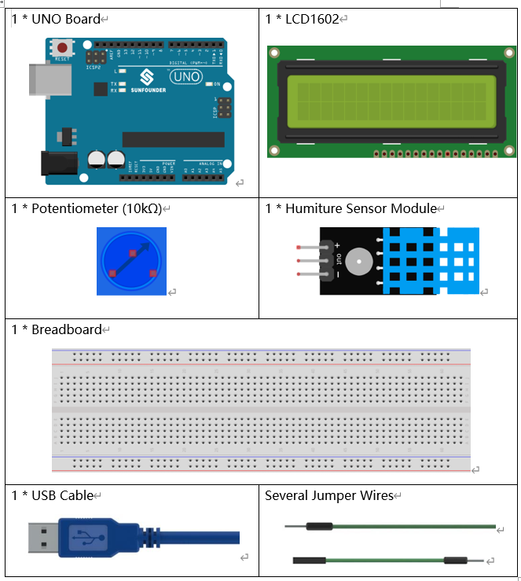
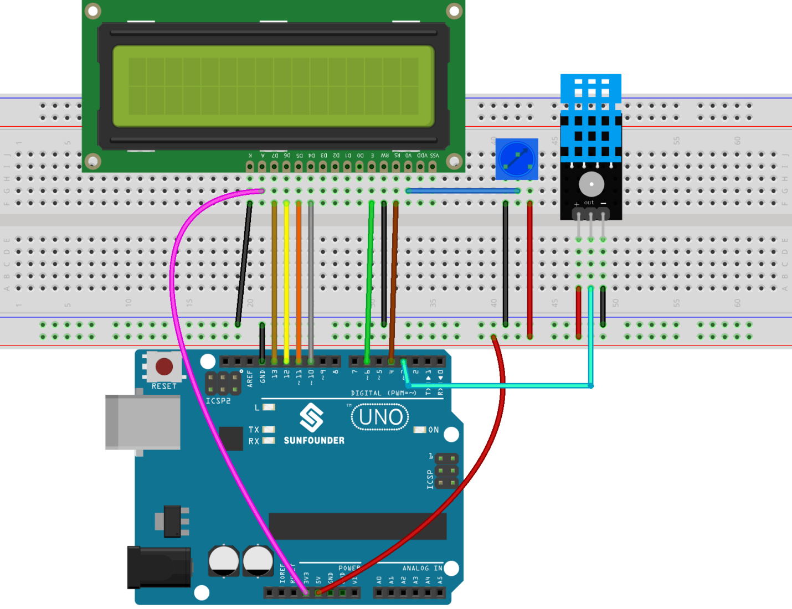

Lesson 17 Humiture Sensor Uno
===============================

Introduction
--------------------

The digital temperature and humidity sensor DHT11 is a composite sensor
that contains a calibrated digital signal output of temperature and
humidity. The technology of a dedicated digital modules collection and
the temperature and humidity sensing technology are applied to ensure
that the product has high reliability and excellent long-term stability.

The sensor includes a resistive sense of wet component and an NTC
temperature measurement device, and is connected with a high-performance
8-bit microcontroller.

Components
---------------

Component Introduction
--------------------------

Humiture Sensor
^^^^^^^^^^^^^^^^^^^^^

.. image:: media_uno/image146.png

Only three pins are available for use: VCC, GND, and DATA. The
communication process begins with the DATA line sending start signals to
DHT11, and DHT11 receives the signals and returns an answer signal. Then
the host receives the answer signal and begins to receive 40-bit
humiture data (8-bit humidity integer + 8-bit humidity decimal + 8-bit
temperature integer + 8-bit temperature decimal + 8-bit checksum). For
more information, please refer to DHT11 datasheet.

Schematic Diagram
------------------------------

.. image:: media_uno/image147.png
   :width: 6.67639in
   :height: 5.26111in
   :align: center

Experimental Procedures
-------------------------------

**Step 1:** Build the circuit.

**Step 2:** Open the code file.

**Step 3:** Select the **Board** and **Port.**

**Step 4:** Upload the sketch to the board.

Now, you can see the value of the current humidity and temperature
displayed on the LCD.

.. image:: media_uno/image149.jpeg
   :alt: 13.1
   :width: 6.35694in
   :height: 4.38611in

Code
-------

.. raw:: html

    <iframe src=https://create.arduino.cc/editor/sunfounder01/214bcc9b-c7db-4df9-b2a7-4b50f30e381b/preview?embed style="height:510px;width:100%;margin:10px 0" frameborder=0></iframe>

Code Analysis
-----------------------

**Code Analysis** **17-1** **Initialize the humiture and LCD1602**

.. code-block:: arduino

    #include <dht.h> //Include the head file dht.h

    #include <LiquidCrystal.h> 

    LiquidCrystal lcd(4, 6, 10, 11, 12, 13); // initialize the LCD1602 dht DHT;

    #define DHT11_PIN 3 //the humiture sensor attact to pin3

**Code Analysis** **17-2** **Read the value of humiture**

.. code-block:: arduino

    int chk = DHT.read11(DHT11_PIN);

    switch (chk)

    {

    case DHTLIB_OK:

        Serial.println("OK,\t");

        break;

    case DHTLIB_ERROR_CHECKSUM:

        Serial.println("Checksum error,\t");

        break;

    case DHTLIB_ERROR_TIMEOUT:

        Serial.println("Time out error,\t");

        break;

    default:

        Serial.println("Unknown error,\t");

        break;

    }

Use the read11() function to read the value of the temperature and
humidity sensor. If OK is displayed on the Serial Monitor, the humiture
sensor is working properly.

read11(): Return values:

.. code-block:: arduino

    // DHTLIB_OK: Indicate the humiture sensor is work well.

    // DHTLIB_ERROR_CHECKSUM

    // DHTLIB_ERROR_TIMEOUT

**Code Analysis** **17-3** **Display on the LCD1602**

.. code-block:: arduino

    lcd.setCursor(0, 0);

    lcd.print("Tem:");

    lcd.print(DHT.temperature,1); //print the temperature on lcd，keep one decimal point

    lcd.print(" C");

    lcd.setCursor(0, 1);

    lcd.print("Hum:");

    lcd.print(DHT.humidity,1); //print the humidity on lcd

    lcd.print(" %");

    delay(200); //wait a while