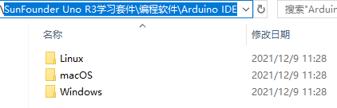
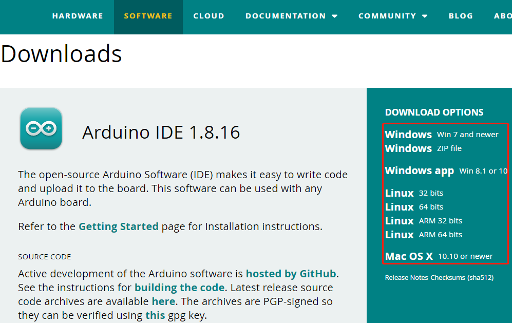
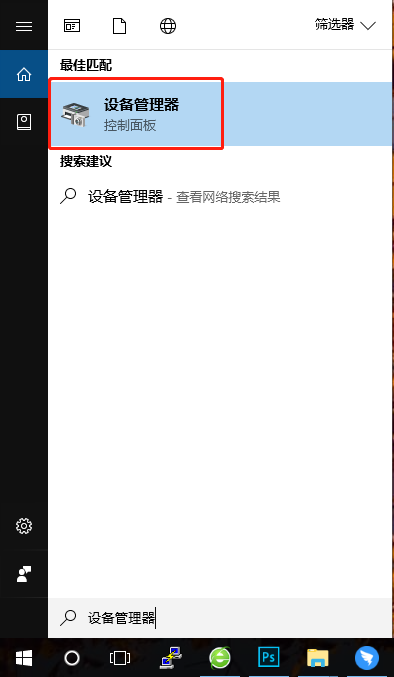
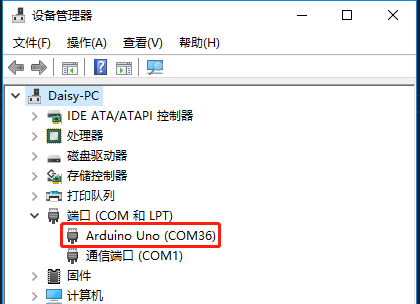
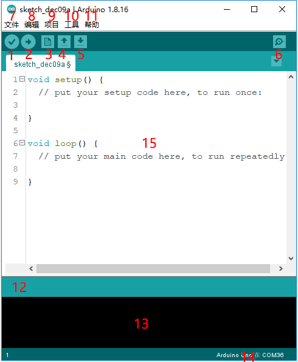

安装和介绍Arduino IDE
=======================================

Arduino 是一个软件和硬件简单的开源平台。即使您是初学者，也可以在短时间内掌握它。提供集成开发环境（IDE）进行代码编译，兼容多种控制板。所以你只需下载Arduino IDE，将代码文件上传到Arduino板上，然后你就可以看到相关的实验现象。有关更多信息，请参阅 https://www.arduino.cc/。

下载Arduino IDE
----------------------

参考章节 :ref:`下载资料` 来下载相关的资料，然后进入到 ``SunFounder Uno R3学习套件\编程软件\Arduino IDE`` 路径中。在这个文件夹中，包含了Arduino IDE在不同系统的安装包，请根据你的系统来选择。

当然，如果你的英语还不错，你可以去Arduino官网：https://www.arduino.cc/en/software，下载最新版本的包装包。

Windows安装步骤
------------------------

下面是Windows系统的安装步骤，对于其他系统的安装教程，请参考：

* `macOS <https://www.arduino.cc/en/Guide/macOS>`_
* `Linux <https://www.arduino.cc/en/Guide/Linux>`_

**第 1 步**：进入到 ``SunFounder Uno R3学习套件\编程软件\Arduino IDE\Windows`` 路径中，双击 ``arduino-x.x.xx-windows.exe`` 文件。

**第 2 步**：在弹出的窗口，点击 **I Agree**。

.. image:: img/image16.png
   :align: center

**第 3 步**：点击 ``Next``。

.. image:: img/image17.png
   :align: center

**第 4 步**：选择安装路径，默认情况下是安装在C盘。你可以点击 ``Browse`` 来选择其他的安装路径，然后点击 ``OK``。

.. image:: img/image18.png
   :align: center

**第 5 步**：在安装过程中，会有窗口弹出安装需要的驱动，请选择 ‘Always trust software from “Arduino LLC” ’。安装完成后，点击 **Close**。

**第 6 步**：用一根USB线将Arduino板插入到电脑的USB端口，在左下角搜索设备管理器，双击来将它打开。

**第 7 步**：如果在端口处看到Arduino Uno (COMxx) 或者 Arduino Mega2560 (COMxx)，说明电脑已经正确识别的你的Arduino板，请记住这个端口号。

介绍Arduino IDE
-------------------------

双击安装过程创建的Arduino图标（arduino.exe）。

.. image:: img/image25.png
   :align: center

然后将出现 Arduino IDE。现在让我们来看下这个编程软件的基本介绍。

* 1、验证：编译您的代码，任何语法问题都会提示错误。
* 2、上传：将代码上传到您的开发板。当您单击按钮时，板上的 RX 和 TX LED 将快速闪烁，并且在上传完成之前不会停止。
* 3、新建：创建一个新的代码编辑窗口。
* 4、打开：打开Arduino代码文件。
* 5、保存：保存代码。
* 6、串行监视器：单击按钮，将出现一个窗口。它接收从您的控制板发送的数据。这对于调试非常有用。
* 7、文件：点击菜单，会出现一个下拉列表，包括文件的创建、打开、保存、关闭、一些参数配置等。
* 8、编辑：单击菜单。在下拉列表中，有剪切、复制、粘贴、查找等一些编辑操作，以及相应的快捷键。
* 9、项目: 包括验证、上传、添加文件等操作。更重要的功能是包含库——您可以在其中添加库。
* 10、工具：包括一些工具——最常用的Board（你使用的板）和Port（你的板所在的端口）。每次要上传代码时，都需要选择或检查它们。
* 11、帮助：如果您是初学者，您可以查看菜单下的选项并获得您需要的帮助，包括在IDE中的操作、介绍信息、故障排除、代码解释等。
* 12、在此消息区，无论何时编译或上传，都会出现摘要消息。
* 13、编译和上传过程中的详细信息。比如使用的文件在哪个路径，错误提示的详细信息。
* 14、开发板和端口: 这里可以预览选择的开发板和端口。如果有任何不正确，您可以通过工具 -> 开发板或端口再次选择它们。
* 15、IDE 的编辑区：你可以在这里写代码。
