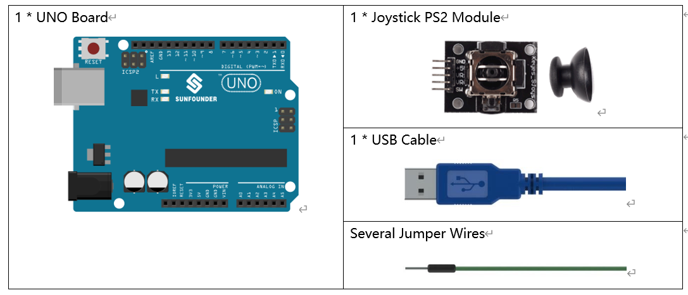
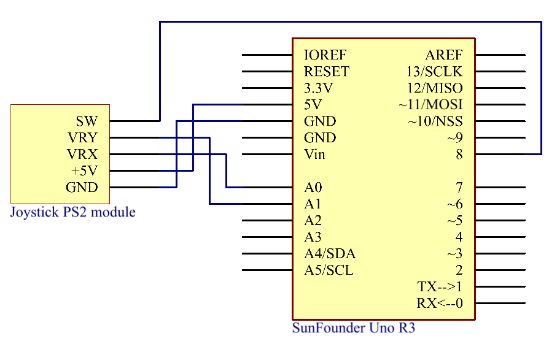
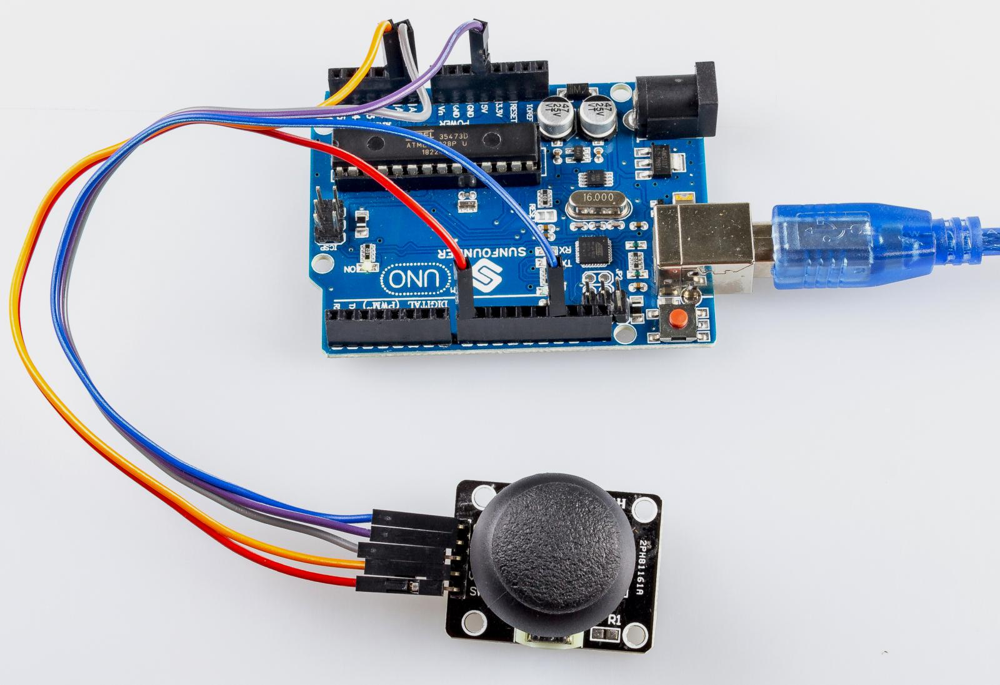

Lesson 18 Joystick PS2 Uno
===========================

Introduction
---------------------

A joystick is an input device consisting of a stick that pivots on a
base and reports its angle or direction to the device it is controlling.
Joysticks are often used to control video games and robots. A Joystick
PS2 is used here.

Components
-------------------------

Schematic Diagram
---------------------

This module has two analog outputs (corresponding to X，Y biaxial
offsets) and one digital output representing whether it is pressed on Z
axis. The module integrates power indicator and can display operation
condition.

In this experiment, we use the Uno board to detect the moving direction
of the Joystick knob and pressing of the button.

Experimental Procedures
------------------------------

**Step 1:** Build the circuit.

.. image:: media_uno/image152.png

**Step 2:** Open the code file.

**Step 3:** Select the **Board** and **Port.**

**Step 4:** Upload the sketch to the board.

Now, push the rocker and the coordinates of X and Y axes displayed on
Serial Monitor will change accordingly; press the button, and the
coordinate of Z=0 will also be displayed.

Code
-------

.. raw:: html

   <iframe src=https://create.arduino.cc/editor/sunfounder01/f7c93ea3-c53d-446c-893d-9857eaffabd0/preview?embed style="height:510px;width:100%;margin:10px 0" frameborder=0></iframe>

Code Analysis
-------------------

The code is use the serial monitor to print the value of the VRX,VRY and
SW pins of the joystick ps2.

.. code-block:: arduino

    const int xPin = A0; //the VRX attach to

    const int yPin = A1; //the VRY attach to

    const int swPin = 8; //the SW attach to

    void setup()

    {

      pinMode(swPin, INPUT); //set the SW pin to INPUT

      digitalWrite(swPin, HIGH); //And initial value is HIGH

      Serial.begin(9600);
   }

    void loop()

    { 
      Serial.print("X: ");

      Serial.print(analogRead(xPin), DEC); // print the value of VRX in DEC

      Serial.print("|Y: ");

      Serial.print(analogRead(yPin), DEC); // print the value of VRX in DEC

      Serial.print("|Z: ");

      Serial.println(digitalRead(swPin)); // print the value of SW

      delay(500);
   }