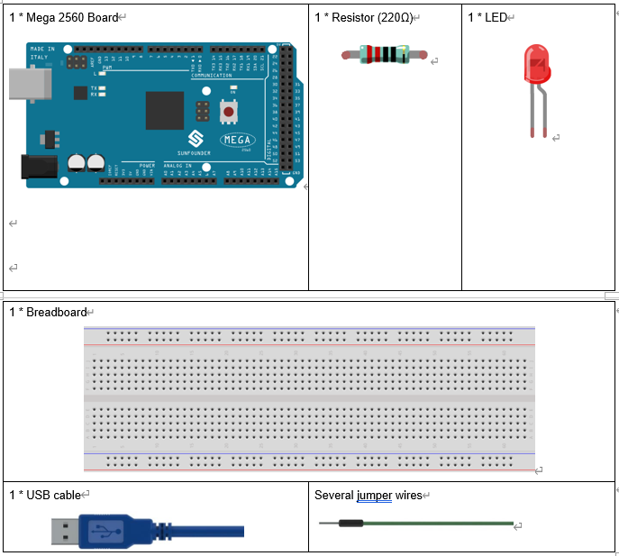
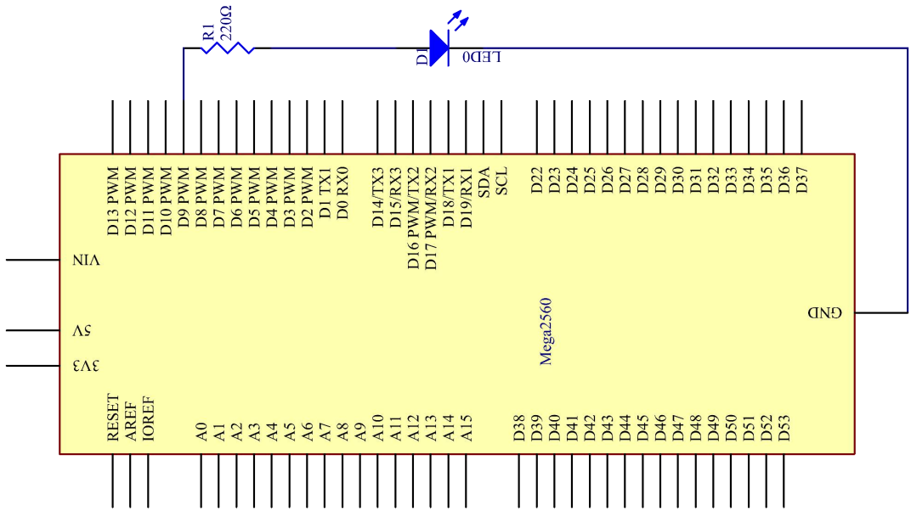
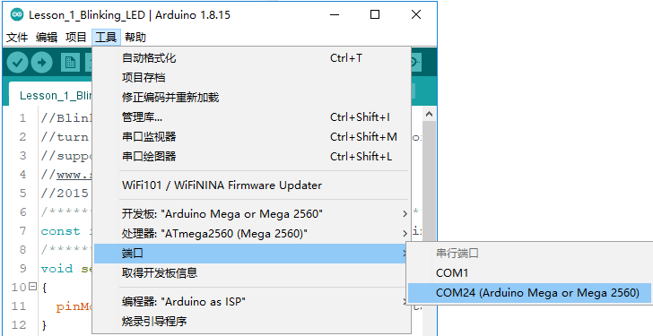
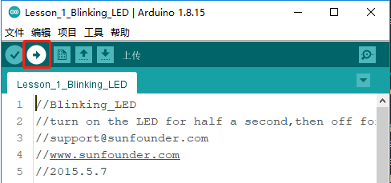
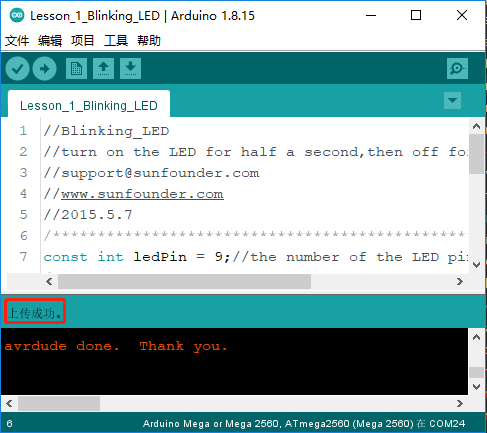
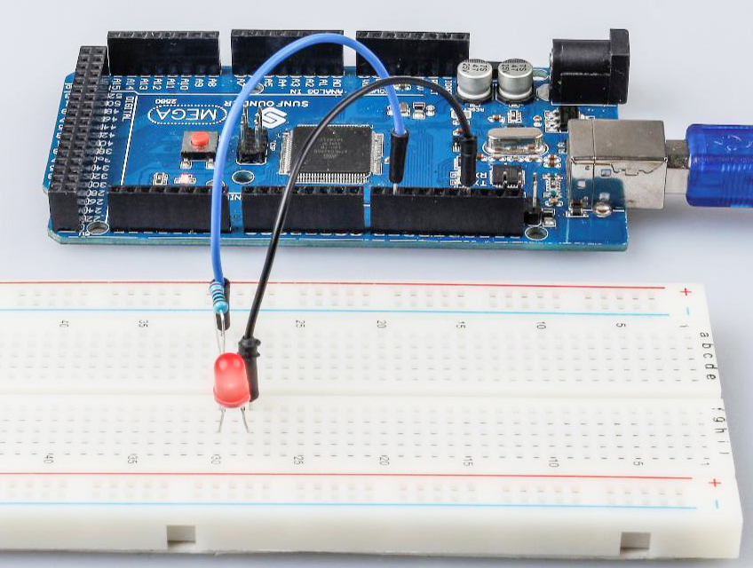

.. _blinking_mega:

Lesson 1 Blinking LED
===========================

Introduction
---------------------

You should've learnt how to install Arduino IDE and add libraries
before. Now you can start with a simple experiment to learn the basic
operation and code in the IDE.

Components
--------------------

* :ref:`SunFounder Mega Board`
* :ref:`Breadboard`
* :ref:`Jumper Wires`
* :ref:`LED`
* :ref:`Resistor`

Principle
^^^^^^^^^^^^^

Connect one end of the 220ohm resistor to pin 9 of the Mega 2560 and the
other end to the anode (the long pin) of the LED, and the cathode (the
short pin) of the LED to GND. When the pin 9 outputs high level, the
current gets through the current limiting resistor to the anode of the
LED. And since the cathode of the LED is connected to GND, the LED will
light up. When pin 9 outputs low level, the LED goes out.

The schematic diagram: 

Experimental Procedures
------------------------------

**Step 1:** Build the circuit (the pin with a curve is the anode of the
LED).

Then plug the board into the computer with a 5V USB cable.

.. image:: media_mega2560/image54.png
    :align: center

**Step 2**: Open the ``Lesson_1_Blinking_LED.ino`` code file in the path of
``SunFounder Mega Kit/Code/Lesson_1_Blinking_LED``

**Step 3:** Select the Board and Port

Before uploading the code, you need to select the **Board** and
**Port**. Click **Tools** -> **Board** and select **Arduino/Genuino
Mega or Mega 2560**.

.. image:: media_mega2560/image55.png
    :align: center

Then select **Tools** -> **Port**. Your port should be different from
mine.

**Step 4:** Upload the sketch to the SunFounder Mega2560 board

Click the **Upload** icon to upload the code to the control board.

If "Done uploading" appears at the bottom of the window, it means the
sketch has been successfully uploaded.

You should now see the LED blinking.

Code
-------

.. raw:: html

    <iframe src=https://create.arduino.cc/editor/sunfounder01/8720186d-a77f-4450-8b6a-792fb14078c5/preview?embed style="height:510px;width:100%;margin:10px 0" frameborder=0></iframe>

Code Analysis
^^^^^^^^^^^^^^^^^^^

**Define variables**

.. code-block:: arduino

    const int ledPin = 9; //the number of the LED pin

You should define every variable before using in case of making
mistakes. This line defines a constant variable ``ledPin`` for the pin 9.
In the following code, ``ledPin`` stands for pin 9. You can also directly
use pin 9 instead.

**setup() function**

A typical Arduino program consists of two subprograms: ``setup()`` for
initialization and loop() which contains the main body of the program.

The ``setup()`` function is usually used to initialize the digital pins
and set them as input or output as well as the baud rate of the serial
communication.

The ``loop()`` function contains what the MCU will run circularly. It will
not stop unless something happens like power outages.

.. code-block:: arduino

    void setup()

    {

        pinMode(ledPin,OUTPUT);//initialize the digital pin as an output

    }

The setup() function here sets the ``ledPin`` as OUTPUT.

``pinMode(Pin)``: Configures the specified pin to behave either as an
input or an output.

The void before the setup means that this function will not return a
value. Even when no pins need to be initialized, you still need this
function. Otherwise there will be errors in compiling.

**loop function**

.. code-block:: arduino

    void loop()

    {

        digitalWrite(ledPin,HIGH); //turn the LED on

        delay(500); //wait for half a second

        digitalWrite(ledPin,LOW); //turn the LED off

        delay(500); //wait for half a second

    }

This program is to set ``ledPin`` as HIGH to turn on the LED, with a delay
of 500ms. Set ``ledPin`` as LOW to turn the LED off and also delay 500ms.
The MCU will run this program repeatedly and you will see that the LED
brightens for 500ms and then dims for 500ms. This on/off alternation
will not stop until the control board runs out of energy.

``digitWrite (Pin)``: Write
a `HIGH <https://www.arduino.cc/en/Reference/Constants>`_ or
a `LOW <https://www.arduino.cc/en/Reference/Constants>`_ value to a
digital pin. When this pin has been set as output in ``pinModel()``, its
voltage will be set to the corresponding value: 5V (or 3.3V on 3.3V
boards) for HIGH, 0V (ground) for LOW.

Experiment Summary
^^^^^^^^^^^^^^^^^^^^^^^^^^^^^^^^^^

Through this experiment, you have learned how to turn on an LED. You can
also change the blinking frequency of the LED by changing the ``num``
value in the delay function ``delay (num)``. For example, change it to
``delay (250)`` and you will find that the LED blinks more quickly.