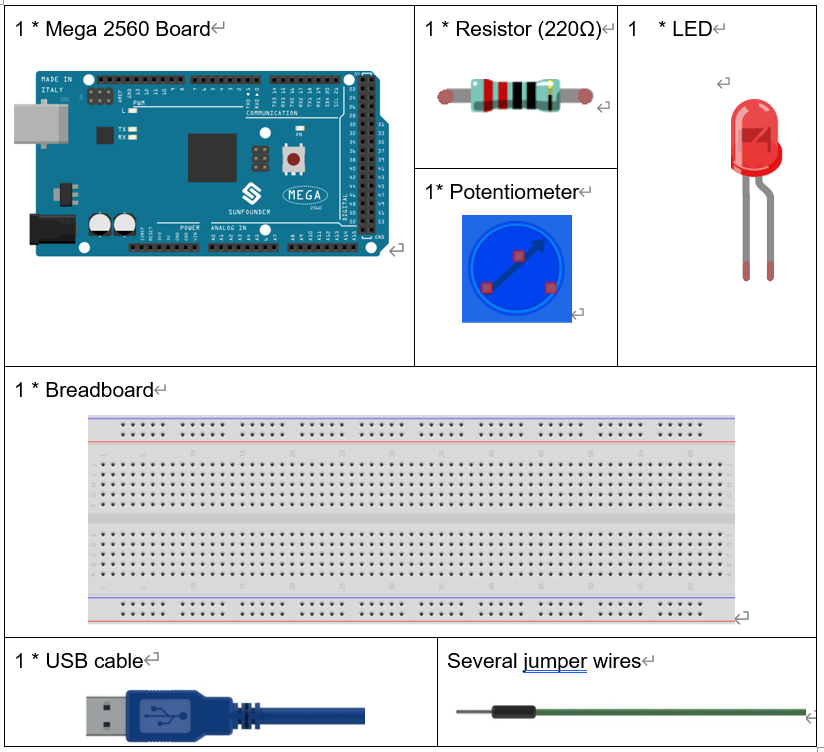
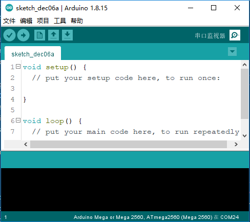
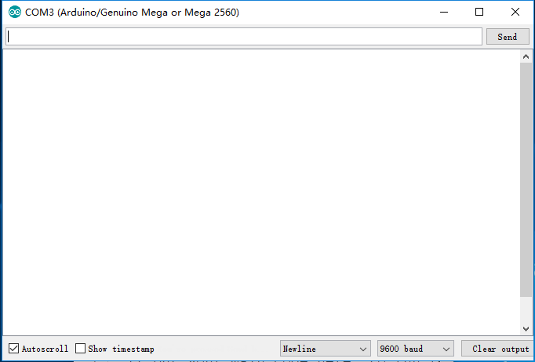
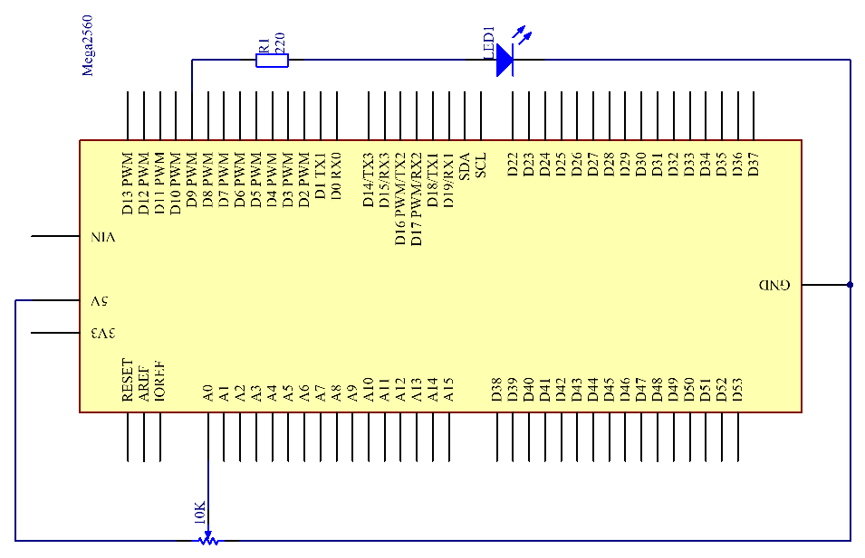
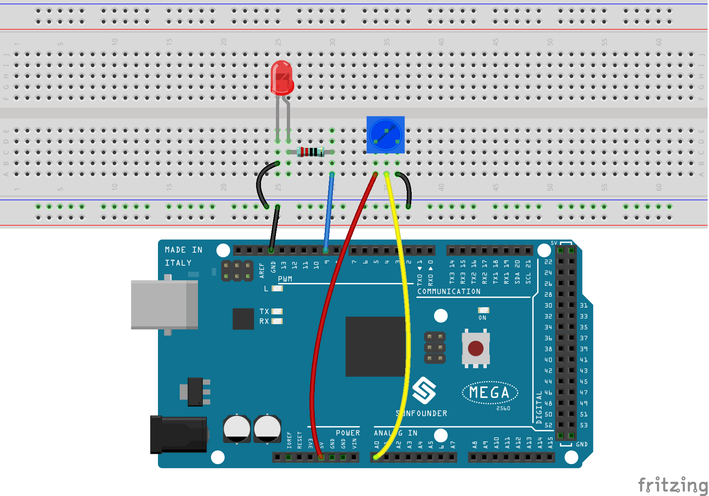
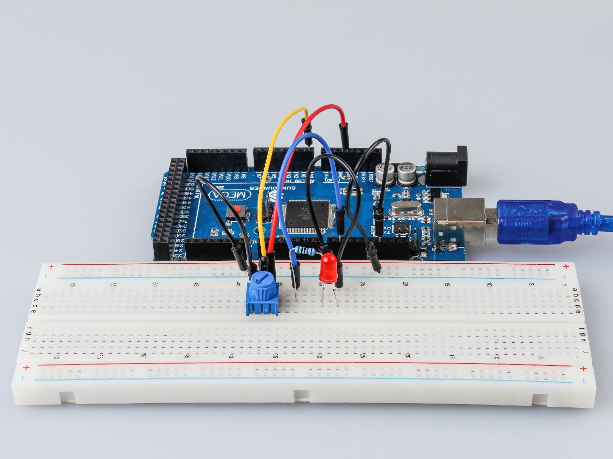

.. _potentiometer_mega:

Lesson 8 Controlling an LED by Potentiometer
=================================================

Introduction
-----------------------

In this lesson, let's see how to change the luminance of an LED by a
potentiometer, and receive the data of the potentiometer in Serial
Monitor to see its value change.

Components
-------------------

* :ref:`SunFounder Mega Board`
* :ref:`Breadboard`
* :ref:`Jumper Wires`
* :ref:`LED`
* :ref:`Resistor`
* :ref:`Potentiometer`

Serial Monitor
-----------------------

Serial Monitor is used for communication between the Mega 2560 board and
a computer or other devices. It is a built-in software in the Arduino
environment and you can click the button on the upper right corner to
open it. You can send and receive data via the serial port on the
control board and control the board by input from the keyboard.

Here, the Serial Monitor serves as a transfer station for communication
between your computer and the Mega 2560 board. First, the computer
transfers data to the Serial Monitor, and then the data is read by the
Mega 2560 board. Finally, the Mega 2560 will perform related operations.
Click the icon at the top right corner and a window will pop up as shown
below:

In this experiment, the potentiometer is used as voltage
divider, meaning connecting devices to all of its three pins. Connect
the middle pin of the potentiometer to pin A0 and the other two pins to
5V and GND respectively. Therefore, the voltage of the potentiometer is
0-5V. Spin the knob of the potentiometer, and the voltage at pin A0 will
change. Then convert that voltage into a digital value (0-1024) with the
AD converter in the control board. Through programming, we can use the
converted digital value to control the brightness of the LED on the
control board.

Schematic Diagram
------------------------

Experimental Procedures
-------------------------------

**Step 1:** Build the circuit

**Step 2:** Open the code file.

**Step 3:** Select the **Board** and **Port.**

**Step 4:** Upload the sketch to the board.

**Step5:** Open the Serial Monitor.

Find the Serial.begin() code to see what baud rate is set, here is 9600.
Then click the top right corner icon to open the Serial Monitor.

.. image:: media_mega2560/image129.png
    :align: center

**Step6:** Set the baud rate to 9600.

The default baud rate for serial monitors is 9600, and if the code is
also set to 9600, there is no need to change the baud rate bar.

.. image:: media_mega2560/image130.png
    :align: center

Spin the shaft of the potentiometer and you should see the luminance of
the LED change.

If you want to check the corresponding value changes, open the Serial
Monitor and the data in the window will change with your spinning of the
potentiometer knob.

Code
-------

.. raw:: html

    <iframe src=https://create.arduino.cc/editor/sunfounder01/93dc988d-16a6-4ee9-8ca2-cb91b8985fdf/preview?embed style="height:510px;width:100%;margin:10px 0" frameborder=0></iframe>

Code Analysis
^^^^^^^^^^^^^^^^^^^^^^^^

**Read the value from A0**

.. code-block:: arduino

    inputValue = analogRead(analogPin);//read the value from the potentiometer

This line is to store the values A0 has read in the ``inputValue`` which
has been defined before.

**analog Read()** reads the value from the specified analog pin. This
means that it will map input voltages between 0 and 5 volts into integer
values between 0 and 1023.

**Print values on Serial Monitor**

.. code-block:: arduino

    Serial.print("Input: "); //print "Input"

    Serial.println(inputValue); //print inputValue

* ``Serial.print()``: Prints data to the serial port as human-readable ASCII text. This command can take many forms. Numbers are printed using an ASCII character for each digit. Floats are similarly printed as ASCII digits, defaulting to two decimal places. Bytes are sent as a single character. Characters and strings are sent as is.

* ``Serial.println()``: Takes the same forms as Serial.print(), but it is followed by a carriage return character (ASCII 13, or '\\r') and a newline character (ASCII 10, or '\\n').

**Map the values**

.. code-block:: arduino

    outputValue = map(inputValue, 0, 1023, 0, 255); //Convert from 0-1023 proportional to the number of a number of from 0 to 255

``map(value, fromLow, fromHigh, toLow, toHigh)`` re-maps a number from
one range to another. That is, a **value** of **Fromm** would get mapped
to one of **to Low**, and a value of **from High** to one of **thigh**,
values in-between to values in-between, etc.

As the range of ``led Pin`` (pin 9) is 0-255, we need to map 0-1023 with
0-255.

Display the output value in Serial Monitor in the same way. If you are
not so clear about the ``map()`` functions, you can observe the data in
the Serial Monitor and analyze it.

.. code-block:: arduino

    Serial.print("Output: "); //print "Output"

    Serial.println(outputValue); //print outputValue

**Write the value of the potentiometer to LED**

.. code-block:: arduino

    analogWrite(ledPin, outputValue); //turn the LED on depending on the output value

Write the output value to ``led Pin`` and you will see that the luminance
of LED changes with your spinning of the potentiometer knob.

**analog Write()**: Writes an analog value (PWM wave) to a pin. It has
nothing to do with an analog pin, but is just for PWM pins. You do not
need to call the ``incommode()`` to set the pin as output before calling
``analog Write()``.

Experiment Summary
------------------------

This experiment can also be changed to others as you like. For example,
use the potentiometer to control the time interval for the LED blinking.
It is to use the value read from the potentiometer for delaying, as
shown below. Have a try!

.. code-block:: arduino

    inputValue = analogRead(analogPin);

    digitalWrite(ledPin, HIGH);

    delay(inputValue);

    digitalWrite(ledPin, LOW);

    delay(inputValue);

