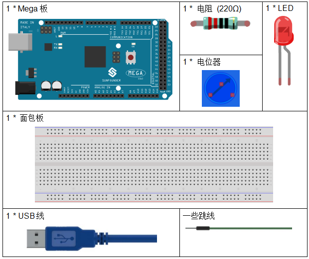

.. _potentiometer_mega:

第 8 课 电位器
=================================================

介绍
-----------------------

在本课中，让我们看看如何通过电位器改变LED的亮度，并在串口监视器中接收电位器的数据以查看其值变化。

所需器件
-------------------

* :ref:`SunFounder Mega板`
* :ref:`面包板`
* :ref:`跳线`
* :ref:`LED发光二极管`
* :ref:`电阻`
* :ref:`电位器`

串行监视器
-----------------------

串行监视器用于控制板和计算机或其他设备之间的通信，可以用来发送和接收数据。它是Arduino环境中的内置软件，你可以点击右上角的按钮打开它。

.. image:: media_mega2560/image125.png
    :align: center

在这里，串行监视器用作计算机和控制板之间通信的中转站。首先，计算机将数据传输到 **串口监视器**，然后由控制板读取数据。最后在控制板进行相关操作。点击右上角的图标，会弹出一个窗口，如下图：

.. image:: media_mega2560/image126.png
    :align: center

原理图
------------------------

在这个实验中，电位器用作分压器，这意味着将设备连接到它的所有三个引脚。将电位器的中间引脚连接到引脚 A0，另外两个引脚分别连接到 5V 和 GND。因此，电位器的电压为0-5V。旋转电位器的旋钮，A0脚的电压会发生变化。然后使用控制板中的 AD 转换器将该电压转换为数字值 (0-1024)。通过编程，我们可以使用转换后的数字值来控制控制板上LED的亮度。

.. image:: media_mega2560/mega18.png
    :align: center

实验步骤
-------------------------------

**第 1 步**：搭建电路。

.. image:: media_mega2560/image128.png
    :align: center

**第 2 步**：打开代码文件 ``Lesson_8_Potentiometer.ino``。

**第 3 步**：选择 **开发板** 和 **端口**。

**第 4 步**：点击 **上传** 按钮来上传代码。

**第 5 步**：打开串口监视器。

找到 ``Serial.begin()``，看看设置了什么波特率，这里是9600。然后点击右上角的图标打开串口监视器。

.. image:: media_mega2560/image129.png
    :align: center

**第 6 步**：设置波特率为9600。

串口监视器的默认波特率为9600，如果代码也设置为9600，则无需更改波特率栏。

.. image:: media_mega2560/image130.png
    :align: center

旋转电位器的轴，你应该看到 LED 的亮度发生变化。

如果要检查相应值的变化，请打开串行监视器，窗口中的数据将随着你旋转电位器旋钮而变化。

.. image:: media_mega2560/image131.jpeg
    :align: center

代码
-------

.. raw:: html

    <iframe src=https://create.arduino.cc/editor/sunfounder01/93dc988d-16a6-4ee9-8ca2-cb91b8985fdf/preview?embed style="height:510px;width:100%;margin:10px 0" frameborder=0></iframe>

代码分析
--------------------

**从 A0 读取值**

.. code-block:: arduino

    inputValue = analogRead(analogPin);//read the value from the potentiometer

这一行是将 A0 读取的值存储在之前定义的 ``inputValue`` 中。

``analogRead()`` 从指定的模拟引脚读取值。这意味着它会将 0 到 5 伏之间的输入电压映射为 0 到 1023 之间的整数值。

**在串行监视器上打印值**

.. code-block:: arduino

    Serial.print("Input: "); //print "Input"
    Serial.println(inputValue); //print inputValue

* ``Serial.print()``：将数据作为人类可读的ASCII文本打印到串口。这个命令可以有多种形式。数字被打印为每个数字的ASCII字符。浮点数同样被打印为ASCII数字，默认为两位小数。字节以单个字符的形式发送。字符和字符串按原样发送。
* ``Serial.println()``：与 ``Serial.print()`` 相同，但它后面有一个回车字符（ASCII 13，或'\r'）和一个换行字符（ASCII 10，或'\n'）。

**将值映射**

.. code-block:: arduino

    outputValue = map(inputValue, 0, 1023, 0, 255); //Convert from 0-1023 proportional to the number of a number of from 0 to 255

* ``map(value, fromLow, fromHigh, toLow, toHigh)`` 函数是将数字从一个范围重新映射到另一个范围。也就是说，值fromLow将被映射到了tolow，值fromHigh到toHigh，值之间以值之间，等等。

由于 ``ledPin`` 的范围是0-255，我们需要将0-1023映射到0-255。

以同样的方式在串口监视器中显示输出值。如果你对 ``map()`` 函数不是很清楚，你可以观察串口监视器中的数据并进行分析。

.. code-block:: arduino

    Serial.print("Output: "); //print "Output"

    Serial.println(outputValue); //print outputValue

**将电位器的值写到LED上**

.. code-block:: arduino

    analogWrite(ledPin, outputValue); //turn the LED on depending on the output value

将输出值写入 ``ledPin``，你将看到 LED 的亮度随着你旋转电位器旋钮而变化。

* ``analogWrite()``：将模拟值（PWM 波）写入引脚。它与模拟引脚无关，仅适用于 PWM 引脚。在调用 ``analog Write()`` 之前，你不需要调用 ``pinMode()`` 将引脚设置为输出 。

实验总结
------------------------

这个实验也可以随意改成其他的。例如，使用电位器来控制 LED 闪烁的时间间隔。就是利用从电位器读取的数值进行延时，如下图。试试！

.. code-block:: arduino

    inputValue = analogRead(analogPin);
    digitalWrite(ledPin, HIGH);
    delay(inputValue);
    digitalWrite(ledPin, LOW);
    delay(inputValue);

