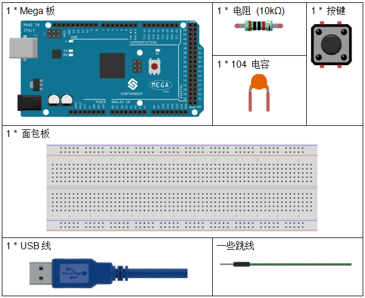
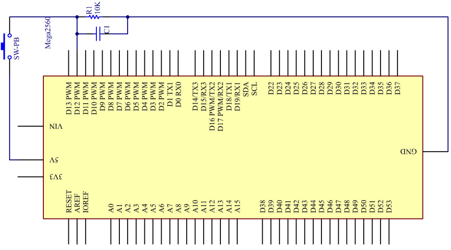
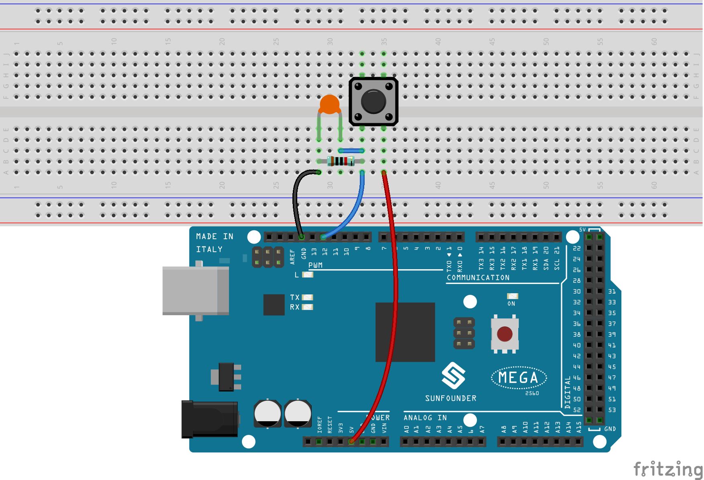
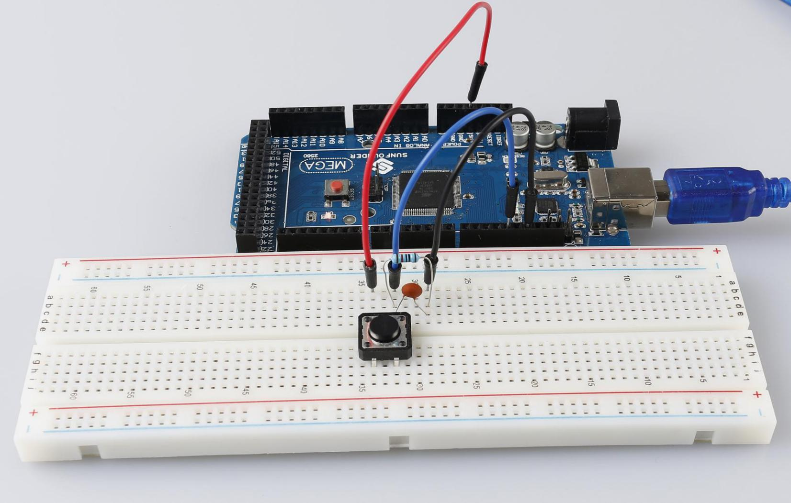

.. _button_mega:

第 3 课 按键
=====================================

介绍
----------------

在本实验中，我们将学习如何使用 I/O 端口和按键来打开/关闭 LED。

“I/O 端口”是指 INPUT 和 OUTPUT 端口。这里使用控制板的 INPUT 端口来读取外部设备的输出。由于板子本身有一个 LED（连接到引脚 13），为了方便起见，你可以使用这个 LED 来做这个实验。

所需器件
----------------

* :ref:`SunFounder Mega板`
* :ref:`面包板`
* :ref:`跳线`
* :ref:`电阻`
* :ref:`电容`
* :ref:`按键`

原理图
------------------------------

按键一端接12脚，同时接下拉电阻和0.1uF（104）电容（用来消除抖动让按键工作时能够输出稳定电平）。

将电阻和电容的另一端连接到 GND，将按键另一端的一个引脚连接到 5V。按下按键时，引脚 12 为 5V（高电平），此时将13引脚设置为高电平来将控制板上的内置LED点亮。然后松开按键（引脚 12 变为低电平），引脚 13 为低电平。因此，我们将看到 LED 在按下和释放按键时交替亮起和熄灭。

原理图如下所示：

实验步骤
---------------------------------

**第 1 步**：搭建电路。

**第 2 步**：打开代码文件 ``Lesson_3_Button.ino``。

**第 3 步**：选择 **开发板** 和 **端口**。

**第 4 步**：点击 **上传** 按钮来上传代码。

现在按下按键，控制板上的LED被点亮。

代码
--------

.. raw:: html

    <iframe src=https://create.arduino.cc/editor/sunfounder01/823bb97c-55c3-492d-9853-62ba474aafb4/preview?embed style="height:510px;width:100%;margin:10px 0" frameborder=0></iframe>

代码分析
----------------

**定义变量**

.. code-block:: arduino

    const int buttonPin = 12; //the button connect to pin 12
    const int ledPin = 13; //the led connect to pin13
    int buttonState = 0; // variable for reading the pushbutton status

将按键连接到引脚12，LED已经连接到引脚 13。定义一个变量 ``buttonState`` 来存储按键的值。

**设置引脚的输入输出状态**

.. code-block:: arduino

    pinMode(buttonPin, INPUT); //initialize thebuttonPin as input
    pinMode(ledPin, OUTPUT); //initialize the led pin as output

本次实验我们需要知道按键的状态，所以这里设置 ``buttonPin`` 为 ``INPUT`` ；要设置 LED 的高/低，我们将 ``LedPin`` 设置为 ``OUTPUT``。

**读取按键状态**

.. code-block:: arduino

    buttonState = digitalRead(buttonPin);

``buttonPin``(Pin12) 是数字引脚；这里是读取按键的值并将其存储在 ``buttonState`` 中。

* ``digitalRead (Pin)``：从指定的数字引脚读取值，无论是高电平还是低电平。

**按键按下时让LED点亮**

.. code-block:: arduino

    if (buttonState == HIGH )
    {
        digitalWrite(ledPin, HIGH); //turn the led on
    }
    else
    {
        digitalWrite(ledPin, LOW); //turn the led off
    }

在这部分代码中，当 ``buttonState`` 为 ``HIGH`` 时，让 ``ledPin`` 为 ``HIGH`` ，LED会被点亮。

由于按键的一端已连接至 5V，另一端已连接至引脚 12，因此按下按键时，引脚 12 为 5V（高电平）。
然后用 ``if ()`` 判断；如果条件为真，则 LED 将亮起。

``else`` 意味着当 ``if(conditional)`` 被确定为 ``false`` 时，运行 ``else``。
