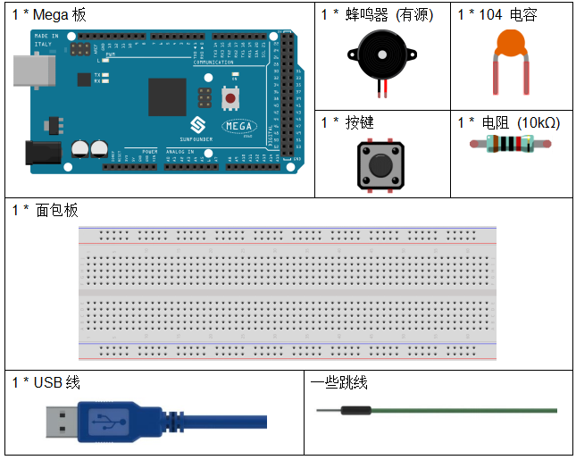
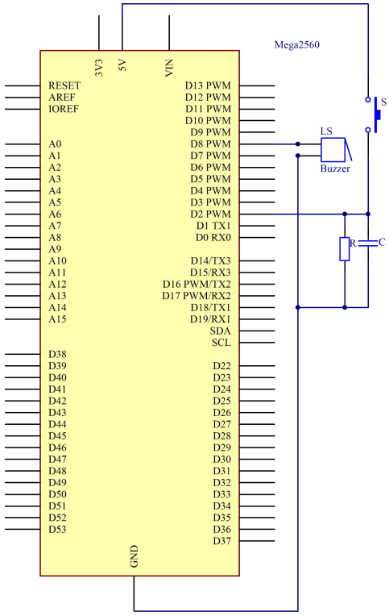
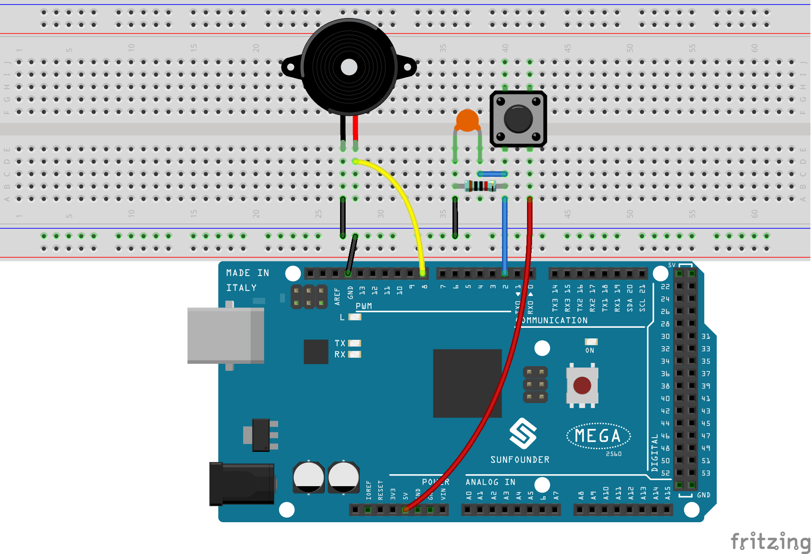
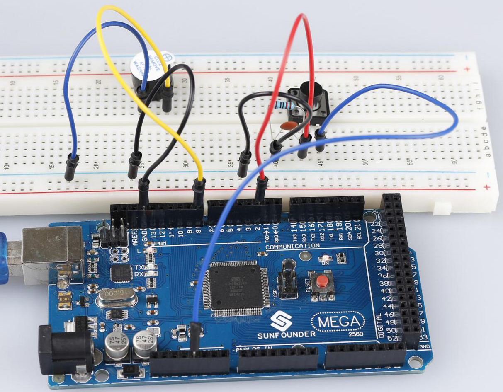

.. _doorbell_mega:

第 4 课 蜂鸣器
====================

介绍
--------------

每当你想发出声音时，蜂鸣器都是你实验中的绝佳工具。在本课中，我们将学习如何驱动有源蜂鸣器来制作一个简单的门铃。

所需器件
----------------

* :ref:`SunFounder Mega板`
* :ref:`面包板`
* :ref:`跳线`
* :ref:`电阻`
* :ref:`电容`
* :ref:`按键`
* :ref:`蜂鸣器`

原理图
-------------------------

在这个课程中，使用的是有源蜂鸣器。

原理图如下所示：

实验步骤
-------------------------------

**第 1 步**：搭建电路。（蜂鸣器长的引脚为阳极，短的为阴极）

**第 2 步**：打开代码文件 ``Lesson_4_Buzzer.ino``。

**第 3 步**：选择 **开发板** 和 **端口**。

**第 4 步**：点击 **上传** 按钮来上传代码。

按下按键，蜂鸣器将发出声音。

代码
--------

.. raw:: html

    <iframe src=https://create.arduino.cc/editor/sunfounder01/fc823eca-3e0a-48b5-b2d4-bc8ed33ac6f1/preview?embed style="height:510px;width:100%;margin:10px 0" frameborder=0></iframe>

代码分析
---------------

**定义变量**

.. code-block:: arduino

    const int buttonPin = 2; //the button connect to pin2
    const int buzzerPin = 8; //the led connect to pin8
    /**********************************/
    int buttonState = 0; //variable for reading the pushbutton status

将按键连接到引脚 2，将蜂鸣器连接到引脚 8。定义一个变量 ``buttonState`` 来存储按键的值。

**设置引脚的输入输出状态**

.. code-block:: arduino

    void setup()
    {
        pinMode(buttonPin, INPUT); //initialize the buttonPin as input
        pinMode(buzzerPin, OUTPUT); //initialize the buzzerpin as output
    }

本次实验我们需要知道按键的状态，所以这里设置 ``buttonPin`` 为 ``INPUT``；要设置蜂鸣器的高/低，我们将 ``buzzerPin`` 设置为 ``OUTPUT``。

**读取按钮状态**

.. code-block:: arduino

    buttonState = digitalRead(buttonPin);

``buttonPin`` (Pin2) 是数字引脚；这里是读取按钮的值并将其存储在 ``buttonState`` 中。

* ``digitalRead (Pin)``：从指定的数字引脚读取值，无论是高电平还是低电平。

**按下按钮让蜂鸣器发出声音**

.. code-block:: Arduino

    if (buttonState == HIGH ) //When press the button, run the following code.
    { 
        for (i = 0; i < 50; i++) 
        /*When i=o, which accords with the condition i<=50, i++ equals to 1 
        (here in i = i + 1, the two "i"s are not the same, but i(now） = i（before） + 1). 
        Run the code in the curly braces: let the buzzer beep for 3ms and stop for 3ms. 
        Then repeat 50 times.*/

        { 
            digitalWrite(buzzerPin, HIGH); //Let the buzzer beep.
            delay(3); //wait for 3ms
            digitalWrite(buzzerPin, LOW); //Stop the buzzer.
            delay(3); //wait for 3ms 
        }

        for (i = 0; i < 80; i++) //Let the buzzer beep for 5ms and stop for 5ms, repeat 80 times.
        { 
            digitalWrite(buzzerPin, HIGH);
            delay(5); //wait for 5ms
            digitalWrite(buzzerPin, LOW);
            delay(5); //wait for 5ms 
        }
    }

在这部分，当 ``buttonState`` 为高电平时，让蜂鸣器以不同的频率发出哔哔声，可以模拟门铃。