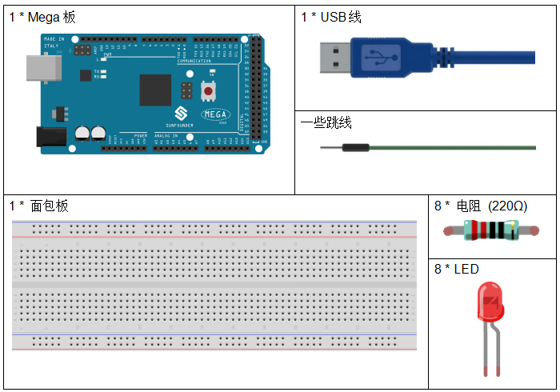
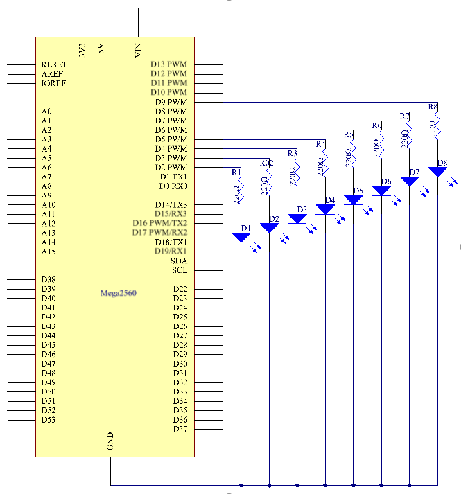
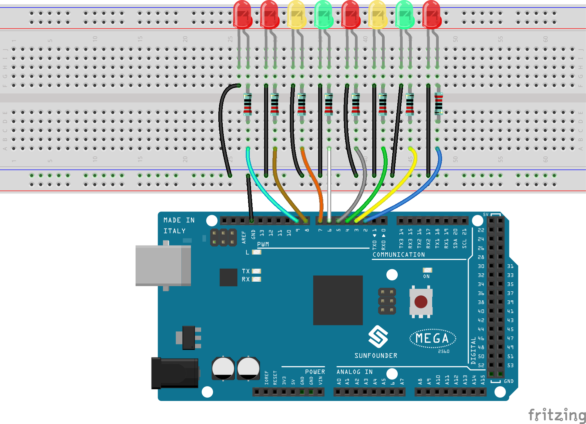
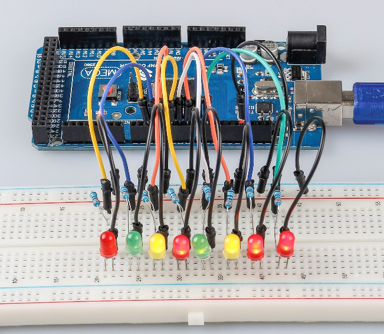

.. _flowing_mega:

第 2 课 流水灯
===============================

介绍
-----------------

在本课中，我们将进行一个简单而有趣的实验——使用 LED 创造流动的 LED 灯。顾名思义，这8颗排成一排的LED依次亮起、变暗，就像流水一样。

所需器件
----------------------

* :ref:`SunFounder Mega板`
* :ref:`面包板`
* :ref:`跳线`
* :ref:`LED发光二极管`
* :ref:`电阻`

原理图
---------------------------

这个实验的原理很简单，就是依次点亮8个LED。8个 LED 分别连接到引脚 2~9。将它们设置为高电平，引脚上相应的 LED 将亮起。控制每个 LED 亮起的时间，你将看到流动的 LED 灯。

原理图如下所示：

实验步骤
------------------------------

**第 1 步**： 搭建电路

**第 2 步**：打开代码文件 ``Lesson_2_Flowing_LED_Lights.ino``。

**第 3 步**：选择 **开发板** 和 **端口**。

**第 4 步**：点击 **上传** 按钮来上传代码。

现在，你应该看到八个LED灯从连接在第2脚的LED到第9脚的LED逐一变亮，然后从第9脚的LED到第2脚的LED依次变暗。这整个过程将重复进行，直到电路断电。

代码
--------

.. raw:: html

    <iframe src=https://create.arduino.cc/editor/sunfounder01/0bbeb938-b857-40fd-beeb-74dfbd5eddb3/preview?embed style="height:510px;width:100%;margin:10px 0" frameborder=0></iframe>    

代码分析
--------------------

**for()语句**

.. code-block:: arduino

    void setup()
    {
        //set pins 2 through 9 as output
        for (int i = 2; i <= 9; i++)
        {
            pinMode(i, OUTPUT); //initialize a as an output
        }
    }

``for (initialization; condition; increment) { //statement(s); }``：
for语句用于重复一个大括号内的语句块。初始化首先发生，而且正好一次。每次通过循环时，都要对条件进行测试；如果条件为真，语句块和增量就会被执行，然后再次测试条件。当条件变为假时，循环结束。

**设置流水灯**

使用 ``for()`` 语句将2引脚~9引脚设置为高电平。

.. code-block:: arduino

    for (int a = 2; a <= 9; a++)
    {
        digitalWrite(a, HIGH); //turn this led on
        delay(100); //wait for 100 ms
    }

然后让8个LED依次从9引脚到2引脚熄灭。

.. code-block:: arduino

    for (int a = 9; a <= 2; a--)
    {
        digitalWrite(a, LOW); //turn this led on
        delay(100); //wait for 100 ms
    }

最后用同样的方法将9引脚到2引脚的8个LED依次点亮，让它们依次熄灭。

.. code-block:: arduino

    for (int a = 9; a <= 2; a--)
    {
        digitalWrite(a, HIGH); //turn this led on
        delay(100); //wait for 100 ms
    }
    for (int a = 2; a <= 9; a++)
    {
        digitalWrite(a, LOW); //turn this led on
        delay(100); //wait for 100 ms
    }

实验总结
------------

通过这个实验，你已经学会了如何使用 ``for()`` 语句，当你想缩短代码时，这是一个非常有用的语句。