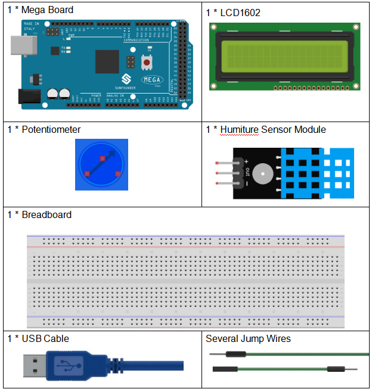
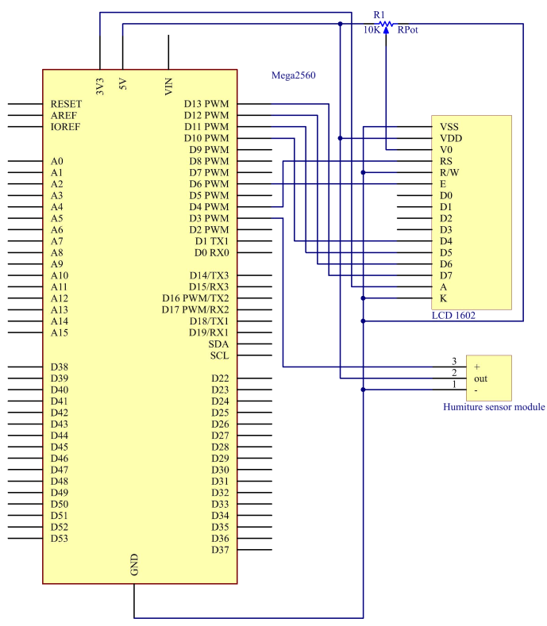
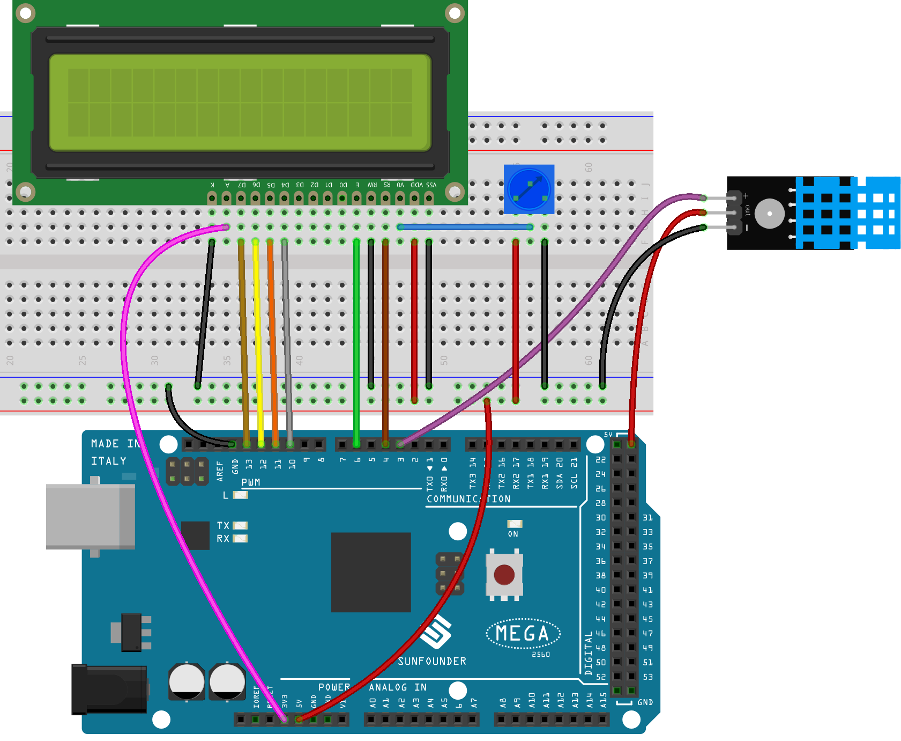

.. _humi_mega:

Lesson 15 Humiture Sensor
============================

Introduction
---------------------

The digital temperature and humidity sensor DHT11 is a composite sensor
that contains a calibrated digital signal output of temperature and
humidity. The technology of a dedicated digital modules collection and
the temperature and humidity sensing technology are applied to ensure
that the product has high reliability and excellent long-term stability.

The sensor includes a resistive sense of wet component and an NTC
temperature measurement device, and is connected with a high-performance
8-bit microcontroller.

Components
------------------

* :ref:`SunFounder Mega Board`
* :ref:`Breadboard`
* :ref:`Jumper Wires`
* :ref:`LCD1602`
* :ref:`Potentiometer`
* :ref:`Humiture Sensor Module`

Schematic Diagram
--------------------------

The schematic diagram:

Experimental Procedures
-----------------------------

**Step 1:** Build the circuit

**Step 2:** Open the code file.

**Step 3:** Select the **Board** and **Port.**

**Step 4:** Upload the sketch to the board.

    .. note::

        * The ``DHT sensor library`` library is used here, you can install it from the **Library Manager**.

        .. image:: img/lib_dht11.png
            :align: center

Now, you can see the value of the current humidity and temperature
displayed on the LCD.

.. image:: img/image196.jpeg
   

Code
-------

.. raw:: html

    <iframe src=https://create.arduino.cc/editor/sunfounder01/1babed03-2393-40a5-af20-41cc2a33bf20/preview?embed style="height:510px;width:100%;margin:10px 0" frameborder=0></iframe>

Code Analysis
------------------

#.  Includes the ``DHT.h`` library, which provides functions to interact with the DHT sensors. Then, set the pin and type for the DHT sensor.

    .. code-block:: arduino

        #include "DHT.h"
        #include <LiquidCrystal.h>                //
        LiquidCrystal lcd(4, 6, 10, 11, 12, 13);  // initialize the LCD1602

        #define DHTPIN 3       // Set the pin connected to the DHT11 data pin
        #define DHTTYPE DHT11  // DHT 11

        DHT dht(DHTPIN, DHTTYPE);

#. Initializes the LCD1602, the serial monitor and the DHT sensor.

    .. code-block:: arduino

        void setup() {
            lcd.begin(16, 2);    // set up the LCD's number of columns and rows:
            Serial.begin(9600);  //set the baud bit to 9600bps
            dht.begin();
        }

#. In the ``loop()`` function, read temperature and humidity values from the DHT11 sensor, and print them to the LCD1602.

    .. code-block:: arduino

        void loop() {
            // Wait a few seconds between measurements.
            delay(2000);

            // Reading temperature or humidity takes about 250 milliseconds!
            // Sensor readings may also be up to 2 seconds 'old' (it's a very slow sensor)
            float humidity = dht.readHumidity();
            // Read temperature as Celsius (the default)
            float temperture = dht.readTemperature();

            // Check if any reads failed and exit early (to try again).
            if (isnan(humidity) || isnan(temperture)) {
                Serial.println("Failed to read from DHT sensor!");
                return;
            }
            // DISPLAY DATA
            lcd.setCursor(0, 0);
            lcd.print("Tem:");
            lcd.print(temperature, 1);  //print the temperature on lcd
            lcd.print(" C");
            lcd.setCursor(0, 1);
            lcd.print("Hum:");
            lcd.print(humidity, 1);  //print the humidity on lcd
            lcd.print(" %");
            delay(200);  //wait a while
        }

    * The ``dht.readHumidity()`` function is called to read the humidity value from the DHT sensor.
    * The ``dht.readTemperature()`` function is called to read the temperature value from the DHT sensor.
    * The ``isnan()`` function is used to check if the readings are valid. If either the humidity or temperature value is NaN (not a number), it indicates a failed reading from the sensor, and an error message is printed.