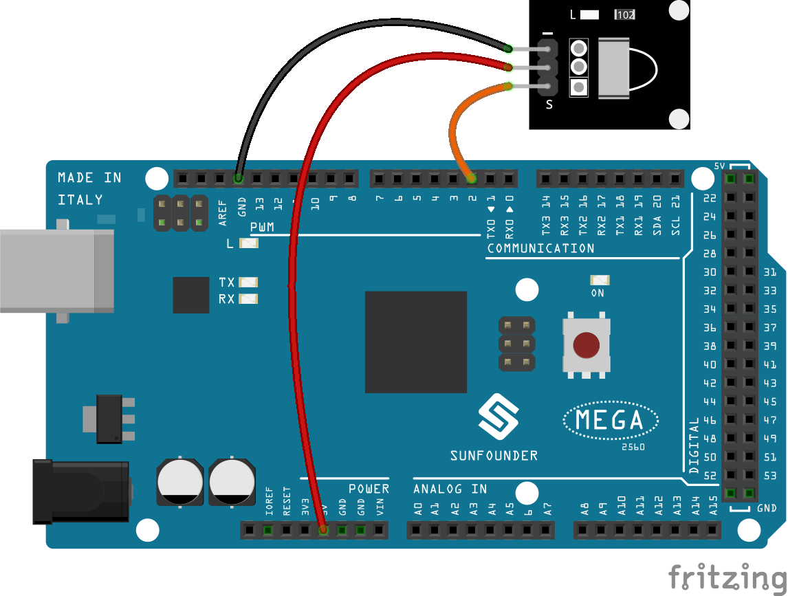

.. _receive_mega:

Lesson 14 Infrared-Receiver
============================

Introduction
-------------------

An infrared-receiver is a component that receives infrared signals and
can independently receive infrared ray and output signals compatible
with TTL level. It's similar with a normal plastic-packaged transistor
in size and it is suitable for all kinds of infrared remote control and
infrared transmission.

Components
-------------------

.. image:: img/mega27.png
    :align: center

* :ref:`SunFounder Mega Board`
* :ref:`Breadboard`
* :ref:`Jumper Wires`
* :ref:`IR Receiver Module`

Schematic Diagram
----------------------------

Control a certain key (for example, Power key) via a remote controller
by programming. When you press the key, infrared rays will be emitted
from the remote controller and received by the infrared receiver, and
the LED on the Mega 2560 board will light up.

The schematic diagram:

.. image:: img/image187.png
    :align: center

Experimental Procedures
----------------------------------

**Step 1:** Build the circuit

**Step 2:** Open the code file.

**Step 3:** Select the **Board** and **Port.**

**Step 4:** Upload the sketch to the board.

After uploading the codes, you can see that the current value of the pressed button of IR Remote Controller displays on the serial monitor.

.. note::

    * The ``IRremote`` library is used here, you can install it from the **Library Manager**.

        .. image:: img/lib_irremote.png
            :align: center

.. Note::

    * There is a transparent plastic piece at the back of the remote control to cut off the power and pull it out before you use the remote control.
    * Please gently press the button on the remote to avoid invalid data FFFFFFFF.

Code
--------

.. raw:: html

    <iframe src=https://create.arduino.cc/editor/sunfounder01/a00ba6b0-274a-487a-84bf-8922cbf3a9f8/preview?embed style="height:510px;width:100%;margin:10px 0" frameborder=0></iframe>

Code Analysis
----------------------

This code is designed to work with an infrared (IR) remote control using the ``IRremote`` library. Here's the breakdown:

#. Include Libraries: This includes the IRremote library, which provides functions to work with IR remote controls.

    .. code-block:: arduino

        #include <IRremote.h>

#. Defines the Arduino pin to which the IR sensor's signal pin is connected and declares a variable to store the last decoded IR value.

    .. code-block:: arduino

        const int IR_RECEIVE_PIN = 11;  // Define the pin number for the IR Sensor
        String lastDecodedValue = "";  // Variable to store the last decoded value

#. Initializes serial communication at a baud rate of 9600. Initializes the IR receiver on the specified pin (``IR_RECEIVE_PIN``) and enables LED feedback (if applicable).

    .. code-block:: arduino

        void setup() {
            Serial.begin(9600);                                     // Start serial communication at 9600 baud rate
            IrReceiver.begin(IR_RECEIVE_PIN, ENABLE_LED_FEEDBACK);  // Start the IR receiver
        }

#. The loop runs continuously to process incoming IR remote signals.

    .. code-block:: arduino

        void loop() {
            if (IrReceiver.decode()) {
                String decodedValue = decodeKeyValue(IrReceiver.decodedIRData.command);
                if (decodedValue != "ERROR" && decodedValue != lastDecodedValue) {
                    Serial.println(decodedValue);
                    lastDecodedValue = decodedValue;  // Update the last decoded value
                }
                IrReceiver.resume();  // Enable receiving of the next value
            }
        }
    
    * Checks if an IR signal is received and successfully decoded.
    * Decodes the IR command and stores it in ``decodedValue`` using a custom ``decodeKeyValue()`` function.
    * Checks if the decoded value is not an error and is different from the last decoded value.
    * Prints the decoded IR value to the serial monitor.
    * Updates the ``lastDecodedValue`` with the new decoded value.
    * Resumes IR signal reception for the next signal.
