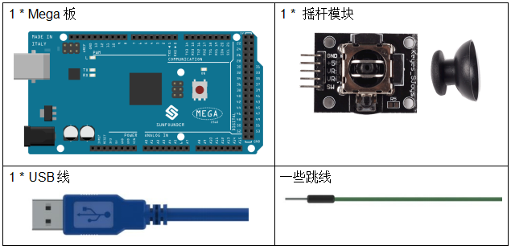
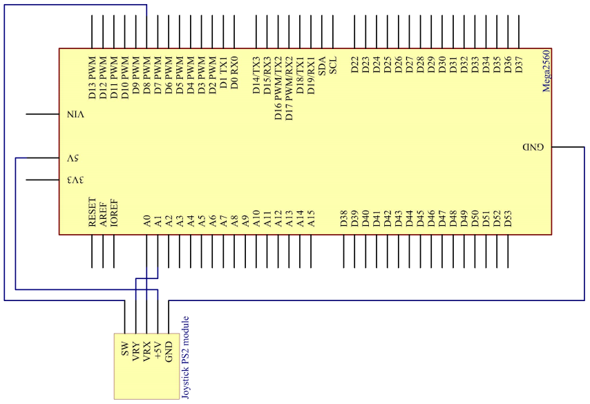
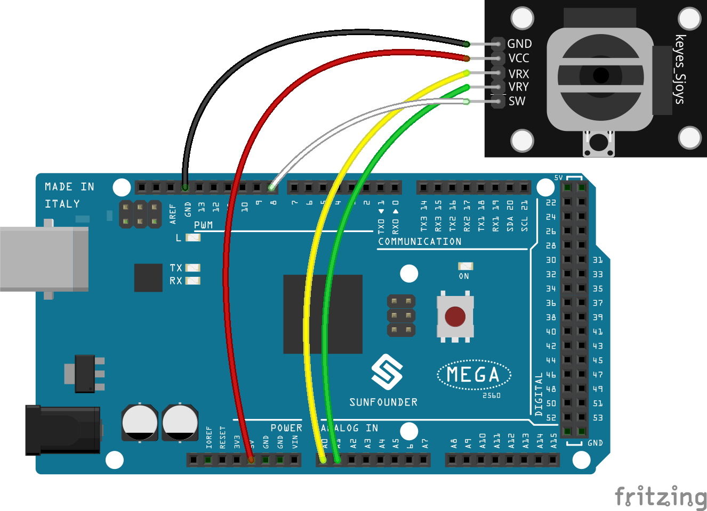
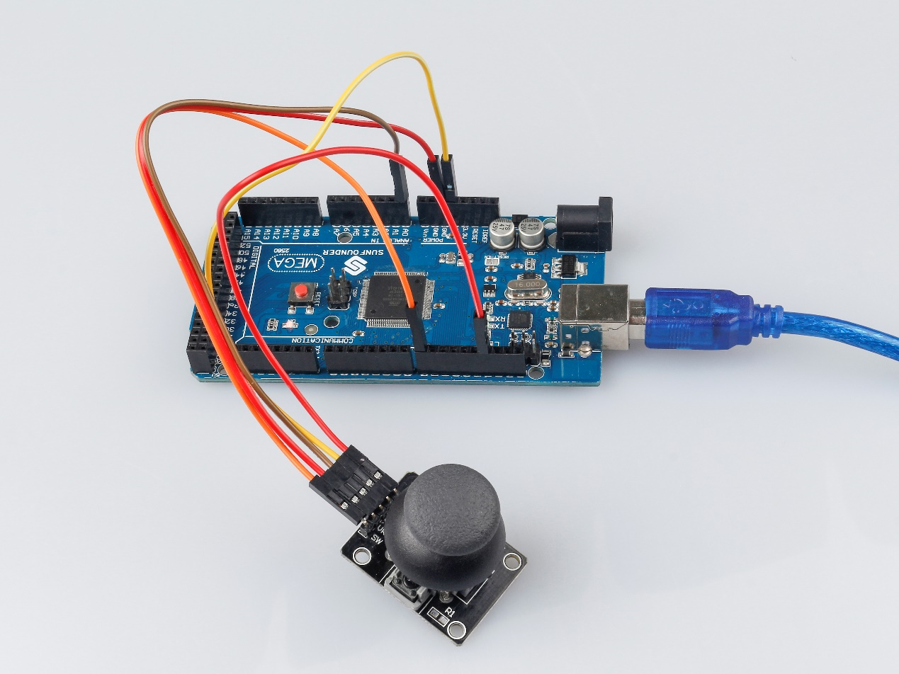

.. _joystick_mega:

第 16 课 摇杆
===========================

介绍
---------------

操纵杆是一种输入设备，由一个在底座上旋转的操纵杆组成，并向它所控制的设备报告其角度或方向。操纵杆通常用于控制视频游戏和机器人，此处使用操纵杆 PS2。

所需器件
----------------

* :ref:`SunFounder Mega板`
* :ref:`面包板`
* :ref:`跳线`
* :ref:`摇杆模块`

原理图
--------------------------

该模块有2路模拟量输出（对应X，Y双轴偏移）和1路数字输出（Z轴），用来表示摇杆是否被按压。

在这个实验中，将在串口监视器中显示摇杆上的X,Y和Z轴上的值的变化。

原理图如下所示：

实验步骤
---------------------------

**第 1 步**：搭建电路。

**第 2 步**：打开代码文件 ``Lesson_16_Joystick_PS2.ino``。

**第 3 步**：选择 **开发板** 和 **端口**。

**第 4 步**：点击 **上传** 按钮来上传代码。

现在，拨动摇杆，串口监视器上显示的 X 和 Y 轴坐标会相应改变；按摇杆，会显示 Z=0。

代码
--------

.. raw:: html

   <iframe src=https://create.arduino.cc/editor/sunfounder01/c3035a9a-e46e-4848-8325-c36f54adb047/preview?embed style="height:510px;width:100%;margin:10px 0" frameborder=0></iframe>

代码分析
-------------------

该代码使用串行监视器打印操纵杆 ps2 的 VRX、VRY 和 SW 引脚的值。

.. code-block:: Arduino

    void loop()
    {
        Serial.print("X: "); 
        Serial.print(analogRead(xPin), DEC);  // print the value of VRX in DEC
        Serial.print("|Y: ");
        Serial.print(analogRead(yPin), DEC);  // print the value of VRX in DEC
        Serial.print("|Z: ");
        Serial.println(digitalRead(swPin));   // print the value of SW
        delay(500);
    }

* ``"|Y: "`` 中的 ``|`` 用来隔开数据。

