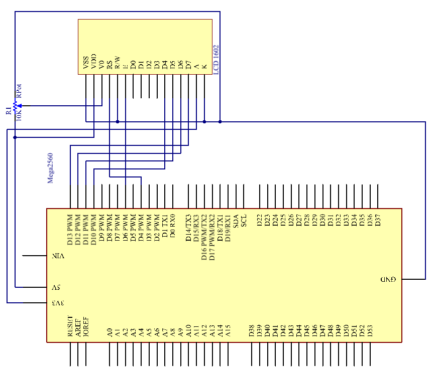
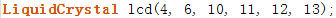
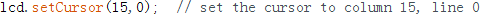
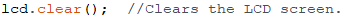
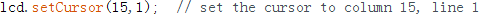

Lesson 11 LCD1602
======================

Introduction
---------------------

In this lesson, we will learn how to use an LCD1602 to display
characters and strings. LCD1602, or 1602 character-type liquid crystal
display, is a kind of dot matrix module to show letters, numbers, and
characters and so on. It's composed of 5x7 or 5x11 dot matrix positions;
each position can display one character. There's a dot pitch between two
characters and a space between lines, thus separating characters and
lines. The number 1602 means on the display, 2 rows can be showed and 16
characters in each. Now let's check more details!

Components
----------------

.. image:: media_mega2560/mega23.png
    :align: center

Experimental Principle
-----------------------------

Generally, LCD1602 has parallel ports, that is, it would control several
pins at the same time. LCD1602 can be categorized into eight-port and
four-port connections. If the eight-port connection is used, then all
the digital ports of the Mega 2560 board are almost completely occupied.
If you want to connect more sensors, there will be no ports available.
Therefore, the four-port connection is used here for better application.

Pins of LCD1602 and their functions
^^^^^^^^^^^^^^^^^^^^^^^^^^^^^^^^^^^^^^^

**VSS:** connected to ground

**VDD:** connected to a +5V power supply

**VO:** to adjust the contrast

**RS:** A register select pin that controls where in the LCD’s memory
you are writing data to. You can select either the data register, which
holds what goes on the screen, or an instruction register, which is
where the LCD’s controller looks for instructions on what to do next.

**R/W:** A Read/Write pin to select between reading and writing mode

**E:** An enabling pin that reads the information when High level (1) is
received. The instructions are run when the signal changes from High
level to Low level.

**D0-D7:** to read and write data

**A and K:** Pins that control the LCD backlight. Connect K to GND and A
to 3.3v. Open the backlight and you will see clear characters in a
comparatively dark environment.

Principle
^^^^^^^^^^^^^

Connect K to GND and A to 3.3 V, and then the backlight of the LCD1602
will be turned on. Connect VSS to GND and the LCD1602 to the power
source. Connect VO to the middle pin of the potentiometer – with it you
can adjust the contrast of the screen display. Connect RS to D4 and R/W
pin to GND, which means then you can write characters to the LCD1602.
Connect E to pin6 and the characters displayed on the LCD1602 are
controlled by D4-D7. For programming, it is optimized by calling
function libraries.

The schematic diagram:

Experimental Procedures
---------------------------

**Step 1:** Build the circuit (make sure the pins are connected
correctly. Otherwise, characters will not be displayed properly)

.. image:: media_mega2560/image161.png
    :align: center

**Step 2:** Open the code file.

**Step 3:** Select the **Board** and **Port.**

**Step 4:** Upload the sketch to the board.

.. Note::
    you may need to adjust the potentiometer on the LCD1602 until it
    can display clearly.

You should now see the characters "**SunFounder**" and "**hello,
world**" rolling on the LCD.

.. image:: media_mega2560/image162.jpeg
    :align: center

Code
-------

.. raw:: html

    <iframe src=https://create.arduino.cc/editor/sunfounder01/a83b36b0-4d7a-4df7-bb12-abe20f9a57ff/preview?embed style="height:510px;width:100%;margin:10px 0" frameborder=0></iframe>

Code Analysis
--------------------

**Code Analysis** **13-1** **Include a library**

.. image:: media_mega2560/image163.png

With the *LiquidCrystal.h* file included, you can call the functions in
this file later.

LiquidCrystal is a built-in library in the Arduino IDE. You can find the
LiquidCrystal folder under the installation path *C:\\Program
Files\\Arduino\\libraries*.

.. image:: media_mega2560/image164.png

There is an example in the *examples* folder. The src folder contains
the major part of the library: *LiquidCrystal.cpp* (execution file, with
function implementation, variable definition, etc.) and LiquidCrystal.h
(header file, including function statement, Macro definition, struct
definition, etc.). If you want to explore how a function is implemented,
you can look up in the file *LiquidCrystal.cpp*.

**Code Analysis** **13-2** **Displayed characters**

.. image:: media_mega2560/image165.png

These are two character type arrays: *arry1[]* and *array2[]*. The
contents in the quotation marks ”xxx” are their elements, including 26
characters in total (spaces counted). *array1[0]* stands for the first
element in the array, which is a space, and *array1[2]* means the second
element *S* and so on. So *array1[25]* is the last element (here it's
also a space).

**Code Analysis** **13-3** **Define the pins of LCD1602**

Define a variable *lcd* of LiquidCrystal type. Here use *lcd* to
represent *LiquidCrystal* in the following code.

The basic format of the *LiquidCrysral()* function is: LiquidCrystal
(rs, enable, d4, d5, d6, d7). You can check the *LiquidCrystal.cpp* file
for details.

So this line defines that pin RS is connected to pin 4, the enable pin
to pin 6, and d4-d7 to pin10-13 respectively.

**Code Analysis** **13-4** **Initialize the LCD**

.. image:: media_mega2560/image167.png

begin(col,row) is to set the display of LCD. Here set as 16 x 2.

**Code Analysis** **13-5** **Set the cursor position of LCD**

**setCursor(col,row)** sets the position of the cursor which is where
the characters start to show. Here set it as 15col, 0 row.

**Code Analysis** **13-6** **LCD displays the elements inside array1[]
and array2[]**

.. code-block:: Arduino

    for (int positionCounter1 = 0; positionCounter1 < 26; positionCounter1++)
    {

        lcd.scrollDisplayLeft(); // Scrolls the contents of the display one space to the left.

        lcd.print(array1[positionCounter1]); // Print a message to the LCD.

        delay(tim); // wait for 250 microseconds

    }

When *positionCounter1*\ =0, which accords with *positionCounter1*\ <26,
*positionCounter1* adds 1. Move one bit to the left through
*lcd.scrollDisplayLeft()*. Make the LCD display array1[0] by
*lcd.print*\ (array1[positionCounter1]) and delay for *tim* ms (250 ms).
After 26 loops, all the elements in *array1[]* have been displayed.

Clear the screen with *lcd.clear()* so it won't influence the display
next time.

Set the cursor at Col. 15 Line 1, where the characters will
start to show.

.. code-block:: Arduino

    for (int positionCounter2 = 0; positionCounter2 < 26; positionCounter2++)
    {

        lcd.scrollDisplayLeft(); // Scrolls the contents of the display one space to the left.

        lcd.print(array2[positionCounter2]); // Print a message to the LCD.

        delay(tim); // wait for 250 microseconds

    }

Similarly, the code is to display the elements in *array2[]* on the LCD.
Therefore, you will see “SunFounder” scroll in the top line of the LCD,
move left until it disappears. And then in the bottom line, “hello,
world ! " appears, scrolls to the left until it disappears.