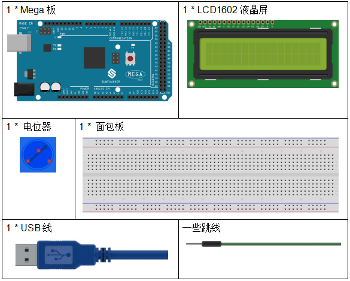

.. _lcd1602_mega:

第 11 课 LCD1602
======================

介绍
---------------------

在本课中，我们将学习如何使用 LCD1602 来显示字符和字符串。LCD1602，即1602字符型液晶显示器，是一种显示字母、数字、字符等的点阵模块。它由 5x7 或 5x11 点阵位置组成；每个位置可以显示一个字符。两个字符之间有一个点间距，行之间有一个空格，从而将字符和行分开。数字 1602 表示在显示屏上可以显示 2 行，每行 16 个字符。现在让我们学习下如何使用它。

所需器件
----------------

* :ref:`SunFounder Mega板`
* :ref:`面包板`
* :ref:`跳线`
* :ref:`LCD1602液晶显示屏`
* :ref:`电位器`

原理图
-----------------------------

* 连接 **K** 到GND和 **A** 至3.3 V，然后将LCD1602的背光将被打开。
* 将 **VSS** 连接到GND。
* 将 **VO** 连接到电位器的中间引脚 - 你可以使用它来调整屏幕显示的对比度。
* 连接RS到D4和R / W连接到GND，该装置则可以写入字符的LCD1602。
* 将 **E** 接6引脚，LCD1602上显示的字符由 **D4-D7** 控制。

原理图如下所示：

.. image:: media_mega2560/image160.png
    :align: center

实验步骤
---------------------------

**第 1 步**：搭建电路。（请仔细按下图接线，以免液晶屏无法正常工作。）

.. image:: media_mega2560/image161.png
    :align: center

**第 2 步**：打开代码文件 ``Lesson_11_LCD1602.ino``。

**第 3 步**：选择 **开发板** 和 **端口**。

**第 4 步**：点击 **上传** 按钮来上传代码。

.. note::

    代码上传完成之后，若不显示或者显示不清晰，可旋转电位器来调整对比度（亮/暗显示比例）。

你现在应该看到字符 ``SunFounder`` 和 ``hello, world`` 在 LCD1602上滚动。

.. image:: media_mega2560/image162.jpeg
    :align: center

代码
-------

.. raw:: html

    <iframe src=https://create.arduino.cc/editor/sunfounder01/a83b36b0-4d7a-4df7-bb12-abe20f9a57ff/preview?embed style="height:510px;width:100%;margin:10px 0" frameborder=0></iframe>

代码分析
--------------------

**导入一个库**

.. code-block:: arduino

    #include <LiquidCrystal.h>// include the library code

由于包含了 ``LiquidCrystal.h`` 文件，你可以在以后调用该文件中的函数。

``LiquidCrystal`` 是Arduino IDE中的一个内置库。你可以在安装路径, 默认是 ``C:\Program Files\Arduino\libraries`` 下找到 ``LiquidCrystal`` 文件夹。

在 ``examples`` 文件夹包含的是相关的示例代码。 ``src`` 文件夹包含了库的主要部分： ``LiquidCrystal.cpp``（执行文件，包括函数实现、变量定义等）和 ``LiquidCrystal.h``（头文件，包括函数声明、宏定义、结构定义等）。如果你想探索某个函数是如何实现的，你可以在 ``LiquidCrystal.cpp`` 文件中查找。

**需显示的字符串**

.. code-block:: arduino

    char array1[]=" SunFounder "; //the string to print on the LCD
    char array2[]="hello, world! "; //the string to print on the LCD

这是两个字符型数组： ``arry1[]`` 和 ``array2[]``。引号 ``"xxx "`` 中的内容是它们的元素，总共包括26个字符（空格算在内）。 ``array1[0]`` 代表数组中的第一个元素，是一个空格， ``array1[2]`` 意味着第二个元素S，以此类推。所以 ``array1[25]`` 是最后一个元素（这里也是一个空格）。

**定义LCD1602的引脚**

.. code-block:: arduino

    LiquidCrystal lcd(4, 6, 10, 11, 12, 13);

定义一个 ``LiquidCrystal`` 类型的变量 ``lcd``。这里用 ``lcd`` 来表示下面代码中的 ``LiquidCrystal``。

* ``LiquidCrysral()`` 函数的基本格式是： ``LiquidCrystal（rs, enable, d4, d5, d6, d7）``。你可以查看 ``LiquidCrystal.cpp`` 文件了解详情。

所以这一行定义了RS脚与4脚相连，enable脚与6脚相连，d4-d7分别与10-13脚相连。

**初始化LCD1602**

.. code-block:: arduino

    lcd.begin(16, 2); // set up the LCD's number of columns and rows: begin(col,row) is to set the display of LCD. Here set as 16 x 2.

**设置光标的位置**

.. code-block:: arduino

    lcd.setCursor(15,0); // set the cursor to column 15, line 0

* ``setCursor(col,row)`` 用来设置光标的位置，即开始显示字符的地方。这里把它设置为 15 列（第16列），0 行（第 1 行）。

**LCD1602显示字符**

.. code-block:: arduino

    for ( int positionCounter1 = 0; positionCounter1 < 26; positionCounter1++)
    {
        lcd.scrollDisplayLeft(); //Scrolls the contents of the display one space to the left.
        lcd.print(array1[positionCounter1]); // Print a message to the LCD.
        delay(tim); //wait for 250 microseconds
    }

当 ``positionCounter1 = 0`` 时，与 ``positionCounter1 < 26`` 一致。
``positionCounter1`` 加1，通过 ``lcd.scrollDisplayLeft()`` 向左移动一位。
通过 ``lcd.print(array1[positionCounter1])`` 使LCD显示 ``array1[0]``， 并延迟 ``tim`` ms（250ms）。
循环26次后， ``array1[]`` 中的所有元素都被显示。

.. code-block:: arduino

    lcd.clear(); //Clears the LCD screen.

用 ``lcd.clear()`` 清除屏幕，这样它就不会影响下次的显示了。

.. code-block:: arduino

    lcd.setCursor(15,1); // set the cursor to column 15, line 1 // Set the cursor at Col. 15 Line 1, where the characters will start to show.
    for (int positionCounter2 = 0; positionCounter2 < 26; positionCounter2++)
    {
        lcd.scrollDisplayLeft(); //Scrolls the contents of the display one space to the left.
        lcd.print(array2[positionCounter2]); // Print a message to the LCD.
        delay(tim); //wait for 250 microseconds
    }

同样地，代码是在LCD上显示 ``array2[]`` 中的元素。因此，你会看到 ``SunFounder`` 在LCD的第一行向左移动直到消失。然后在第二行显示 ``hello, world !``，同时也向左滚动直到消失。