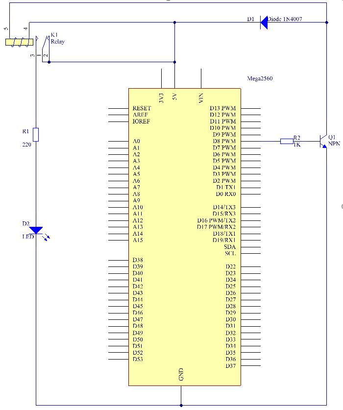
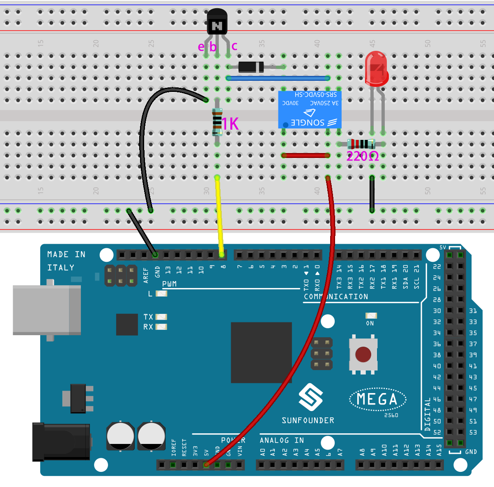
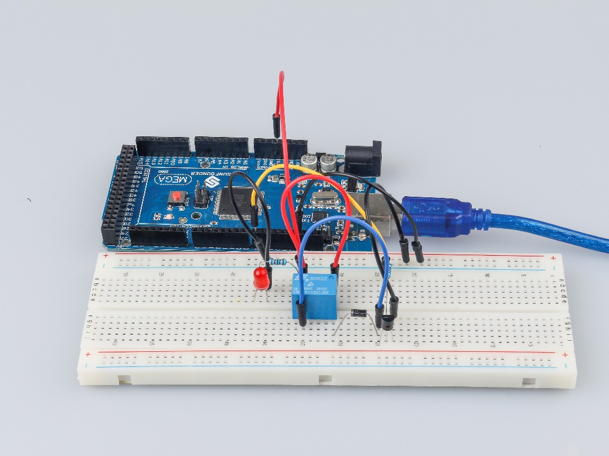
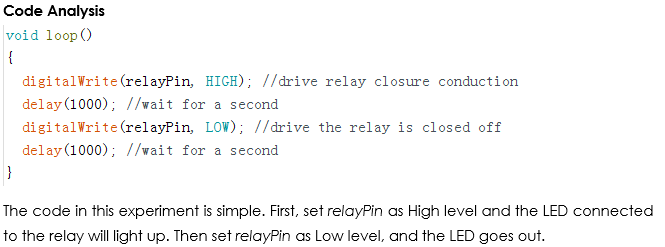

Lesson 6 Relay
====================

Introduction
--------------

As we may know, relay is a device which is used to provide connection
between two or more points or devices in response to the input signal
applied. In other words, relays provide isolation between the controller
and the device as devices may work on AC as well as on DC. However, they
receive signals from a microcontroller which works on DC hence 
requiring a relay to bridge the gap. Relay is extremely useful when you
need to control a large amount of current or voltage with small
electrical signal.

Components
------------------

.. image:: media_mega2560/mega12.png
    :align: center

Experimental Principle
--------------------------

Relay
^^^^^^^^^

There are 5 parts in every relay:

1. **Electromagnet** – It consists of an iron core wounded by coil of
wires. When electricity is passed through, it becomes magnetic.
Therefore, it is called electromagnet.

2. **Armature** – The movable magnetic strip is known as armature. When
current flows through them, the coil is it energized thus producing a
magnetic field which is used to make or break the normally open (N/O) or
normally close (N/C) points. And the armature can be moved with direct
current (DC) as well as alternating current (AC).

3. **Spring** – When no currents flow through the coil on the
electromagnet, the spring pulls the armature away so the circuit cannot
be completed.

4. Set of electrical **contacts** – There are two contact points:

* Normally open – connected when the relay is activated, and disconnected when it is inactive.

* Normally close – not connected when the relay is activated, and connected when it is inactive.

5. **Molded frame** – Relays are covered with plastic for protection.

Working of Relay
^^^^^^^^^^^^^^^^^^^^^^^

The working principle of relay is simple. When power is supplied to the
relay, currents start flowing through the control coil; as a result, the
electromagnet starts energizing. Then the armature is attracted to the
coil, pulling down the moving contact together thus connecting with the
normally open contacts. So the circuit with the load is energized. Then
breaking the circuit would a similar case, as the moving contact will be
pulled up to the normally closed contacts under the force of the spring.
In this way, the switching on and off of the relay can control the state
of a load circuit. 

.. image:: media_mega2560/image102.jpeg

Transistor
^^^^^^^^^^^^

Transistor is a semiconductor device that controls current by current.
It functions by amplifying weak signal to larger amplitude signal and is
also used for non-contact switch. A transistor is a three-layer
structure composed of P-type and N-type semiconductors. They form the
three regions internally. The thinner in the middle is the base region;
the other two are both N-type or P-type ones – the smaller region with
intense majority carriers is the emitter region, when the other one is
the collector region. This composition enables the transistor to be an
amplifier.

.. image:: media_mega2560/image103.jpeg

From these three regions, three poles are generated respectively, which
are base (b), emitter (e), and collector (c). They form two P-N
junctions, namely, the emitter junction and collection junction. The
direction of the arrow in the transistor circuit symbol indicates that
of the emitter junction. Based on the semiconductor type, transistors
can be divided into two groups, the NPN and PNP ones. From the
abbreviation, we can tell that the former is made of two N-type
semiconductors and one P-type and that the latter is the opposite. See
the figure below. 

.. image:: media_mega2560/image104.png

When a High level signal goes through an NPN transistor, it is
energized. But a PNP one needs a Low level signal to manage it. Both
types of transistor are frequently used for contactless switches, just
like in this experiment.

The schematic diagram:

**Principle:** Connect a 1K resistor (for current limiting
when the transistor is energized) to pin 8 of the SunFounder Mega2560
board, then to an NPN transistor whose collector is connected to the
coil of a relay and emitter to GND; connect the normally open contact of
the relay to an LED and then GND. Therefore, when a High level signal is
given to pin 8, the transistor is energized, thus making the coil of the
relay conductive. Then its normally open contact is closed, and the LED
will light up. When pin 8 is given a Low level, the LED will stay dim.

**Function of the freewheeling diode:** When the voltage input changes
from High (5V) to Low (0V), the transistor changes from saturation
(three working conditions: amplification, saturation, and cut-off) to
cut-off, the current in the coil suddenly has no way to flow through. At
this moment, without the freewheeling diode, a counter-electromotive
force (EMF) will be generated at the ends of the coil, with positive at
the bottom and negative at the top, a voltage higher than 100V. This
voltage plus that from the power at the transistor are big enough to
burn it. Therefore, the freewheeling diode is extremely important in
discharging this counter-EMF in the direction of the arrow in the figure
above, so the voltage of the transistor to GND is no higher than +5V
(+0.7V).

In this experiment, when the relay closes, the LED will light up; when
the relay opens, the LED will go out.

Experimental Procedures
---------------------------

**Step 1:** Build the circuit

**Step 2:** Open the code file.

**Step 3:** Select the **Board** and **Port.**

**Step 4:** Upload the sketch to the board.

Now, send a High level signal, and the relay will close and the LED will
light up; send a low one, and it will open and the LED will go out. In
addition, you can hear a tick-tock caused by breaking the normally close
contact and closing the normally open one.

Code
--------

.. raw:: html

    <iframe src=https://create.arduino.cc/editor/sunfounder01/3bd4b017-9715-4f76-b03e-6408d318232c/preview?embed style="height:510px;width:100%;margin:10px 0" frameborder=0></iframe>

