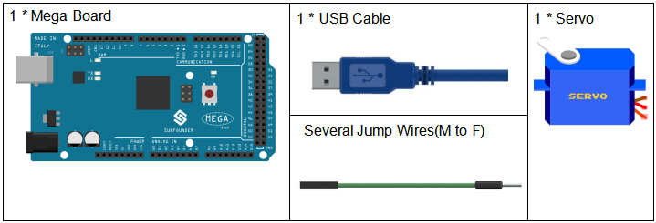
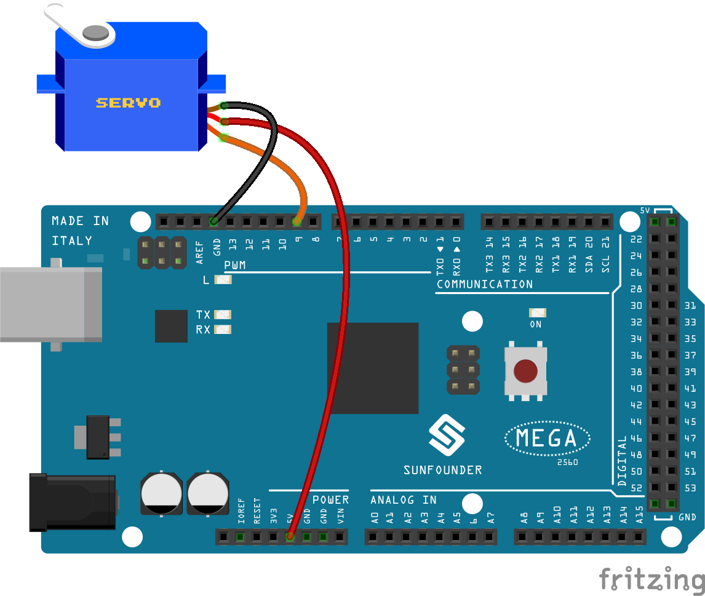
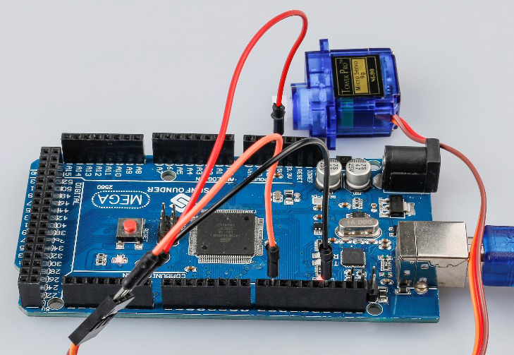
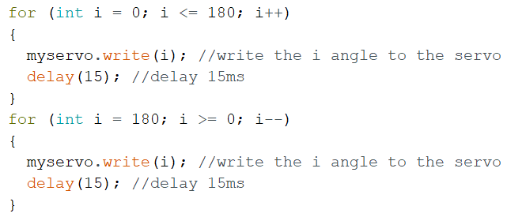

Lesson 10 Servo
==================

Introduction
-----------------

Servo is a type of geared motor that can only rotate 180 degrees. It is
controlled by sending electrical pulses from your board. These pulses
tell the servo what position it should move to.

A servo has three wires: the brown wire is GND, the red one is VCC, and
the orange one is signal line.

Components
---------------

Experimental Principle
--------------------------

Servo
^^^^^^^^

A servo is generally composed of the following parts: case, shaft, gear
train, adjustable potentiometer, DC motor, and control circuit board.

It works like this: The Mega 2560 board sends out PWM signals to the
servo, and then the control circuit in the servo receives the signals
through the signal pin and controls the motor inside to turn. As a
result, the motor drives the gear chain and then motivates the shaft
after deceleration. The shaft and adjustable potentiometer of the servo
are connected together. When the shaft rotates, it drives the pot, so
the pot outputs a voltage signal to the circuit board. Then the board
determines the direction and speed of rotation based on the current
position, so it can stop exactly at the right position as defined and
hold there.

The schematic diagram:

.. image:: media_mega2560/mega22.png
    :align: center

Experimental Procedures
----------------------------

**Step 1:** Build the circuit (Brown to GND, Red to VCC, Orange to pin 9
of the control board)

**Step 2:** Open the code file.

**Step 3:** Select the **Board** and **Port.**

**Step 4:** Upload the sketch to the board.

Now, you can see the rocker arm of the servo rotate and stop at 90
degrees (15 degrees each time). And then it rotates in the opposite
direction.

Code
--------

.. raw:: html

    <iframe src=https://create.arduino.cc/editor/sunfounder01/b6d44ce5-7d33-4728-bb53-36c7cf079573/preview?embed style="height:510px;width:100%;margin:10px 0" frameborder=0></iframe>

Code Analysis
-----------------

**Code Analysis** **12-1** **Include a library**

.. image:: media_mega2560/image155.png

With the *Servo.h* file included, you can call the functions in this
file later. Servo is a built-in library in the Arduino IDE. You can find
the Servo folder under the installation path *C:\\Program
Files\\Arduino\\libraries*.

**Code Analysis** **12-2** **Initialize the servo**

.. image:: media_mega2560/image156.png

**myservo.attach():** Attach the Servo variable to a pin. Initialize the
servo attach to pin9.

**myservo.write():** Writes a value to the servo, controlling the shaft
accordingly. On a standard servo, this will set the angle of the shaft
(in degrees), moving the shaft to that orientation. Here let the servo
stay in the 0 angle firstly.

**Code Analysis** **12-3** **Servo rotate**

Use 2 for() statement to write 0 - 180 to the servo, so that you can see
the servo rotate from 0 to 180 angle,then turn back to 0.
