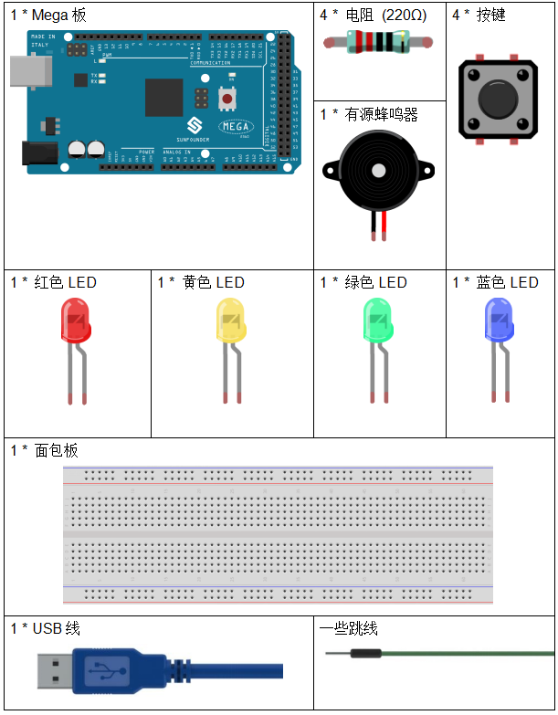
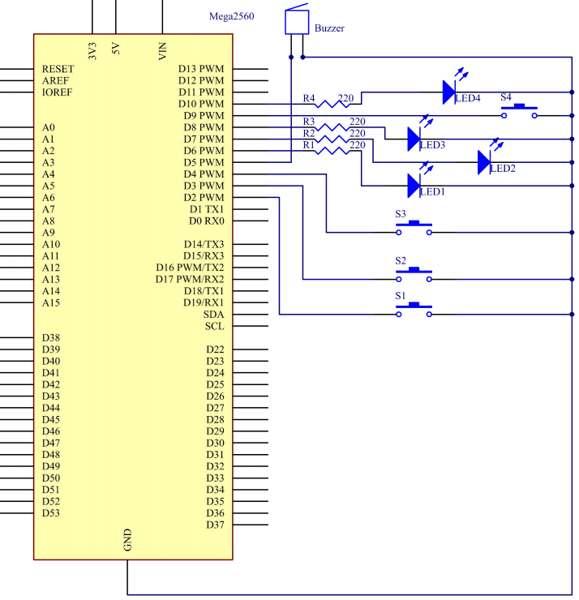
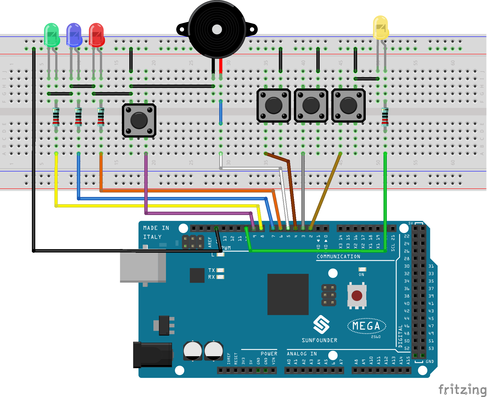

.. _answer_mega:

第 21 课 简单创作 - 抢答器
=============================================

介绍
----------------

在问答比赛中，尤其是娱乐活动（如竞技答题活动）中，主办方为了准确、公正、直观地确定答题者的座位号，往往会采用蜂鸣器系统。

现在系统可以用数据来说明判断的准确性和公平性，提高了娱乐性。同时，也更加公平公正。在本课中，我们将使用一些按键、蜂鸣器和 LED 来制作测验蜂鸣器系统。

所需器件
-------------

* :ref:`SunFounder Mega板`
* :ref:`面包板`
* :ref:`跳线`
* :ref:`电阻`
* :ref:`LED发光二极管`
* :ref:`按键`
* :ref:`蜂鸣器`

原理图
---------------------------

按键1、2 和 3 是抢答按键，按键 4 是重置按键。如果先按下按键 1，蜂鸣器将发出蜂鸣声，相应的 LED 将亮起，所有其他 LED 将熄灭。如果要开始另一轮，请按按键 4 重置。

原理图如下所示：

实验步骤
------------------------------

**第 1 步**：搭建电路

**第 2 步**：打开代码文件 ``Lesson_21_Answer_Machine.ino``。

**第 3 步**：选择 **开发板** 和 **端口**。

**第 4 步**：点击 **上传** 按键来上传代码。

现在，首先按下按键4开始。如果你先按下按键1，你将看到相应的 LED 亮起，蜂鸣器将发出哔哔声。然后再次按下按键4进行重置，然后再按下其他按键。

.. image:: media_mega2560/image234.jpeg

代码
--------

.. raw:: html

  <iframe src=https://create.arduino.cc/editor/sunfounder01/1aec7115-0e59-4863-8d4d-cb90ea3558a0/preview?embed style="height:510px;width:100%;margin:10px 0" frameborder=0></iframe>

代码分析
---------------

这个实验的代码可能有点长。但是语法很简单。

这个代码用到了6个嵌套if语句。

* 第一个if语句用来判断按键4是否按下。
* 第二个if语句用来再次判断按键4是否按下，用来防止误触。若确定按下，则让flag为1，同时让LED点亮。
* 第三个if语句用来判断flag的值，如果为1(按键4已按下)，此时读取按键1，2，3的值。
* 第四-六个if语句用来分别判断按键1，2，3是否按键，如果按下，则让LED点亮，蜂鸣器出声音。

**Alarm() 函数**

.. code-block:: arduino

    void Alarm()
    {
    for(int i=0;i<100;i++){
        digitalWrite(buzzerPin,HIGH); //the buzzer sound
        delay(2);
        digitalWrite(buzzerPin,LOW);  //without sound
        delay(2);                     //when delay time changed,the frequency changed
    }
    }

这个函数是用来设置蜂鸣器发出的声音长度和频率。

