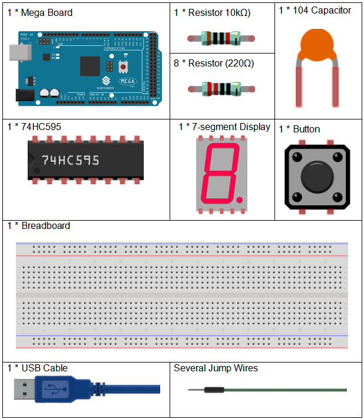

Lesson 23 Simple Creation - Digital Dice
=========================================

Introduction
------------------

In previous experiments, we learned how to use a 7-segment display and
control LEDs by a button. In this lesson, we will use a 7-segment
display and a button together to create a simple digital dice.

Components
--------------

Experimental Principle
-----------------------------

The idea behind a digital dice is very simple: a 7-segment display
circularly jumps from 1 to 7 rapidly. When the button is pressed, the
jumping will slow down until it stops on a number. When the button is
pressed again, the process will repeat.

The schematic diagram:

.. image:: media_mega2560/image252.png
    :align: center

Experimental Procedures
------------------------------

**Step 1:** Build the circuit

.. image:: media_mega2560/image211.png
   :alt: 74HC595
   :width: 1.26736in
   :height: 0.53264in
   :align: center

.. image:: media_mega2560/image253.png
   :alt: Simple Creation - Digital Dice_bb
   :width: 6.90139in
   :height: 4.59028in
   :align: center

**Step 2:** Open the code file.

**Step 3:** Select the Board and Port.

**Step 4:** Upload the sketch to the board.

You can now see the 7-segment display jump between numbers from 1 to 6.
Press the button, and the jumping will slow down until it stops three
seconds later. Press the button again, and the process will repeat.

.. image:: media_mega2560/image254.jpeg
   :alt: \_MG_5373
   :width: 6.50347in
   :height: 4.30069in

Code
--------

.. raw:: html

   <iframe src=https://create.arduino.cc/editor/sunfounder01/01ff7967-7923-46ed-b1fb-8f817ca30659/preview?embed style="height:510px;width:100%;margin:10px 0" frameborder=0></iframe>

Code Analysis
--------------------

**Code Analysis** **25-1** **The initial random number comes from A0**

.. code-block:: arduino

   randomSeed(analogRead(0));

The initial random number is generated from A0 and the range for the
random numbers is 0-1023.

**Code Analysis** **25-2** **Digital Dice**

.. code-block:: Arduino

   void loop()
   {
      int stat = digitalRead(keyIn);  //store value read from keyIn
      if(stat == HIGH)  // check if the pushbutton is pressed

If yes, the corresponding pin is high level.

.. code-block:: Arduino
      
   {
      num ++; // num adds 1
      if(num > 1) 
      {
         num = 0;
      }
   }

If num > 1, clear the value. This is to prevent repeated pressing. So just count it as once no matter how many times you press.
      
.. code-block:: Arduino
   
   Serial.println(num);  // print the num on serial monitor
   if(num == 1)  //when pushbutton is pressed
   {
      randNumber = random(1,7); //Generate a random number in 1-7
      showNum(randNumber);  //show the randNumber on 7-segment
      delay(1000);  //wait for 1 second   
      while(!digitalRead(keyIn));  //When not press button,program stop here. 
      
Make it keep displaying the last random number.

.. code-block:: Arduino     

   int stat = digitalRead(keyIn); 

Read the state of the button again.

.. code-block:: Arduino 

   if(stat == HIGH) // check if the pushbutton is pressed
   
If yes, run the code below.

.. code-block:: Arduino 

         {
            num ++; // num+1=2
            digitalWrite(ledPin,HIGH); //turn on the led
            delay(100);
            digitalWrite(ledPin,LOW); //turn off the led
            delay(100);
            if(num >= 1) // clear the num
            {
               num = 0;
            }
         }
      }
      //show random numbers at 100 microseconds intervals
      //If the button has not been pressed
      randNumber = random(1,7);
      showNum(randNumber);
      delay(100);
   }

**Code Analysis** **25-3** **showNum() function**

.. image:: media_mega2560/image267.png
   :width: 6.44722in
   :height: 1.85417in

This function is to display the number in *dataArray[]* on the 7-segment
display.

Copyright Notice
---------------------

All contents including but not limited to texts, images, and code in
this manual are owned by the SunFounder Company. You should only use it
for personal study, investigation, enjoyment, or other non-commercial or
nonprofit purposes, under the related regulations and copyrights laws,
without infringing the legal rights of the author and relevant right
holders. For any individual or organization that uses these for
commercial profit without permission, the Company reserves the right to
take legal action.