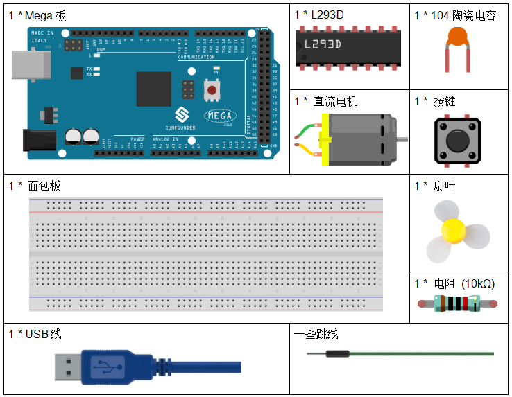

.. _fan_mega:

第 22 课 简单创作 - 小风扇
====================================

介绍
---------------------

在夏天若有个手持小风扇，让你能够走到哪吹到哪，并且还能更改档速，将是个非常爽的事情。

在这个课程中，我们将制作一个手持风扇原型(去外壳)。

所需器件
---------------

* :ref:`SunFounder Mega板`
* :ref:`面包板`
* :ref:`跳线`
* :ref:`电阻`
* :ref:`电容`
* :ref:`按键`
* :ref:`L293D`
* :ref:`直流电机`

原理图
------------------------

Arduino I/O 端口的最大电流为 20mA，但电机的驱动电流至少为 70mA。因此，我们不能直接使用I/O口来驱动电流；相反，我们可以使用 L293D 来驱动电机。

L293D 的Enable pin 1,2EN 已经连接到5V，所以L293D 一直处于工作状态。将引脚 1A 和 2A 分别连接到控制板的引脚 9 和 10。电机的两个引脚分别连接到引脚 1Y 和 2Y。当 10 脚为高电平，9 脚为低电平时，电机开始向一个方向旋转。当引脚 10 为低电平且引脚 9 为高电平时，它以相反的方向旋转。

原理图如下所示：

.. image:: media_mega2560/image239.png
   :align: center

实验步骤
-------------------------------

**第 1 步**：搭建电路。

.. image:: media_mega2560/image240.png

**第 2 步**：打开代码文件 ``Lesson_22_Small_Fan.ino``。

**第 3 步**：选择 **开发板** 和 **端口**。

**第 4 步**：点击 **上传** 按钮来上传代码。

制作的小风扇有3档速度，按下第一次，风扇转速较慢，再次按下，风扇加速；第三次按下，风扇达到最大速度，按下第四次风扇将停止；以此为一个循环。

.. image:: media_mega2560/image241.jpeg

代码
-----------

.. raw:: html

   <iframe src=https://create.arduino.cc/editor/sunfounder01/8eadc5e2-3cb8-466f-8b7b-b14f4b4c0dd1/preview?embed style="height:510px;width:100%;margin:10px 0" frameborder=0></iframe>

代码分析
--------------------

这个代码嵌套了5个 ``if`` 语句用来判断按键的按下状态。

* 第一个if语句用来判断按键是否按下。
* 第二个if语句用来判断时间是否过了50ms。
* 第三个if语句用来判断过了50ms, 按键确实有按下，以免有误触。
* 第四个if语句用来记录按键按下次数，每按下一次， ``stat`` 加1。
* 第五个if语句用来判断按键按下次数是否大于4，如果是，则将 ``stat`` 清零。

**switch()语句**

.. code-block:: arduino

    switch(stat)
    {
    case 1:
        clockwise(rank1);// When stat=1, set the rotate speed of the motor as rank1=150
        break;
    case 2:
        clockwise(rank2);// When stat=2, set the rotate speed of the motor as rank1=200
        break;
    case 3:
        clockwise(rank3);// When stat=3, set the rotate speed of the motor as rank1=250
        break;
    default:
        clockwise(0);
    }

``switch`` 语句与 ``if`` 语句一样， ``switch case`` 允许程序员在各种条件下执行的不同代码来控制程序流程。特别是，switch 语句将变量的值与 case 语句中指定的值进行比较。当找到值与变量的值匹配的 case 语句时，将运行该 case 语句中的代码。
如果没有 ``break`` 语句， ``switch`` 语句将继续执行下面的表达式，直到 ``break`` 或到达 switch 语句的末尾。

在这部分代码中：

* 如果stat = 1, 让风扇以速度 rank1(150)转动。
* 如果stat = 1, 让风扇以速度 rank2(200)转动。
* 如果stat = 1, 让风扇以速度 rank3(250)转动。
* 如果stat = 0, 让风扇以速度 0转动。

**clockwise()函数**

.. code-block:: arduino

    void clockwise(int Speed)//
    {
        analogWrite(motorIn1,0);
        analogWrite(motorIn2,Speed);
    }

该功能是设置电机的转速：将 ``Speed`` 写入 引脚9，将0写入引脚10。电机朝某个方向旋转，速度为 ``Speed`` 的值。

实验总结
-------------
在本实验中，你还可以控制电机转动与否。只需将 L293D 的引脚 1、2EN 连接到控制板的 I/O 端口。设置1、2EN为高电平，电机开始转动；将其设置为低电平，它将停止旋转。