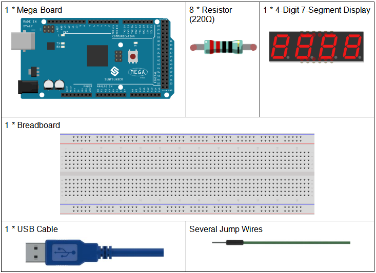
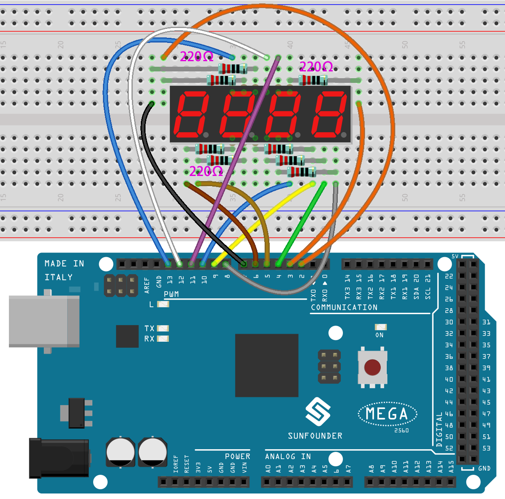
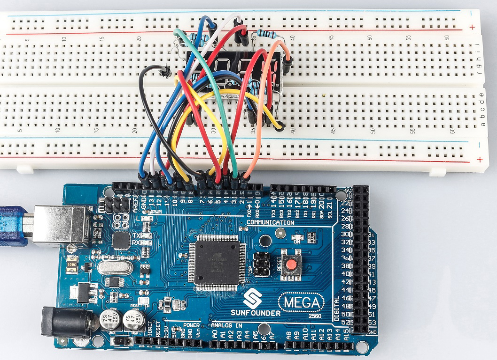

.. _stopwatch_mega:

Lesson 20 Simple Creation-Stopwatch
=====================================

Introduction
-----------------------

In this lesson, we will use a 4-digit 7-segment display to make a
stopwatch.

Components
-------------

* :ref:`SunFounder Mega Board`
* :ref:`Breadboard`
* :ref:`Jumper Wires`
* :ref:`Resistor`
* :ref:`4-Digit 7-Segment Display`

Schematic Diagram
-----------------------------

When a 7-segment display is used, if it is a common anode display,
connect the anode pin to power source; if it is a common cathode one,
connect the cathode pin to GND. When a 4-digit 7-segment display is
used, the common anode or common cathode pin is to control the digit
displayed. There is only one digit working. However, based on the
principle of Persistence of Vision, we can see four 7-segment displays
all displaying numbers. This is because the electronic scanning speed is
too fast for us to notice interval.

The schematic diagram of the 4-digit 7-segment display is as shown
below:

.. image:: img/image225.png
    :width: 400
    :align: center

The schematic diagram:

.. image:: img/image226.png
    :align: center

Experimental Procedures
--------------------------------

**Step 1:** Build the circuit

The wiring between the 4-digit 7-segment display and the Mega 2560 Board
board is as shown below:

========================= ===============
4-Digit 7-Segment Display Mega 2560 Board
a                         2
b                         3
c                         4
d                         5
e                         6
f                         7
g                         8
p                         9
D1                        13
D2                        12
D3                        11
D4                        10
========================= ===============

**Step 2:** Open the code file.

**Step 3:** Select the **Board** and **Port.**

**Step 4:** Upload the sketch to the board.

Now, you can see the number increases by one per second on the 4-digit
7-segment display.

Code
--------

.. raw:: html

    <iframe src=https://create.arduino.cc/editor/sunfounder01/aa285426-9df3-47df-9443-351fa3d8c1ae/preview?embed style="height:510px;width:100%;margin:10px 0" frameborder=0></iframe>

Code Analysis
---------------------

In essence, this code uses the principle of multiplexing to display a 4-digit number on a 7-segment display. By rapidly switching between digits and displaying one digit at a time, it gives the illusion of all digits being displayed concurrently. 
The stopwatch functionality is achieved by using the built-in ``millis()`` function to track time and increment the displayed number every second.

#. Variable and Constant Definitions:

    .. code-block:: arduino

        int segmentPins[] = {2, 3, 4, 5, 6, 7, 8, 9};
        int digitPins[] = {13, 12, 11, 10};

        long n = 0; // Variable to store the current stopwatch number
        int del = 5; // Delay time (in milliseconds) to keep each digit illuminated
        unsigned long previousMillis = 0; // Store the last time the stopwatch incremented
        const long interval = 1000; // One-second interval (in milliseconds)

    * ``segmentPins`` and ``digitPins`` arrays define the pins that are connected to the segments and the digits of the 7-segment display, respectively.
    * ``n`` is a long variable that keeps track of the current stopwatch number, starting from 0 and incrementing.
    * ``del`` is a delay time to maintain the display of the current digit before transitioning to the next one.
    * ``previousMillis`` and ``interval`` are related to timing to decide when to increment the stopwatch.

#. 7-Segment Patterns for Numbers:

    The 2D array numbers defines how each of the numbers 0-9 is represented on a common-cathode 7-segment display. Each sub-array has 8 values (either HIGH or LOW), corresponding to the 7 segments and a decimal point. This pattern helps in driving the appropriate segments for each number.

    .. code-block:: arduino

        byte numbers[10][8] = {
            {HIGH, HIGH, HIGH, HIGH, HIGH, HIGH, LOW, LOW},  // 0
            {LOW, HIGH, HIGH, LOW, LOW, LOW, LOW, LOW},      // 1
            {HIGH, HIGH, LOW, HIGH, HIGH, LOW, HIGH, LOW},   // 2
            {HIGH, HIGH, HIGH, HIGH, LOW, LOW, HIGH, LOW},   // 3
            {LOW, HIGH, HIGH, LOW, LOW, HIGH, HIGH, LOW},    // 4
            {HIGH, LOW, HIGH, HIGH, LOW, HIGH, HIGH, LOW},   // 5
            {HIGH, LOW, HIGH, HIGH, HIGH, HIGH, HIGH, LOW},  // 6
            {HIGH, HIGH, HIGH, LOW, LOW, LOW, LOW, LOW},     // 7
            {HIGH, HIGH, HIGH, HIGH, HIGH, HIGH, HIGH, LOW}, // 8
            {HIGH, HIGH, HIGH, HIGH, LOW, HIGH, HIGH, LOW}   // 9
        }; 

#. Setup Function:

    .. code-block:: arduino

        void setup() {
            // Configure all segment and digit pins as OUTPUT
            for (int i = 0; i < 8; i++) {
                pinMode(segmentPins[i], OUTPUT);
            }
            for (int i = 0; i < 4; i++) {
                pinMode(digitPins[i], OUTPUT);
                digitalWrite(digitPins[i], HIGH); // Initially turn off all digits (for common-cathode displays, HIGH is OFF)
            }
        }

    * All segment and digit pins are set to OUTPUT mode since they will drive the segments and digits of the display.
    * Initially, all the digits are turned off, denoted by writing HIGH for a common-cathode display.

#. Main Loop:

    .. code-block:: arduino

        void loop() {
            // Check if a second has passed since the last increment
            if (millis() - previousMillis >= interval) {
                previousMillis += interval; // Update the last increment time
                n = (n + 1) % 10000; // Increment the stopwatch number and wrap around at 9999
            }

            displayNumber(n); // Display the current stopwatch number on the 7-segment display
        }

    * This section checks if the interval (which is set to 1000ms or 1 second) has passed since the last increment of the stopwatch. If so, it increments the number.
    * The number is then displayed on the 7-segment using the displayNumber() function.

#. ``displayNumber()`` Function:

    .. code-block:: arduino

        // Function to display a 4-digit number on the 7-segment display
        void displayNumber(long num) {
          int divisor = 1000; // Start with the highest divisor for the first digit
          for (int digit = 0; digit < 4; digit++) {
            clearLEDs(); // Turn off all segments and digits
            pickDigit(digit); // Activate the current digit
            int value = (num / divisor) % 10; // Extract the specific digit from the number
            pickNumber(value); // Illuminate the segments to display the digit
            divisor /= 10; // Reduce the divisor for the next digit
            delay(del); // Keep the digit illuminated for a short time
          }
        }

    * This function breaks down the 4-digit number into individual digits and displays each digit one at a time in rapid succession. This creates the illusion of all digits being displayed simultaneously due to persistence of vision.
    * For each digit, the function first clears all LEDs, selects the appropriate digit using ``pickDigit()``, and then displays the number on that digit using ``pickNumber()``.
    * The ``delay (del)`` ensures each digit is visible for a short time before transitioning to the next.

#. ``pickDigit()`` Function:

    This function is responsible for selecting (or turning on) one of the four digits on the 7-segment display. This is achieved by setting the corresponding digit pin to LOW.

    .. code-block:: arduino

        void pickDigit(int x) {
            digitalWrite(digitPins[x], LOW); // Turn ON the selected digit (for common-cathode displays, LOW is ON)
        }

#. ``pickNumber()`` Function:

    Given a single number (0-9), this function drives the 7-segment display's segments to show that number. It uses the previously defined ``numbers`` array to know which segments to turn on/off.

    .. code-block:: arduino

        void pickNumber(int x) {
            for (int i = 0; i < 8; i++) {
                digitalWrite(segmentPins[i], numbers[x][i]); // Set each segment according to the pattern for the given number
            }
        }

#. ``clearLEDs()`` Function:

    As the name suggests, this function turns off all segments and digits. It's used to ensure that only one digit is active at a time during the multiplexing process in the ``displayNumber()`` function.

    .. code-block:: arduino

        void clearLEDs() {
            for (int i = 0; i < 8; i++) {
                digitalWrite(segmentPins[i], LOW); // Turn off all segments
            }
            for (int i = 0; i < 4; i++) {
                digitalWrite(digitPins[i], HIGH); // Turn off all digits
            }
        }

