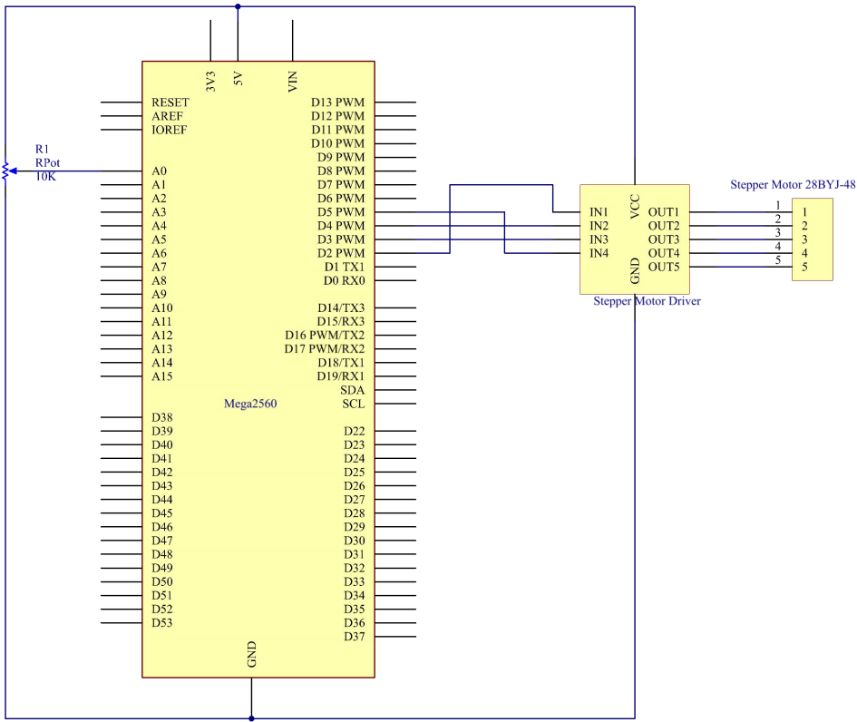
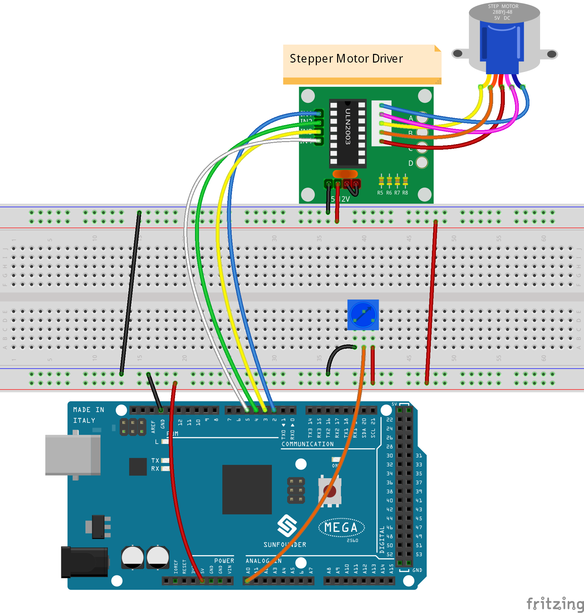
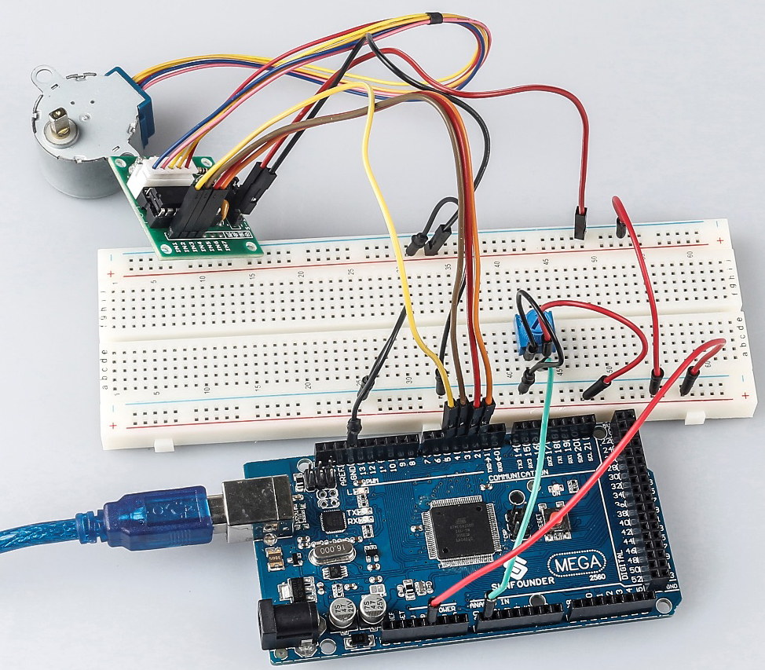

Lesson 19 Stepper Motor
=========================

Introduction
--------------------

Stepper motors, due to their unique design, can be controlled to a high
degree of accuracy without any feedback mechanisms. The shaft of a
stepper, mounted with a series of magnets, is controlled by a series of
electromagnetic coils that are charged positively and negatively in a
specific sequence, precisely moving it forward or backward in small
"steps".

Components
-------------

.. image:: media_mega2560/mega32.png
    :align: center

* :ref:`SunFounder Mega Board`
* :ref:`Breadboard`
* :ref:`Jumper Wires`
* :ref:`Potentiometer`
* :ref:`Stepper Motor`

Schematic Diagram
-------------------------

The schematic diagram of the Stepper Motor Driver:

Experimental Procedures
--------------------------------

**Step 1:** Build the circuit

The wiring between Stepper Motor Driver board and Mega 2560 board:

==================== =========
Stepper Motor Driver Mega 2560
IN1                  2
IN2                  4
IN3                  3
IN4                  5
GND                  GND
VCC                  5v
==================== =========

**Step 2:** Open the code file.

**Step 3:** Select the **Board** and **Port.**

**Step 4:** Upload the sketch to the board.

Now, you should see the rocker arm of the stepper motor spin clockwise
and counterclockwise alternately.

Code
--------

.. raw:: html

   <iframe src=https://create.arduino.cc/editor/sunfounder01/ac4b6b8f-1c91-4f73-80b8-03bc1979b8fa/preview?embed style="height:510px;width:100%;margin:10px 0" frameborder=0></iframe>

Code Analysis
-----------------

**Initialize the stepper**

.. code-block:: Arduino

    #include <Stepper.h> //include a head file

    //the steps of a circle

    #define STEPS 100

    //set steps and the connection with MCU

    Stepper stepper(STEPS, 2, 3, 4, 5);

    //available to store previous value

    int previous = 0;

Include a head file Stepper.h, set the steps to 100 and then initialize
the stepper with a function stepper().

**Stepper(steps, pin1, pin2, pin3, pin4):** This function creates a new
instance of the Stepper class that represents a particular stepper motor
attached to your Arduino board.

**steps:** The number of steps in one revolution of your motor. If your
motor gives the number of degrees per step, divide that number into 360
to get the number of steps (e.g. 360 / 3.6 gives 100 steps). (*int*).

**setSpeed() function**

.. code-block:: Arduino

    //speed of 180 per minute

    stepper.setSpeed(180); //set the motor speed in rotations per minute(RPMs)

**setSpeed(rpms):** Sets the motor speed in rotations per minute (RPMs).
This function doesn't make the motor turn, just sets the speed at which
it will when you call step().

**Parameters**

rpms: the speed at which the motor should turn in rotations per minute -
a positive number (long)

**setSpeed() function**

.. code-block:: Arduino

    void loop()

    { 
    
    //get analog value

    int val = analogRead(0); //Read the value of the potentiometer

    //current reading minus the reading of history

    stepper.step(val - previous); //Turn the motor in val-previous steps

    //store as prevous value

    previous = val; //the value of potentiometer assignment to variable previous

    }

**step(steps):** Turns the motor a specific number of steps, at a speed
determined by the most recent call to setSpeed(). This function is
blocking; that is, it will wait until the motor has finished moving to
pass control to the next line in your sketch. For example, if you set
the speed to, say, 1 RPM and called step(100) on a 100-step motor, this
function would take a full minute to run. For better control, keep the
speed high and only go a few steps with each call to step().

**steps:** the number of steps to turn the motor - positive to turn one
direction, negative to turn the other (int).