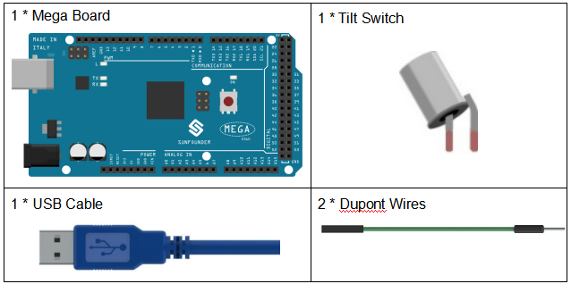

.. _tilt_mega:

Lesson 5 Tilt Switch
========================

Introduction
----------------

The tilt switch used here is a ball one with a metal ball inside. It is
used to detect inclinations of a small angle.

Components
-------------

* :ref:`SunFounder Mega Board`
* :ref:`Breadboard`
* :ref:`Jumper Wires`
* :ref:`Tilt Switch`

Schematic Diagram
--------------------------

The schematic diagram:

.. image:: img/mega11.png
    :align: center

Experimental Procedures
------------------------------

**Step 1:** Build the circuit

.. image:: img/image96.png

**Step 2:** Open the code file.

**Step 3:** Select the **Board** and **Port.**

**Step 4:** Upload the sketch to the board.

Now, tilt the switch, and the LED attached to pin 13 on Mega 2560 board
will light up.

.. image:: img/image97.jpeg

Code
--------

.. raw:: html

    <iframe src=https://create.arduino.cc/editor/sunfounder01/b5f76ee3-929a-47a6-b410-3b2b6d6f5e66/preview?embed style="height:510px;width:100%;margin:10px 0" frameborder=0></iframe>

Code Analysis
^^^^^^^^^^^^^^^^^^^

**Whole Code**

.. code-block:: Arduino

    const int ledPin = 13; //the led attach to

    void setup()

    {

        pinMode(ledPin,OUTPUT); //initialize the ledPin as an output

        pinMode(2,INPUT); //set pin2 as INPUT

        digitalWrite(2, HIGH); //set pin2 as HIGH

    }

    /******************************************/

    void loop()

    {

        int digitalVal = digitalRead(2); //Read the value of pin2

        if(HIGH == digitalVal) //if tilt switch is not breakover

        {

            digitalWrite(ledPin,LOW); //turn the led off

        }

        else //if tilt switch breakover

        {

            digitalWrite(ledPin,HIGH); //turn the led on

        }

    }

The whole code are very simple, one pin of the tilt switch is connected
to pin2, another pin is connected to GND, when tilt the switch, the two
pins of the switch will be connected to GND, then let the LED on the
pin13 lights up.
