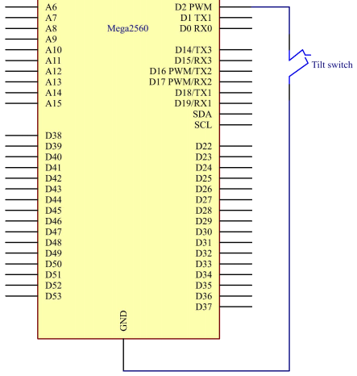
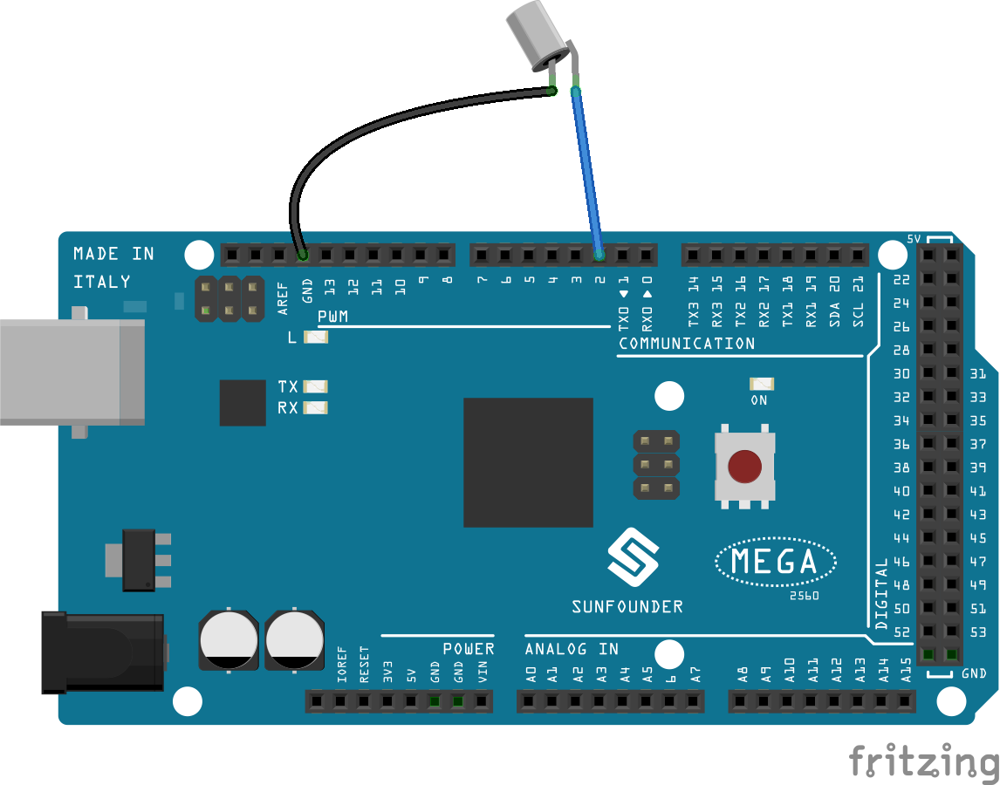

.. _tilt_mega:

第 5 课 倾斜开关
========================

介绍
----------------

这里用的倾斜开关是内部有一个金属球，用来检测小角度的倾斜值。

所需器件
-------------

.. image:: media_mega2560/megac5.png
    :align: center

* :ref:`SunFounder Mega板`
* :ref:`面包板`
* :ref:`跳线`
* :ref:`倾斜开关`

原理图
--------------------------

原理图如下图所示：

实验步骤
------------------------------

**第 1 步**：搭建电路。

**第 2 步**：打开代码文件 ``Lesson_5_Tilt_Switch.ino``。

**第 3 步**：选择 **开发板** 和 **端口**。

**第 4 步**：点击 **上传** 按钮来上传代码。

现在，将开关倾斜，控制板上的LED将会被点亮。

.. image:: media_mega2560/image97.jpeg

代码
--------

.. raw:: html

    <iframe src=https://create.arduino.cc/editor/sunfounder01/b5f76ee3-929a-47a6-b410-3b2b6d6f5e66/preview?embed style="height:510px;width:100%;margin:10px 0" frameborder=0></iframe>

整个代码很简单，倾斜开关的一个脚接pin2，另一脚接GND，当倾斜开关时，开关的两个脚接GND，然后让pin13上的LED点亮。
