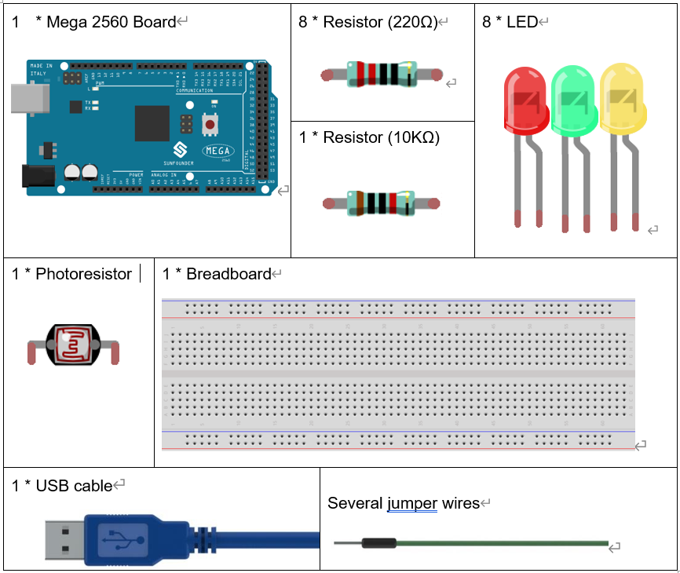
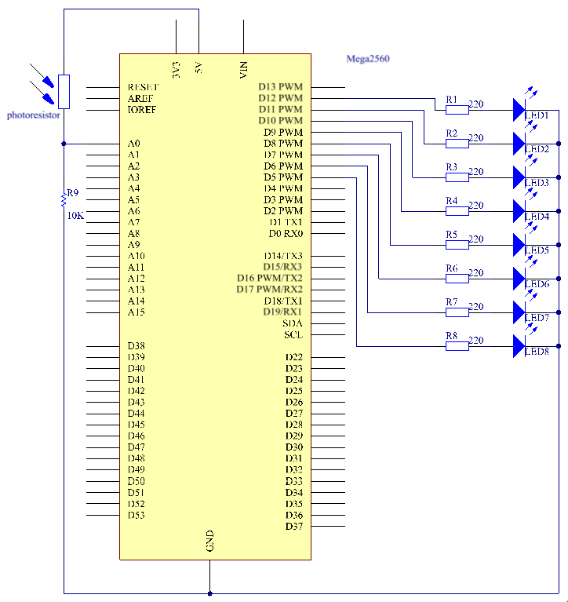
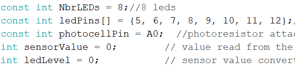
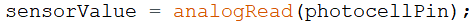
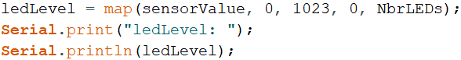
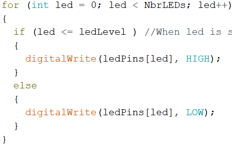

Photo resistor
====================

Introduction
------------------

In this lesson, you will learn to how to measure light intensity using a
photo resistor. The resistance of a photo resistor changes with incident
light intensity. If the light intensity gets higher, the resistance
decreases; if it gets lower, the resistance increases.

Components
-----------------

Experimental Principle
-----------------------

A photo resistor or photocell is a light-controlled variable resistor.
The resistance of a photo resistor decreases with increasing incident
light intensity; in other words, it exhibits photo conductivity. A photo
resistor can be applied in light-sensitive detector circuits, and light-
and darkness-activated switching circuits.

In this experiment, we will use 8 Eds to show the light intensity. The
higher the light intensity is, the more Eds will light up. When the
light intensity is high enough, all the Eds will be on. When there is no
light, all the Eds will go out.

The schematic diagram:

Experimental Procedures
-----------------------------

**Step 1:** Build the circuit

.. image:: media_mega2560/image142.png
    :align: center

**Step 2:** Open the code file.

**Step 3:** Select the **Board** and **Port.**

**Step 4:** Upload the sketch to the board.

Now, shine some light on the photo resistor, and you will see several
Eds light up. Shine more light and you will see more Eds light up. When
you place it in a dark environment, all the Eds will go out.

.. image:: media_mega2560/image143.jpeg
    :align: center

Code
--------

.. raw:: html

    <iframe src=https://create.arduino.cc/editor/sunfounder01/7ab14d87-c031-4184-aad0-09c7827a6455/preview?embed style="height:510px;width:100%;margin:10px 0" frameborder=0></iframe>

Code Analysis
--------------------

**Code Analysis** **11-1** **Set the variables**

The 8 Eds are connected to pin5-pin12, in this code, use a array to
store the pins, ledPins[0] is equal to 5, ledPins[1] to 6 and so on.

**Code Analysis** **11-2** **Set 8 pins to OUTPUT**

.. image:: media_mega2560/image145.png

Using the for() statement set the 8 pins to OUTPUT. The variable led is
added from 0 to 8, and the pinMode() function sets pin5 to pin12 to
OUTPUT in turn.

**Code Analysis** **11-3** **Read the analog value of the
photoresistor**

Read the analog value of the **photocellPin(A0**) and store to the
variable **sensorValue.**

**analogRead():** Reads the value from the specified analog pin. Arduino
boards contain a multichannel, 10-bit analog to digital converter. This
means that it will map input voltages between 0 and the operating
voltage(5V or 3.3V) into integer values between 0 and 1023.

.. image:: media_mega2560/image147.png

Use the Serial.print()function to print the analog value of the
photoresistor. You can see them on the Serial Monitor.

**Serial.print():**\ Prints data to the serial port as human-readable
ASCII text. This command can take many forms. Numbers are printed using
an ASCII character for each digit. Floats are similarly printed as ASCII
digits, defaulting to two decimal places. Bytes are sent as a single
character. Characters and strings are sent as is.

**Serial.println():** Thiscommand takes the same forms as
Serial.print(), but it is followed by a carriage return character (ASCII
13, or '\r') and a newline character (ASCII 10, or '\n').

.. image:: media_mega2560/image148.png

**Code Analysis** **11-4** **Map the analog value to 8 LEDs**

The map() command is used to map 0-1023 to 0-NbrLEDs(8),
(1023-0)/(8-0)=127.875

+-------+-------+-------+-------+-------+-------+-------+-------+
| 0-12  | 128-2 | 2     | 384-  | 5     | 640-7 | 7     | 896   |
| 7.875 | 55.75 | 56-38 | 511.5 | 12-63 | 67.25 | 68-89 | -1023 |
|       |       | 3.625 |       | 9.375 |       | 5.125 |       |
+-------+-------+-------+-------+-------+-------+-------+-------+
| 0     | 1     | 2     | 3     | 4     | 5     | 6     | 7     |
+-------+-------+-------+-------+-------+-------+-------+-------+

If sensorValue is 560, then the ledLevel is 4.

**map(value, fromLow, fromHigh, toLow, toHigh)** re-maps a number from
one range to another. That is, a value of *fromLow* would get mapped to
one of *toLow*, and a value of *fromHigh* to one of *toHigh*, values
in-between to values in-between, etc.

**Code Analysis** **11-5** **Light up the LEDs**

Light up the corresponding LEDs. Such as, when the ledLevel is 4, then
light up the ledPins[0] to ledPins[4] and go out the ledPins[5] to
ledPins[7].