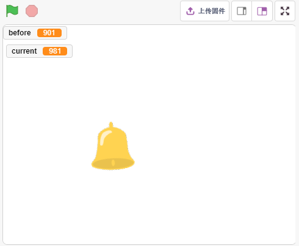
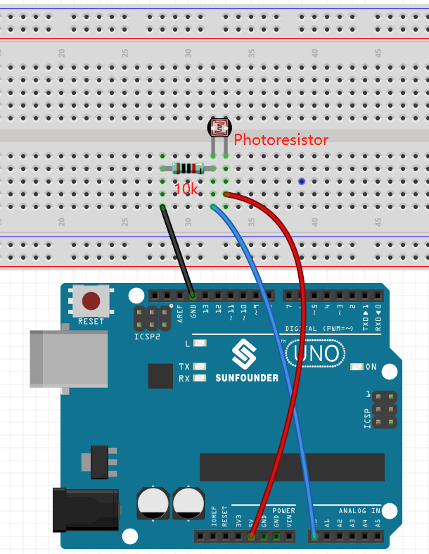
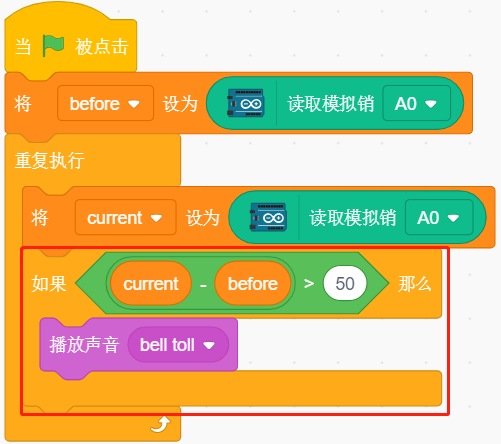
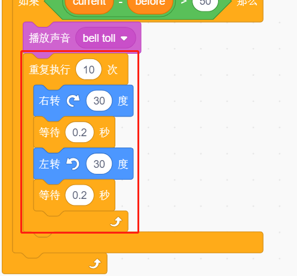
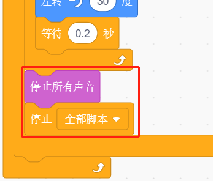

10. 光控闹钟
======================

生活中，有各种各样的时间闹钟。现在我们来制作一个光控闹钟，早晨来临，光亮度增强，这个光控闹钟就会提醒你，该起床了。

你将学习
---------------------

- 了解光敏电阻
- 停止播放声音和停止脚本运行

搭建电路
-----------------------

光敏电阻或光电管是一种光控可变电阻器。光敏电阻的电阻随着入射光强度的增加而降低。

根据下图搭建电路：

光敏电阻一端接5V，另一端接A0，在此端与GND串联一个10K的电阻。所以当光照强度增加时，光敏电阻的阻值减小，10K电阻的分压增加，A0得到的值变大。

* :ref:`面包板`
* :ref:`光敏电阻` 
* :ref:`电阻`

编程
------------------

**1. 选择精灵**

删除默认精灵，点击精灵区域右下角的 **选择一个角色** 按钮，在搜索框中输入 **bell**，然后点击添加。

**2. 读取A0的值**

创建2个变量 **before** 和 **current**, 程序一开始，读取A0的值存放到before中以作为参考值。在[重复执行]中，再次读取A0的值，存放到变量current中，重复循环的读取。

**3. 发出声音**

当 **current** 的值比 **before** 大50，即当前光强度大于设定值，则让精灵发出声音。

**4. 转动精灵**

使用[右转/左转（）度]来让bell精灵左右转动来达到闹铃的效果。

**5. 停止所有**

当闹钟响了一段时间后，停止运行。

