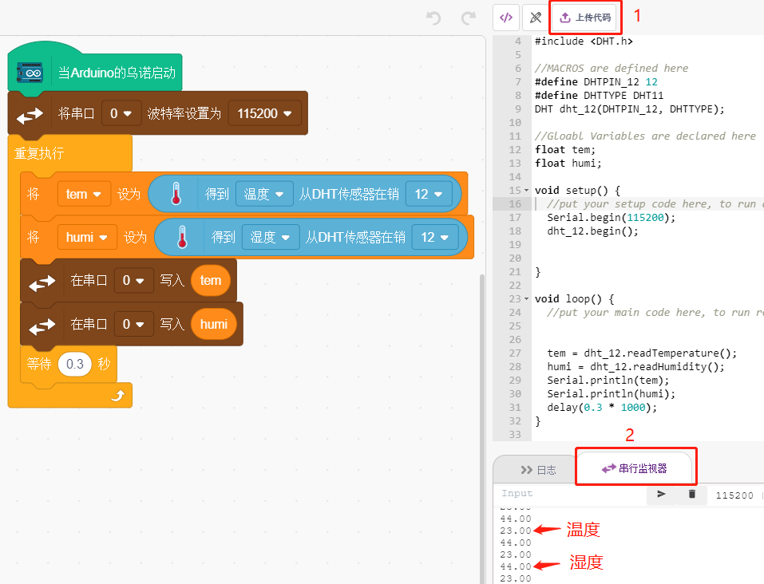
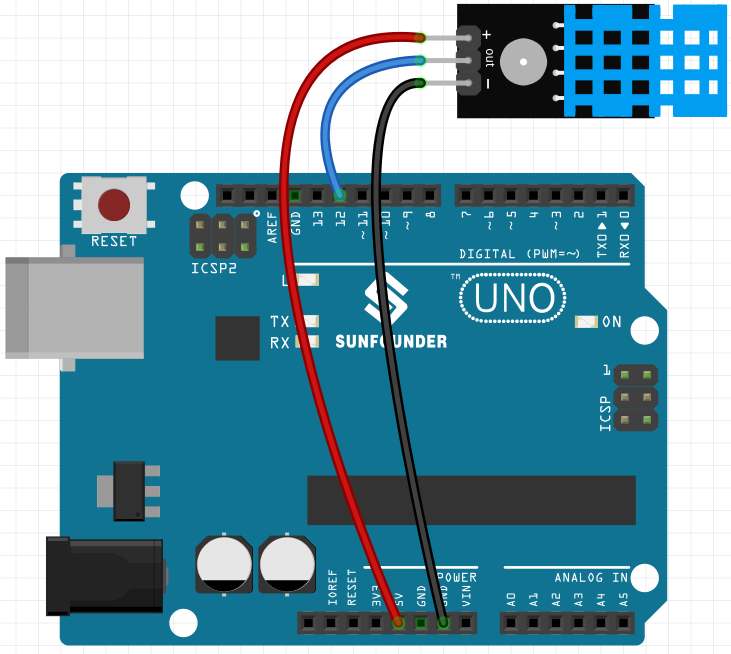
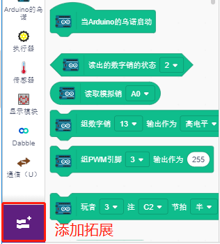
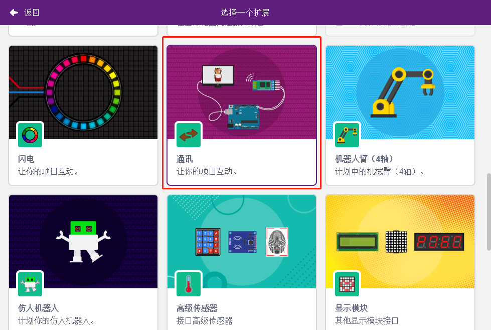
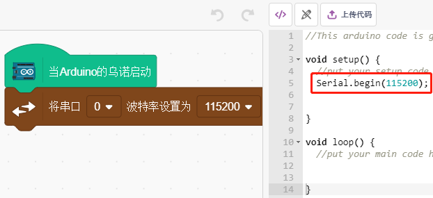
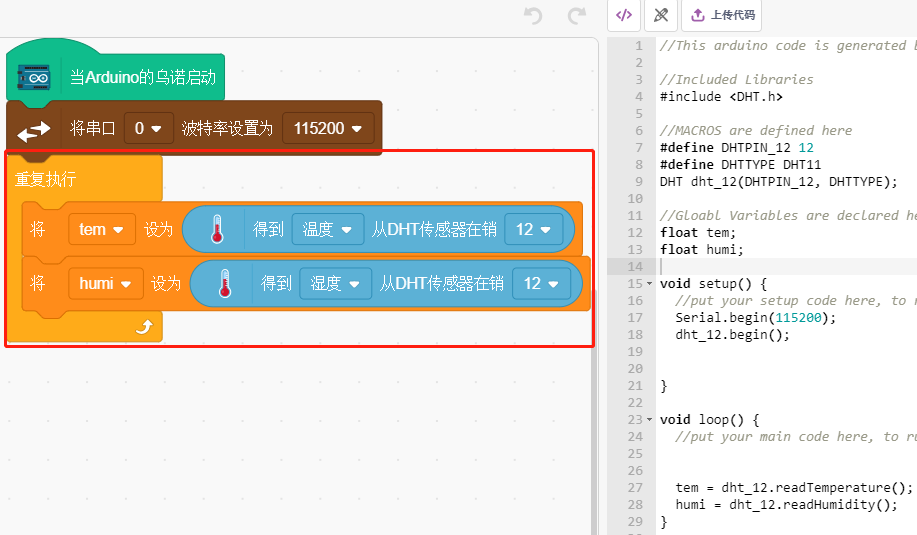
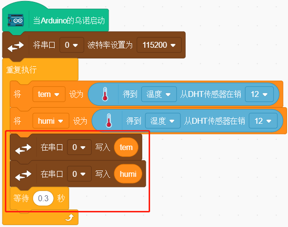

11. 读取温湿度
=================================================

之前的项目一直使用舞台模式，但是有些功能只有上传模式才有，比如串口通讯功能。在这个项目中，我们将在 :ref:`上传模式` 下使用串行监视器打印 DHT11 的温度和湿度。

You Will Learn
---------------------

- 通过DHT11模块得到温湿度
- 上传模式的串行监视器
- 添加扩展

搭建电路
-----------------------

数字温湿度传感器 DHT11 是一种复合传感器，包含经过校准的温湿度数字信号输出。

现在根据下图构建电路:

* :ref:`面包板`
* :ref:`光敏电阻` 
* :ref:`电阻`

编程
------------------

**1. 添加拓展**

切换到上传模块，点击左下角的 **添加拓展** 按钮。

然后选择 **通讯** 来将它添加，最后它将出现在调色板区域的最后面。

**2. 初始化Arduino的乌诺和串口监视器**

在上传模式中，启动Arduino的乌诺，然后设置串口波特率。

* [当Arduino的乌诺启动]: 在上传模式中，启动Arduino的乌诺。
* [将串口（）波特率设置位（）]: 来自通讯调色板, 用来为串口0设置波特率，默认为115200. 如果你用的是Mega2560, 那你可以选择在串口0~3.

**3. 创建变量并读取温湿度**

创建2个变量 **tem** 和 **humi** 用来分别存放温度和湿度，在你拖拽块的同时，右侧会出现相关的代码。

**4. 在串口打印温湿度**

将读取到的温湿度写到串口中，为避免传输速度太快，导致PictoBlox卡机，用[等待（）秒]块, 为下一次打印增加一些时间间隔。

**5. 上传代码并打开串口监视器**

与舞台模式不同的是，上传模式的代码需要用 **上传代码** 按钮上传到Arduino板子上才能看到效果，这也让你可以在拔掉USB线之后，程序仍然在运行。

现在打开串口监视器来查看温湿度。

