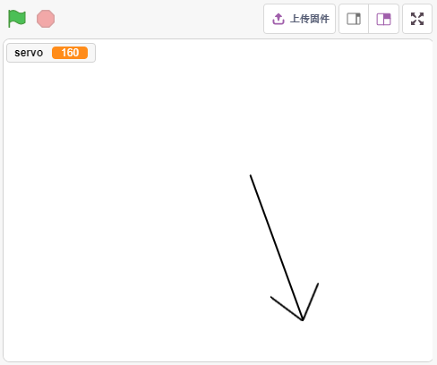
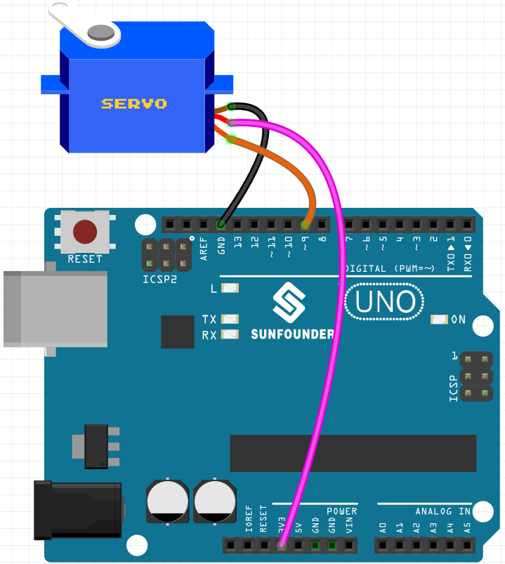
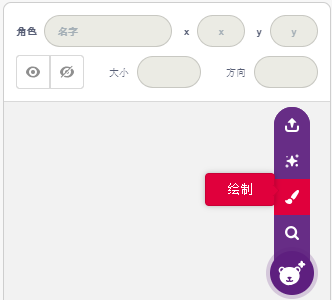
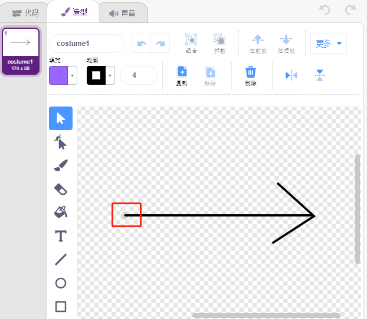
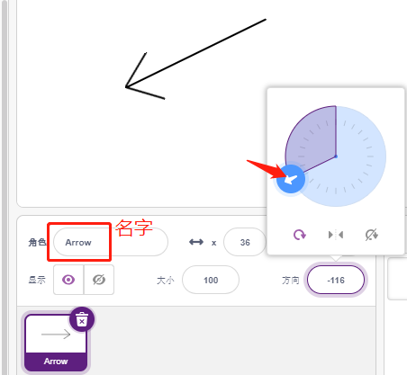
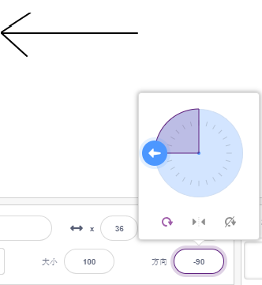
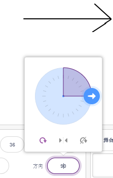
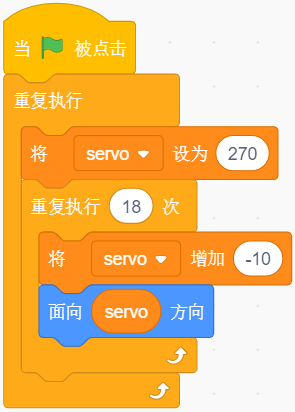
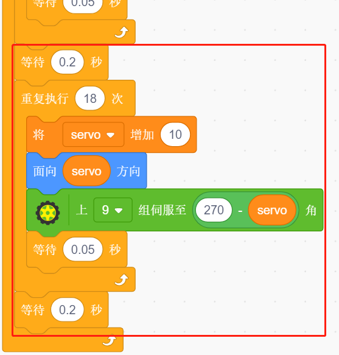

12. 摆钟
=====================

在这个项目中，我们将制作一个箭头钟摆，同时舵机会跟着转动。

你将学习
---------------------

- 舵机的工作原理及角度范围
- 画一个精灵，将中心点放尾部。

搭建电路
-----------------------

伺服是一种只能旋转 180 度的齿轮电机。它是通过从电路板发送电脉冲来控制的。这些脉冲告诉伺服它应该移动到什么位置。

舵机共有三根线：棕色线为GND，红色线为VCC（接3.3V），橙色线为信号线。角度范围为 0-180。

现在根据下图构建电路：

* :ref:`面包板`
* :ref:`舵机` 

编程
------------------

**1. 画一个精灵**

删除默认的精灵，选择精灵按钮，点击 **绘制**，将出现一个空白精灵Sprite1。

在打开的 **造型** 页面，使用 **画线段** 工具画一个箭头。

.. note::

    一定要从画布的中心点向外开始画箭头，这样就能保证箭头是以中心点为原点转圈。
    按住Shift可让线角度为直的或45度方向。

画完之后，将在舞台上显示箭头精灵，将它命名为 **arrow**。然后点击 **方向** 后的270，将出现一个圆形表盘，现在拖动这个箭头，看下舞台上的arrow精灵是否以尾部为原点转圈。

若要让arrow精灵从左边摆动到右边，角度范围是-90~-180，180~90。

**2. 创建变量**

创建一个变量servo, 用来存放角度值，并设置初始值为270。

.. image:: img/12_servo.png

**3. 从左边摆动到右边**

现在让箭头精灵从左边-90度位置摆动到右边90度位置。

通过[重新（）次]块, 将变量每次加-10，通过18次就能加到90度。然后用[面向（）方向]让arrow精灵转到这些角度。

由于精灵转动角度是-180 ~ 180，超出这个范围的角度会通过下面的条件来换算。

* 如果角度 > 180，则角度-360.

**4. 转动舵机**

当你点击绿色旗子的时候，你会发现箭头迅速转动到右边，然后回到左边，所以这里用一个[等待（）秒]块让转动速度慢点。另外使用[上（）组伺服至（）角]块让接在Arduino板上的舵机转到特定的角度。

.. image:: img/12_servo2.png

**5. 从右边摆动到左边**

通过同样的方法，让舵机和箭头精灵从右边慢慢转动到左边。

