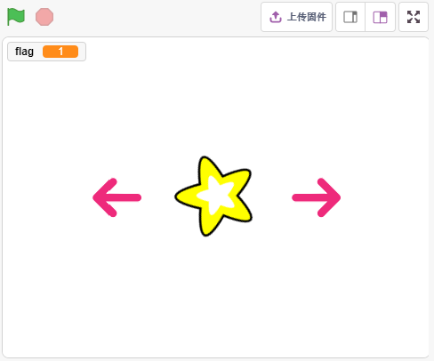
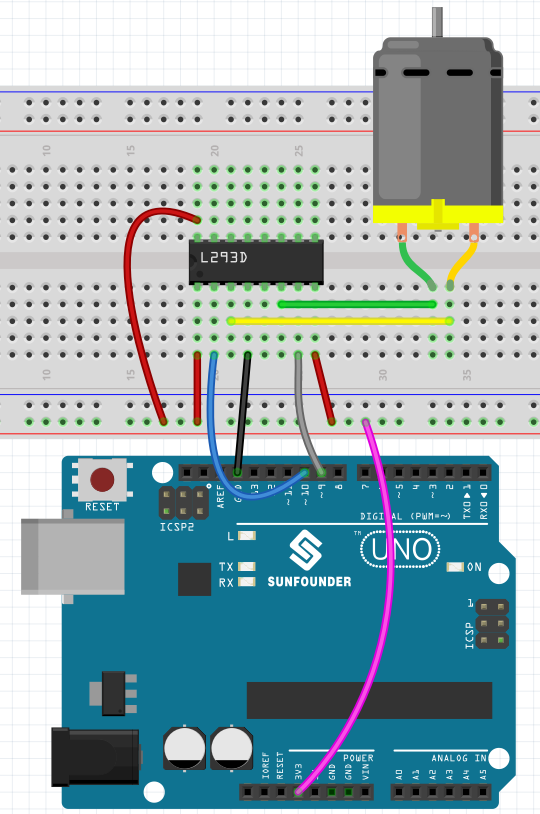
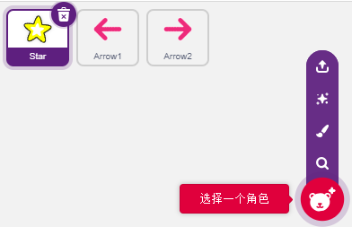
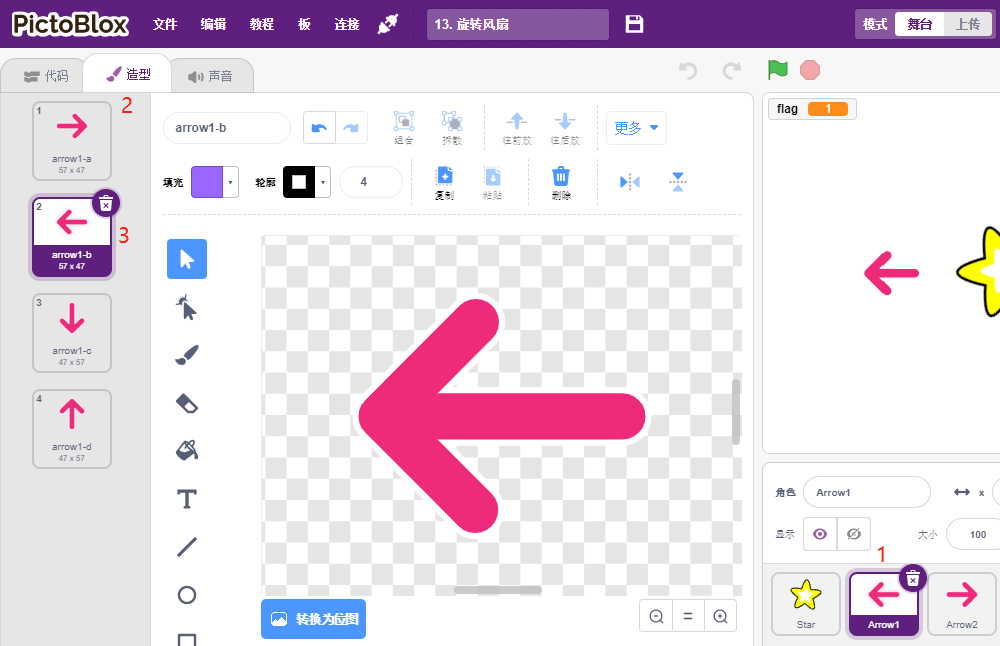
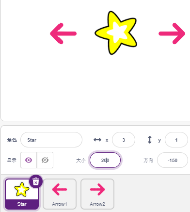
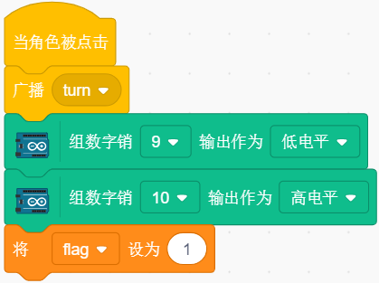
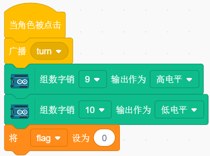
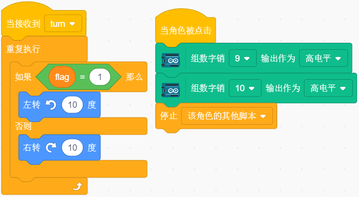

13. 旋转风扇
========================

在这个项目中，我们将制作一个旋转的星星精灵和风扇。

点击舞台上的左右箭头精灵将控制电机的正转和反转，同时星星精灵也会随着转，点击星星精灵时，点击停止转动。

你将学习
---------------------

- 电机工作原理
- 广播功能
- 停止精灵块中的其他脚本

搭建电路
-----------------------

在本项目中，电机驱动芯片 :ref:`L293D` 用于使电机旋转。

L293D是一款高电压大电流芯片集成的4通道电机驱动器。

其引脚排列如下所示：

EN引脚为使能引脚，只工作在高电平；A代表输入，Y代表输出。当销EN是高电平时，如果甲是高，ÿ输出高电平; 如果A为低电平，则Y输出低电平。当EN引脚为低电平时，L293D 不工作。

.. image:: img/13_l293d.png

现在根据下图构建电路: 

* L293D 的Enable pin 1,2EN 已经连接到3.3V，所以L293D 一直处于工作状态。
* 将引脚 1A 和 2A 分别连接到控制板的引脚 9 和 10。
* 电机的两个引脚分别连接到引脚 1Y 和 2Y。
* 当 10 脚为高电平，9 脚为低电平时，电机开始向一个方向旋转。
* 当引脚 10 为低电平且引脚 9 为高电平时，它以相反的方向旋转。

* :ref:`面包板`
* :ref:`直流电机`
* :ref:`L293D` 

编程
------------------
我们要实现的效果是用2个箭头精灵分别控制电机和 **Star** 精灵的正转和反转，点击 **Star** 精灵，电机将停止转动。

**1. 添加精灵**

删除默认精灵，然后选择 **Star** 精灵和 **Arrow1** 精灵，并复制 **Arrow1** 一次。

在 **造型** 页面中，将 **Arrow1** 精灵更改为不同方向的造型。

适当调整精灵的大小和位置。

**2. Arrow1精灵**

当此精灵被点击时，广播一条信息 turn, 然后设置数字引脚9为低电平和pin 10为高电平，将变量flag设置为1. 若你点击 **Arrow1** 精灵，你会发现电机逆时针转，如果你的顺时针转，那你交换下9引脚和10引脚的位置。

这里有2个点需要注意：

* [广播（）]: 来自事件调色板，用于广播一条信息给其他精灵，当其他精灵收到这条信息，将执行特定的事件。比如这里是turn，当 **Star** 精灵接收到这个信息，它就执行转动的脚本。
* 变量[flag]： **Star** 精灵转动方向是通过flag的值来判定的，flag为1，让 **Star** 精灵反转; flag为0， 则正转。所以你在创建flag变量的时候，需要让它适用于所有的精灵。

**3. Arrow2精灵**

当此精灵被点击时，广播一条信息 turn, 然后设置数字引脚9为高电平和引脚 10为低电平来让电机顺时针转动，并将变量flag设置为0.

**4. Star精灵**

这里包含2个事件：

* 当 **Star** 精灵接收到广播的信息turn时，则判断flag的值，如果flag为1，向左转10度，否则反转。由于是在[重新执行]中，所以它会一直转动。
* 当这个精灵被点击，将电机的2个引脚都设置为高电平来让它停止转动，并停止在这个精灵中的其他脚本。

