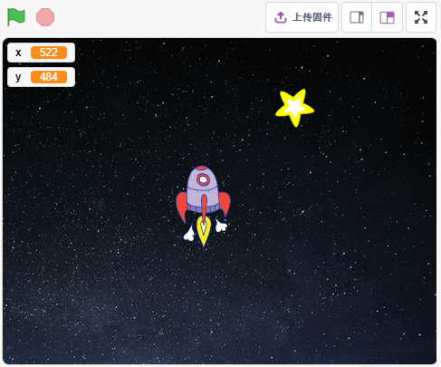
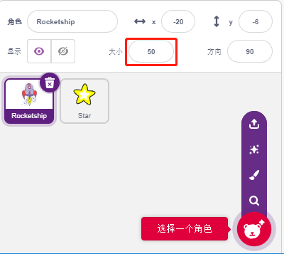
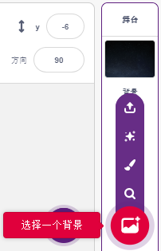
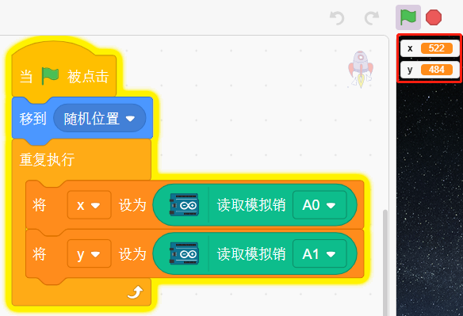
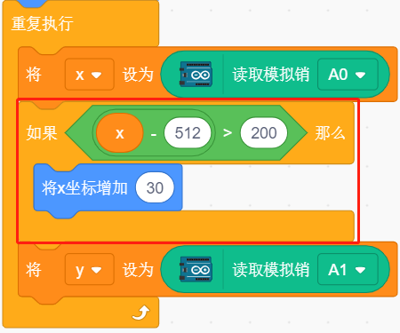
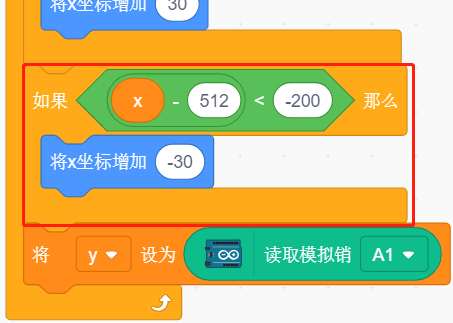
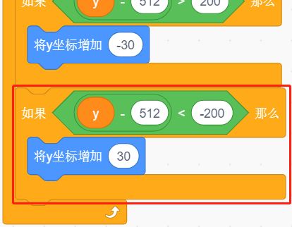
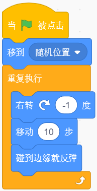
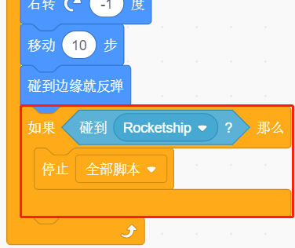

14. 游戏 - 星际穿越
==========================

在这里，我们使用摇杆模块来玩一个躲避星星的游戏：

脚本运行后，舞台上会随机出现星星，你需要用摇杆控制火箭精灵躲避星星，如果碰到了，游戏将结束。

你将学习
---------------------

- 摇杆模块工作原理
- 根据摇杆的值来设置精灵的x，y坐标
- 让精灵去随机的位置
- 精灵之间的触碰事件

搭建电路
-----------------------

操纵杆是一种输入设备，由一个在底座上旋转的操纵杆组成，并向它所控制的设备报告其角度或方向。操纵杆通常用于控制视频游戏和机器人。

为了将完整的运动范围传达给计算机，操纵杆需要在两个轴上测量操纵杆的位置——X 轴（从左到右）和 Y 轴（上下）。

摇杆的运动坐标如下图所示：

.. note::
    * x坐标是从左到有，范围是0-1023
    * y坐标是从下到上，范围是0-1023

.. image:: img/16_joystick.png

现在按照下图搭建电路.

.. image:: img/16_circuit.png

* :ref:`面包板`
* :ref:`摇杆模块`

编程
------------------
整个脚本要实现的效果是，当绿旗点击时，Star精灵在舞台上呈曲线运动，你需要用摇杆来移动Rocketship, 以免它被Star精灵碰到。

**1. 添加精灵和背景**

删除模块精灵，用 **选择一个角色** 按钮来添加 **Rocketship** 精灵和 **Star** 精灵。注意将Rocket的尺寸设置为50%。

现在通过 **选择一个背景** 来添加 **Stars** 背景。

**2. 为Rocketship编写脚本**

Rocketship精灵要实现的效果，它会在随机位置出现，然后由摇杆控制它的上下左右移动。

工作流程如下：

* 当绿旗被点击时，让精灵去随机的位置，创建2个变量x和y, 分别存放从A0（VRX of Joystick）和A1（VRY of Joystick）的读的值。你可以让脚本运行，上下左右拨动摇杆，看下x和y的取值范围。

* A0的值的范围时0-1023（中间位置约为512），用 [x-512>200]来判断Joystick是否向右拨动，如果是则让精灵的x坐标+30（让精灵向右移动）。

* 如果向左拨动 [x-512<-200], 则如果是则让精灵的x坐标-30（让精灵向左移动）。

* 由于Joystick的y坐标是从上（0）到下（1023），而精灵的y坐标是从下（-211）到上（211）。所以为了能在向上拨动摇杆，精灵也向上移动，须在脚本中让y坐标-30。

.. image:: img/16_roc5.png

* 如果摇杆下拨拨动，精灵y坐标+30.

**3. 为Star编写脚本**

Star精灵要实现的效果是在随机的位置出现，并且碰到Rocketship, 则停止脚本运行，游戏结束。

* 当绿旗被点击，精灵去随机的位置，[右转（）度] 块是让Star精灵向前移动的同时，有点角度变化，这样你就能看到它是呈曲线运动，并在碰到边缘就反弹。

* 如果精灵在移动过程中碰到了Rocketship精灵，则停止脚本运行。

