15. 游戏 - 吃苹果
==============================
在接下来的项目中，我们将在PictoBlox中玩一些有趣的小游戏。

在这里，我们使用按键控制甲壳虫去吃苹果的游戏。

当绿旗被点击时，按下按键，甲壳虫将旋转，再次按下按键，甲壳虫停止运行，并按照这个角度向前走。你需要控制甲壳虫的角度，让它在前进的同时不碰到地图上的黑线，直到吃到苹果。如果碰到黑线，游戏结束。

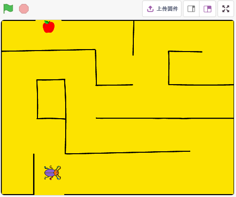

你将学习
---------------------

- 触碰颜色事件
- 嵌套条件循环
- 切换背景和绘制背景

搭建电路
-----------------------

该按钮为4引脚器件，因为1引脚连接到2引脚，3引脚连接到4引脚，当按下按钮时，4个引脚连接在一起，从而闭合电路。

.. image:: img/5_buttonc.png

按照下图搭建电路：

* 将按钮左侧的其中一个引脚连接到12引脚，该引脚连接下拉电阻和0.1uF（104）电容（以消除抖动并在按钮工作时输出稳定电平）。
* 将电阻和电容的另一端连接到GND，将按钮右侧的一个引脚连接到5V。

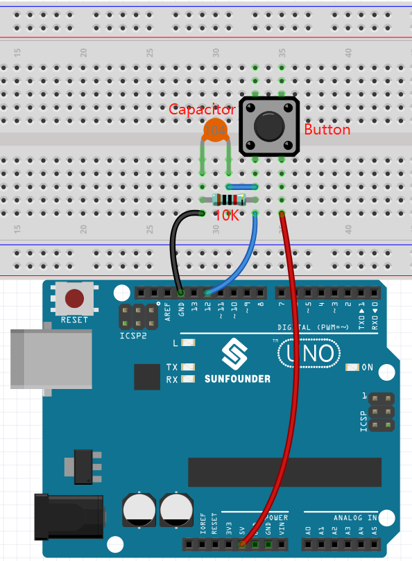

* :ref:`面包板`
* :ref:`按键`
* :ref:`电阻`
* :ref:`电容`

编程
------------------
我们要实现的效果是用按键的控制Beetle精灵前进方向，在不碰触Maze背景上的黑色线的情况下，吃到苹果，吃到后会切换背景。

现在来添加相关背景和精灵。

**1. 添加背景**

通过 **选择一个角色** 按钮添加一个 **Maze** 背景。

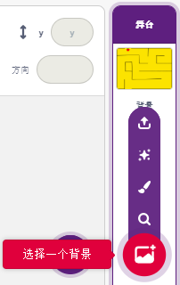

**2. 画一个背景**

我们需要一个背景来提示beetle精灵已成功吃到Maze背景上的苹果。现在来简单绘制一个背景，在背景上出现WIN! 字符。

首先点击背景缩略图，进入到 **背景** 页面，点击空白的 **背景1**。

.. image:: img/14_paint_back.png
    :width: 800

现在开始绘制，你可以参考下图绘制，也可以自行绘制一个背景，只要表达的意思是赢了就行。

* 使用画圆工具，画一个椭圆，颜色设置为红色，没有轮廓。
* 再使用文本工具，写字符 WIN!, 将字符颜色设置为黑色，调整字符的大小和位置。
* 将背景命名为Win

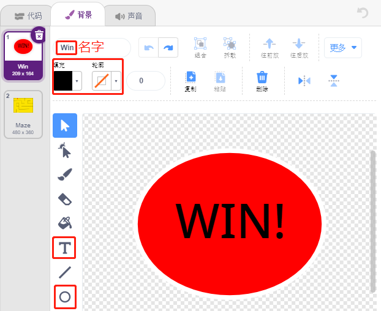

**3. 为背景编写脚本**

在每次游戏启动的时候，都需要将背景切换为Maze。

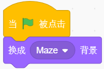

**4. 添加一个精灵**

删除默认精灵，选择 **Beetle** 精灵.

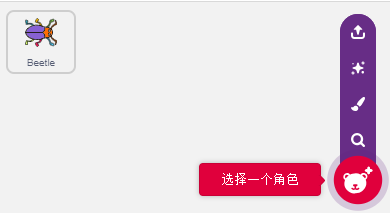

将Beetle精灵放在Maze精灵的入口处，记住此时的x,y坐标值，并调整精灵大小为40%。

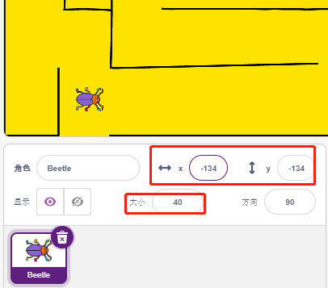

**5. 为精灵Beetle编写脚本**

现在为精灵Beetle编写脚本，让它能够在按键的控制下前进和转动方向，工作流程如下：

* 当绿色旗子点击时，将Beetle角度设置为90, 位置为（-134，-134），或者换成你自己放置的位置的坐标值。创建变量flag，并设置初始值为-1。

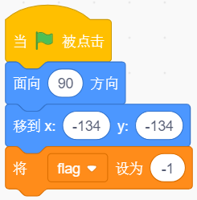

接下来在[重复执行]块中，用了4个[如果（）那么]块来判断各种可能出现的情况。

* 如果按键为1（被按下），用[除以（）的余数] 块将变量flag的值在0和1之间切换（这次按下为0，下次按下为1，以此交替）。

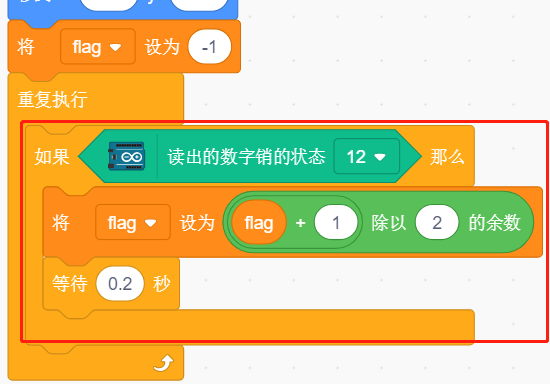

* 如果flag=0（此次按键按下）, 让Beetle精灵顺时针转动。再判断flag是否等于1（按键再次按下）, Beetle精灵前进。否则就一直顺时针转动。

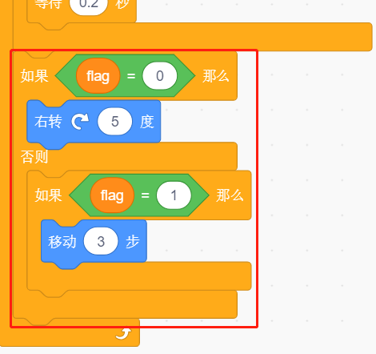

* 如果 **Beetle** 精灵碰到黑色（在Maze背景上的黑色线），游戏结束并且脚本停止运行。

.. note::

    你需要点击[碰到颜色（）?]块中的颜色区域，然后用吸管工具来吸取舞台上黑线的颜色。如果你随意选择黑色，则此[碰到颜色（）?]块将不起作用。

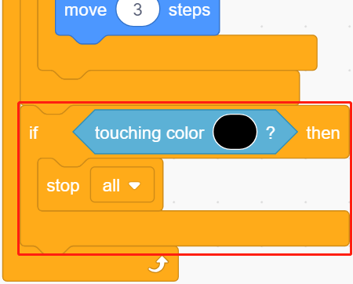

* 如果甲壳虫碰到红色（也用吸管工具吸取苹果的红色），背景将切换到Win，这意味着游戏成功并停止脚本运行。

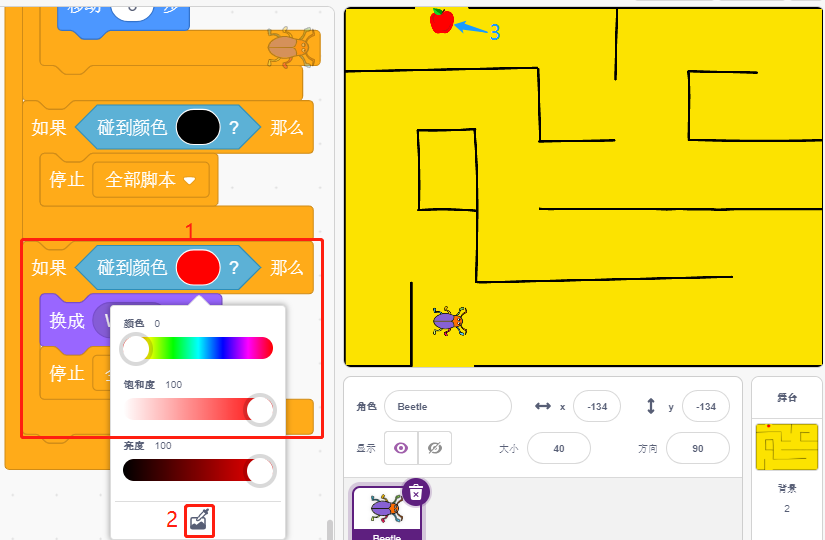

