16. 游戏 - 愤怒的鹦鹉
==============================

在这里，我们使用超声波模块来玩一个愤怒的鹦鹉的游戏：

脚本运行后，绿色的竹子会在最右侧随机高度慢慢向左移动。现在将手放在超声波上方，如果手与超声波距离小于10，鹦鹉将向上飞，否则将向下落。
你需要控制你的手与超声波的距离，让鹦鹉可以躲过绿色的竹子, 如果碰到了，则游戏结束。

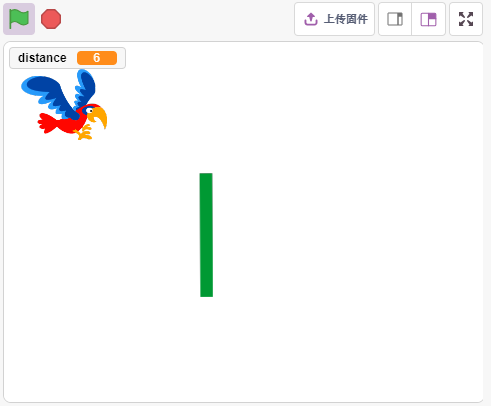

你将学习
---------------------

- 超声波模块工作原理
- 克隆精灵本身

搭建电路
-----------------------

超声波传感器模块是一种使用超声波测量与物体之间距离的仪器。它有两个探头。一种是发送超声波，另一种是接收超声波并将发送和接收的时间转换为距离，从而检测设备与障碍物之间的距离。

现在根据下图构建电路：

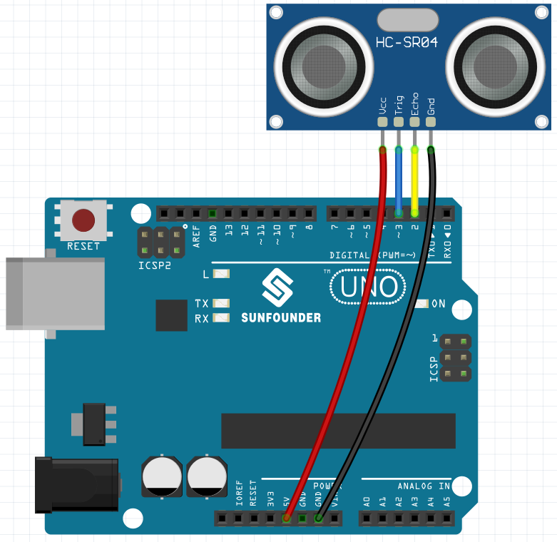

* :ref:`面包板`
* :ref:`超声波模块`

编程
------------------
我们要实现的效果是用超声波控制精灵Parrot的飞行高度，同时躲开Paddle精灵。

**1. 添加精灵**

删除默认精灵，并使用 **选择一个角色** 按钮添加鹦鹉精灵。将其大小设置为 50%，并将其位置移动到左中心。

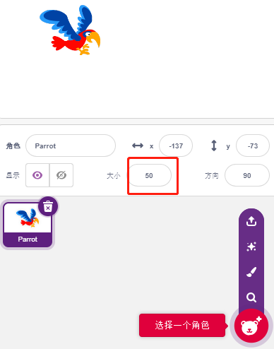

现在添加Paddle精灵，设置它的尺寸为150%，将它的角度设置为180，并将它的初始位置挪到右上角。

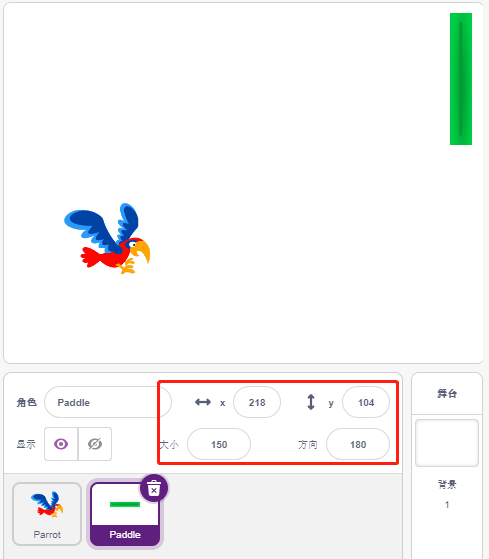

进入到Paddle精灵的 **造型** 页面，移除轮廓.

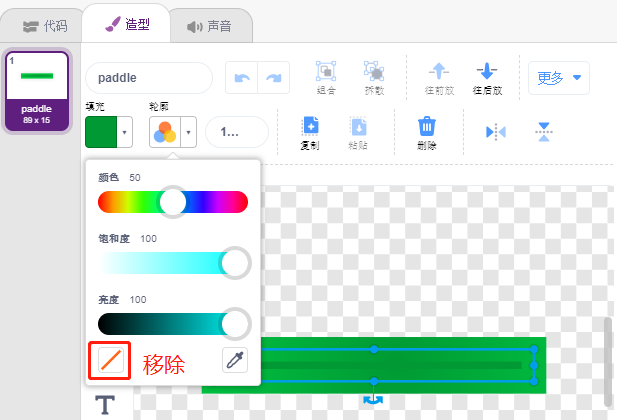

**2. 为Parrot编写脚本**

现在为Parrot精灵脚本，它处于飞行状态，飞行高度由超声波模块的决定，工作流程如下：

* 当绿色旗子被点击时，每隔0.2s切换精灵造型，让它一直处于飞行状态。

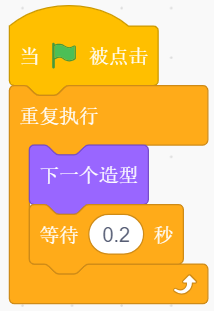

* 读取超声波传感器的值，用[四舍五入]块取整之后，存放到变量distance中。

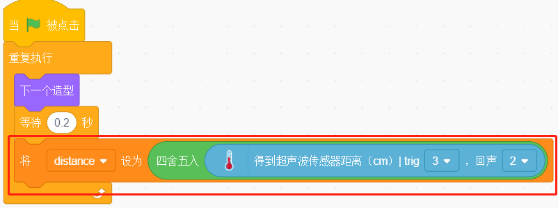

* 如果超声波检测的距离低于10cm, 则让y坐标增加50，即Parrot精灵将向上飞. 否则，y坐标值减少20，即Parrot向下落。

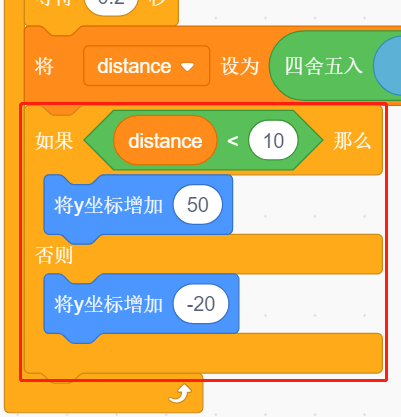

* 如果Parrot精灵碰到了Paddle精灵，则游戏结束，脚本停止运行。

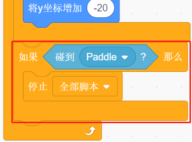

**3. 为Paddle精灵编写脚本**

现在为Paddle精灵编写脚本，它需要随机出现在舞台上。工作流程如下：

* 当绿色旗子被点击时，隐藏精灵Paddle, 并同时将它自己克隆。[克隆（）]块是一个控制块和一个堆栈块。它在参数中创建了精灵的克隆。它还可以克隆它正在运行的精灵，递归地创建克隆的克隆。

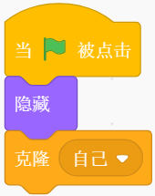

* 当Paddle是以克隆体出现，显示它的位置，它的x坐标为220（最右边），y坐标在（-125~125）随机（高度随机）。

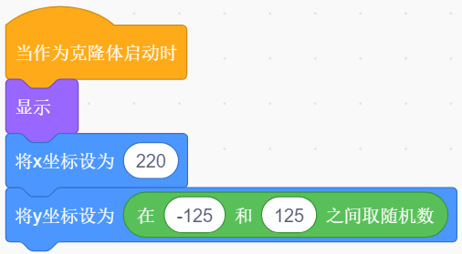

* 使用[重复执行（）次] 块让它的x坐标值慢慢减少，这样你就能看到Paddle精灵的克隆体从最右边慢慢移动到最左边，直到消失。

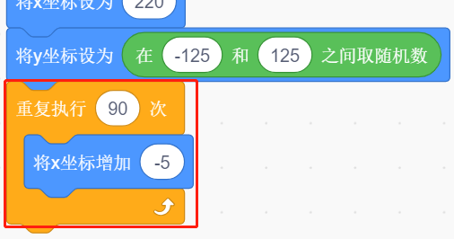

* 重新克隆一个新的Paddle精灵，并将上一个克隆的Paddle删除。

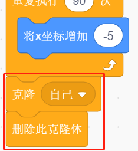