17. 游戏 - 打砖块
============================

在这里，我们使用电位器来玩一个打砖块的游戏：

脚本运行后，你需要移动舞台下方的横条，让黄色的球在落下的时候能够接住，并让它向上弹向舞台上方的砖块，碰到一个砖块，砖块就会消失。砖块全部消失，则游戏赢了，若横条没有接住球，则游戏结束。

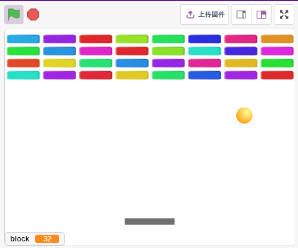

搭建电路
-----------------------

按照下图搭建电路，电位器是一个有3个端子的电阻元件，2侧的引脚分别接5V和GND，中间引脚接到A0，经过Arduino板的ADC转换器转换后，得到的数值范围为0-1023.

.. image:: img/6_circuit.png

* :ref:`面包板`
* :ref:`电位器`

编程
------------------
在舞台上有3个精灵：

* Paddle精灵：Paddle精灵初始位置在舞台的下方中心，它的左右移动由电位器控制。
* Ball精灵：Ball精灵在舞台上四处弹，当向上弹碰到Block1精灵，它将向下反弹；下落的时候如果碰到了Paddle精灵，它将向上弹，若没有碰到，则停止脚本运行。
* Block1精灵：在舞台上方克隆4x8个Block1精灵, 颜色随机，当Block1的克隆被Ball精灵碰到，则删除该克隆。

**1. Paddle精灵**

Paddle要实现的效果是，初始位置为舞台下方中间，由电位器来控制它向左或向右移动。

* 删除默认精灵，使用 **选择一个角色** 按钮来添加 **Paddle** 精灵，并将它的x和y设置为（0，-140）。

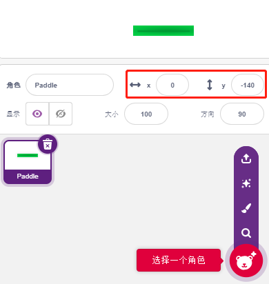

* 进入到 **造型** 页面，移除轮廓并将它的颜色修改成深灰色。

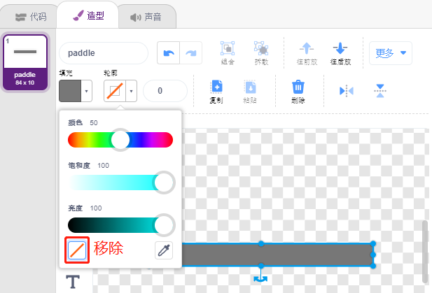

* 现在为Paddle精灵编写脚本，当绿旗点击时，设置它的初始位置为（0，-140），读取A0（电位器）的值存放到变量a0. 由于Paddle精灵在舞台上从左边移动到右边的x坐标为-195~195，所以需要用[从映射（）]块将变量a0范围0~1023映射到-195~195。

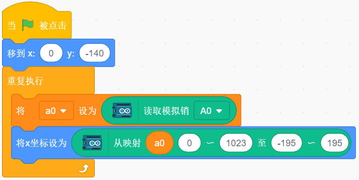

* 现在你可以旋转电位器，看起Paddle是否能在舞台上左右移动。

**2. Ball精灵**

Ball精灵要实现的效果是：在舞台上向移动，碰到边缘就反弹；如果碰到舞台上方的block时就会向下弹；如果下落过程中碰到Paddle精灵就会向上弹；如果在下落过程中，没有碰到Paddle精灵，停止脚本运行，游戏结束。

* 添加 **Ball** 精灵。

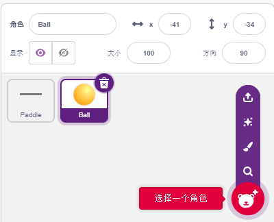

* 当绿旗点击时，设置Ball精灵的角度为45°，并设置初始位置为（0，-120）.

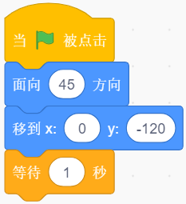

* 现在让Ball精灵在舞台上移动，碰到边缘则反弹，你可以点击绿旗看下效果。

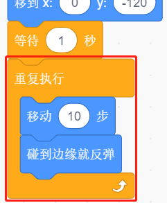

* 当Ball精灵碰到Paddle精灵时，进行一次反射。简单的做法是让角度直接取反，但是这样做的话，你会发现小球的路径是完全固定的，这未免过于无趣。因此，我们借助两个精灵的中心点进行计算，让小球往挡板中心的反方向弹出。

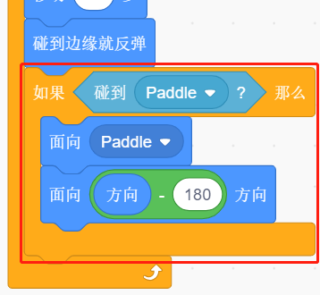

.. image:: img/17_ball6.png

* 当Ball精灵下落到舞台边缘，则停止脚本运行，游戏结束。

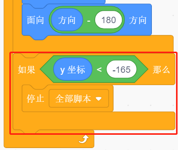

**3. Block1精灵**

Block1精灵要出现的效果是，在舞台上方克隆4x8个它自己，颜色随机显示，如果某个克隆体被Ball精灵碰到，则删除这个克隆。
Block1精灵在PictoBlox库中没有，你需要自己绘制或者用现有的精灵修改。这里我们是将 用 **Button3** 精灵修改。

* 添加 **Button3** 精灵，进入到 **造型** 页面，删除button-a，将button-b宽度和高度都缩小，并将精灵名字改为 **Block1** , 如下图所示：

.. note::

    * 对于Block1的宽度，你可以大概在屏幕上模拟下，看下是否一行能放下8个，如果不能再适当缩小宽度。
    * 在缩小Block1精灵的过程中，需要让中心点保持在精灵的中间位置。

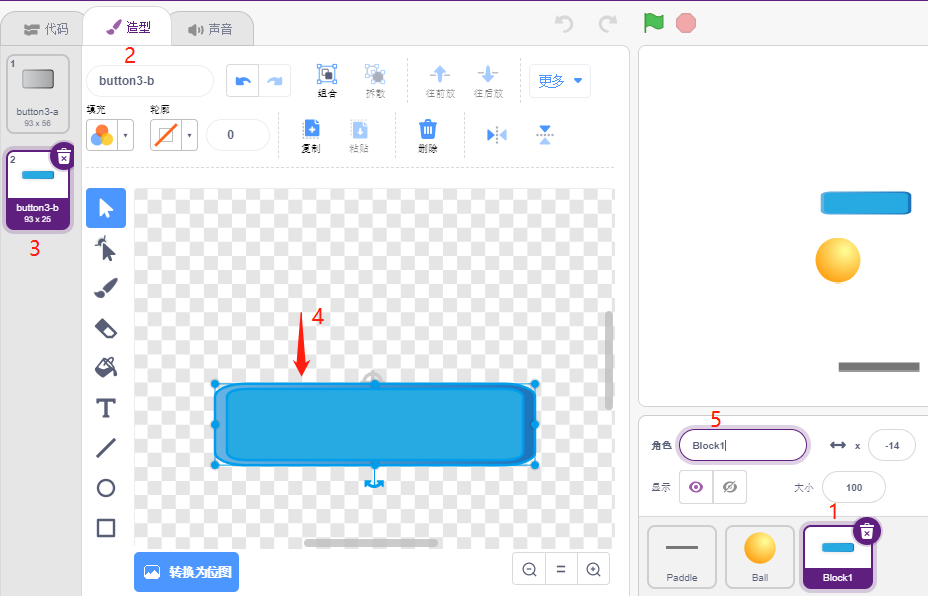

* 现在开始编写脚本，先创建2个变量，block用来存放块的个数，roll用来存放行数。

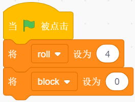

* 我们需要让克隆Block1精灵，让它从左到右，从上到下，一个一个显示，总共显示4x8个，颜色随机显示。

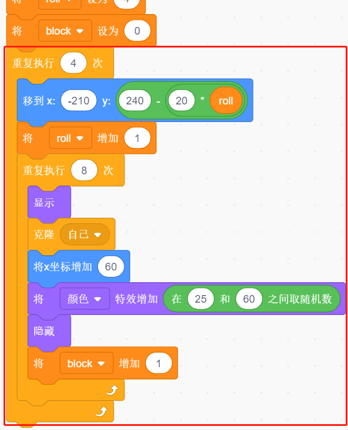

* 脚本写完后，点击绿旗，看下舞台上的显示效果，如果太紧凑或者太小，你可以改变 **大小** 的值.

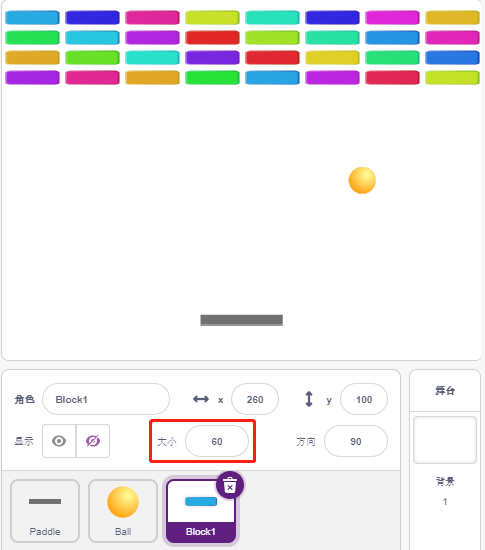

* 现在编写触发事件。如果克隆的 **Block1** 精灵接触到 **Ball** 精灵，则删除该克隆并广播消息 **crush**。

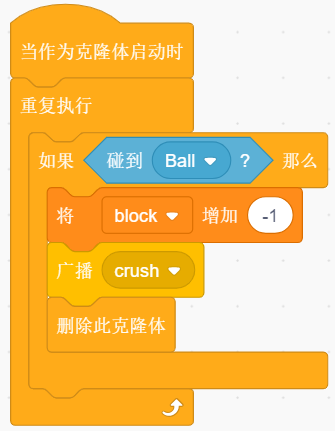

* 回到 **Ball** 精灵，当接收到广播 **crush** (即 **Ball** 精灵碰到 **Block1** 的克隆)，则 **Ball** 从反方向弹出。

.. image:: img/17_ball7.png

