18. 游戏 - 钓鱼
===========================

在这里，我们使用按键来玩一个钓鱼的游戏：

脚本运行后，鱼在舞台上左右游动，你需要在鱼快靠近鱼钩时，按下按键(建议按久一点时间)来将鱼钓起，同时会自动记录钓鱼的数量。

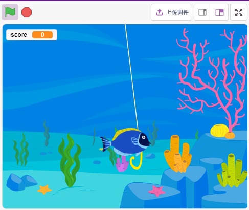

搭建电路
-----------------------

该按钮为4引脚器件，因为1引脚连接到2引脚，3引脚连接到4引脚，当按下按钮时，4个引脚连接在一起，从而闭合电路。

.. image:: img/5_buttonc.png

按照下图搭建电路：

* 将按钮左侧的其中一个引脚连接到12引脚，该引脚连接下拉电阻和0.1uF（104）电容（以消除抖动并在按钮工作时输出稳定电平）。
* 将电阻和电容的另一端连接到GND，将按钮右侧的一个引脚连接到5V。

.. image:: img/7_circuit.png

* :ref:`面包板`
* :ref:`按键`
* :ref:`电阻`
* :ref:`电容`

编程
------------------
我们需要先选择一个Underwater的背景，然后添加Fish精灵，让它在舞台上来回游动。然后绘制一个Fishhook精灵，由按键控制它起钓。当Fish精灵碰到Fishhook的鱼钩（红色），代表已钓到一条鱼。

**1. 添加背景**

使用 **选择一个背景** 按钮来添加一个 **Underwater** 的背景。

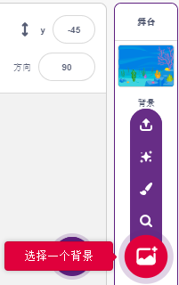

**2. Fishhook精灵**

鱼钩精灵要实现的效果是，它平时以黄色状态呆在水底，当按键按下它处于起钓状态（红色），同时它会移动到舞台上方。

在Pictoblox中没有鱼钩精灵，我们可以用Glow-J精灵修改成鱼钩的样子。

* 通过 **选择一个背景** 添加 **Glow-J** 精灵。

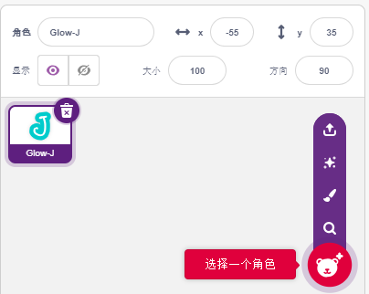

* 现在进入到Glow-J精灵的 **造型** 页面，在画面中选中青色的填充并将它删除。然后将J颜色换成红色，可将它的宽度缩小。最需要注意的点是，需要让它的顶部刚好在中心点位置。

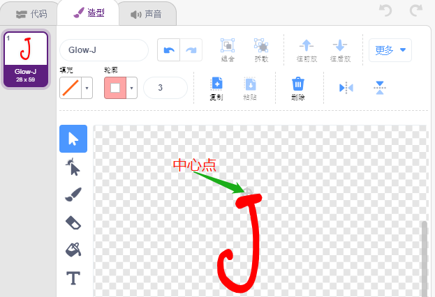

* 用 **画线段** 工具画一条尽可能长的线，让它在舞台上看起来是从最上面往下放。现在鱼钩精灵已绘制完成，将精灵名字设置为Fishhook，并将它移动到合适的位置.

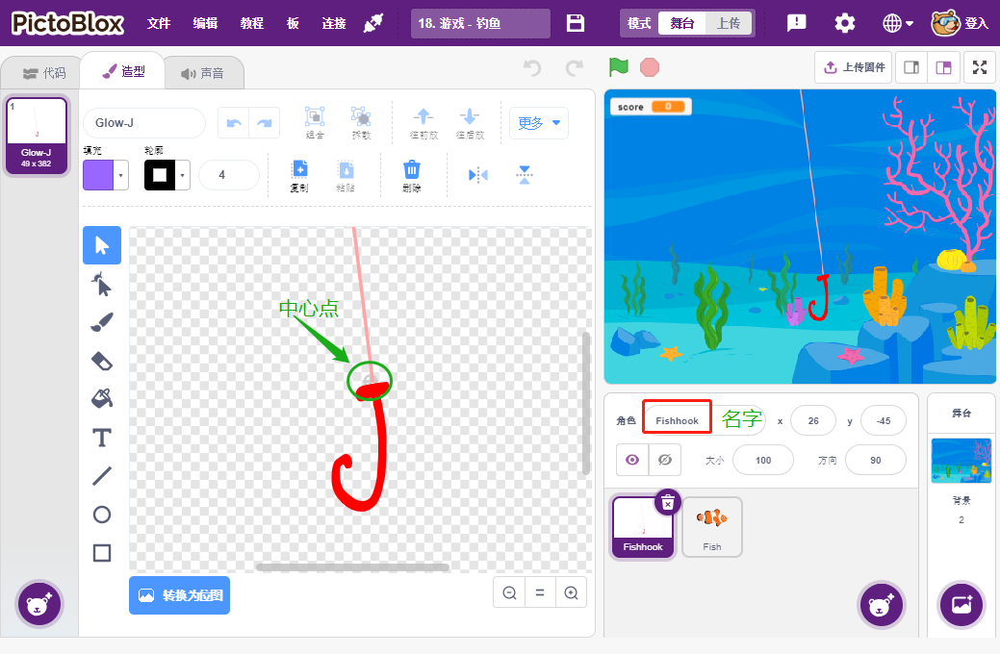

* 当绿旗被点击时，设置精灵的颜色效果为30（yellow）, 并将它的初始位置设置为（26，-45）。

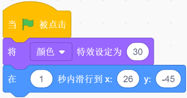

* 如果按键被按下，则将颜色效果设置为0（红色，起钓状态），等待0.1后，将鱼钩精灵移动到舞台上方。松开按键，让鱼钩回到初始位置。

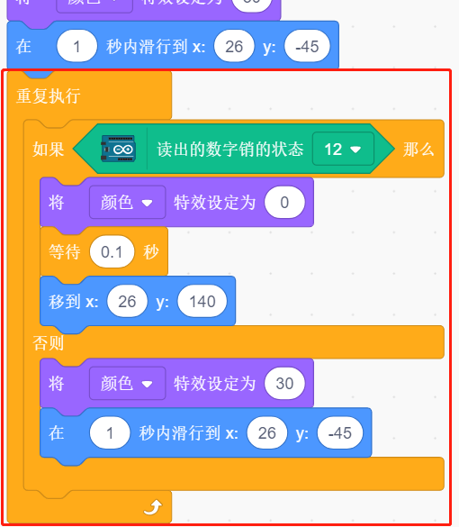

**3. Fish精灵**

fish精灵要实现的效果是，在舞台上左右移动，当碰到遇到Fishhook精灵，则缩小和移动到特定位置后消失，然后再重新克隆fish精灵。

* 添加 **fish** 精灵，并调整它的尺寸和位置。

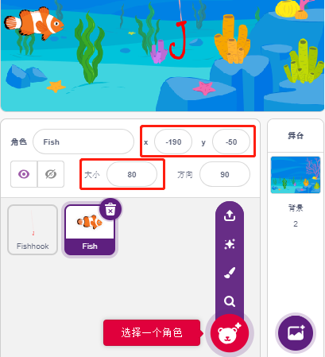

* 现在给fish编写脚本，创建score来存放钓到的鱼的数量，将此精灵隐藏并将它克隆。

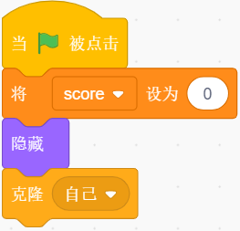

* 将fish精灵的克隆显示，并给它切换造型，设置初始位置为（-190，-50）.

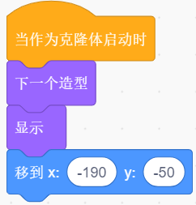

* 让fish精灵的克隆，左右移动，碰到边缘则反弹。

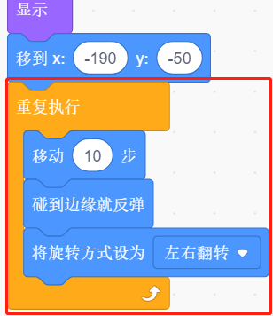

* 鱼的精灵（的克隆）在经过鱼钩精灵时不会有任何反应；当它在钓鱼状态下碰到鱼钩精灵时（变成红色），就会被抓住，这时分数（可变分数）+1，还会出现一个分数动画（缩小40%，迅速移动到记分牌的位置，然后消失）。同时，一条新的鱼被创造出来（一个新的鱼的克隆精灵），游戏继续。

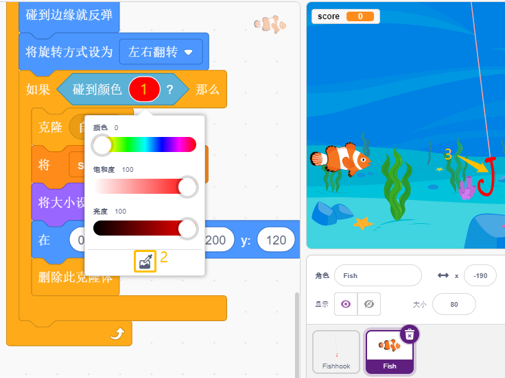

