19. 游戏 - 击败恶龙
============================

在这里，我们使用摇杆来玩kill drogon的游戏：

脚本运行后，龙会在右侧上下浮动，并间歇性喷射火焰，你需要通过摇杆控制魔法棒的移动，在避开龙喷射的火焰的同时，向dragon发射星星攻击，以将它打败。

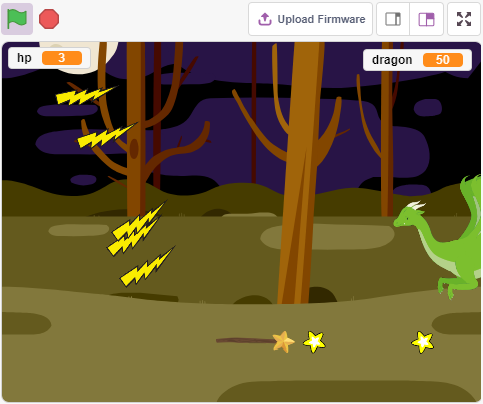

搭建电路
-----------------------

操纵杆是一种输入设备，由一个在底座上旋转的操纵杆组成，并向它所控制的设备报告其角度或方向。操纵杆通常用于控制视频游戏和机器人。

为了将完整的运动范围传达给计算机，操纵杆需要在两个轴上测量操纵杆的位置——X 轴（从左到右）和 Y 轴（上下）。

摇杆的运动坐标如下图所示：

.. note::

    * x坐标是从左到有，范围是0-1023
    * y坐标是从下到上，范围是0-1023

.. image:: img/16_joystick.png

现在按照下图搭建电路.

.. image:: img/16_circuit.png

* :ref:`面包板`
* :ref:`摇杆模块`

编程
------------------

**1. Dragon**

* 通过 **选择一个背景** 按键添加 **Woods** 背景。

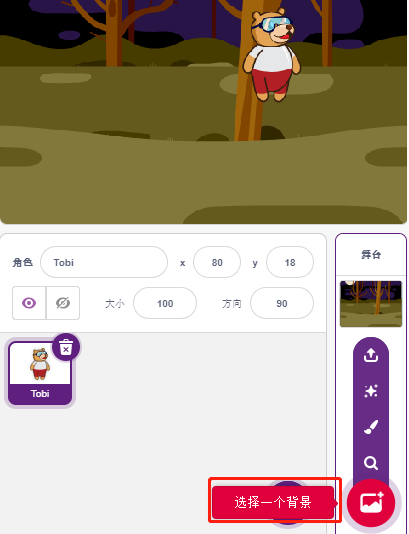

* 删除原有的精灵，添加 **Dragon** 精灵。

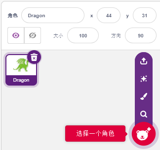

* 进入 **造型** 页面，将 **dragon-b** 和 **dragon-c** 造型水平翻转。

.. image:: img/19_dragon1.png

* 将尺寸设置为50%。

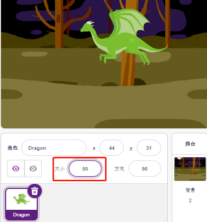

* 现在开始为Dragon精灵编写脚本，先创建变量dragon来记录龙的生命值，初始值设置为50。

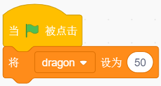

* 接下来将精灵造型切换为dragon-b，并让Dragon精灵在一个范围内上下徘徊。

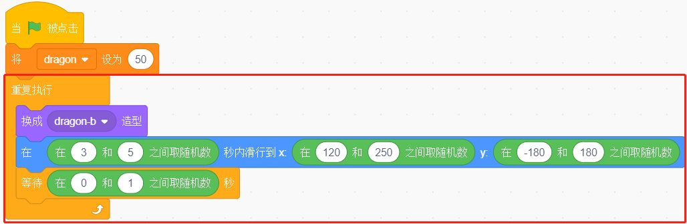

* 添加一个 **Lightning** 精灵作为巨龙喷出的火焰。你需要在造型中将它顺时针转90°，这是为了让闪电发射时的移动方向正确。

.. note::
    在调整Lightning精灵的造型时，你可能会将它移的偏离中心点，这是必须避免的！中心点必须在精灵正中央的位置！

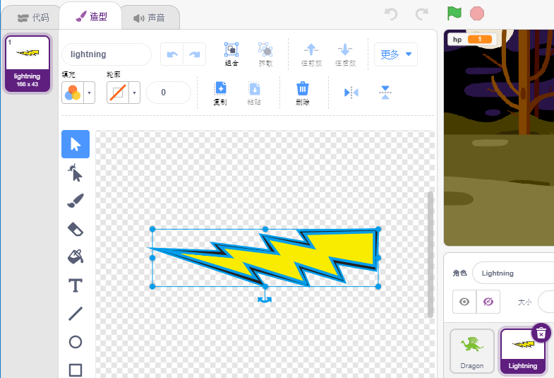

* 随后你需要调整Dragon精灵的 dragon-c 造型，中心点应当位于巨龙口中的火焰处。这样做是为了让dragon精灵和和Lightning精灵的位置能对应的上，避免闪电从巨龙的脚底发射出来。

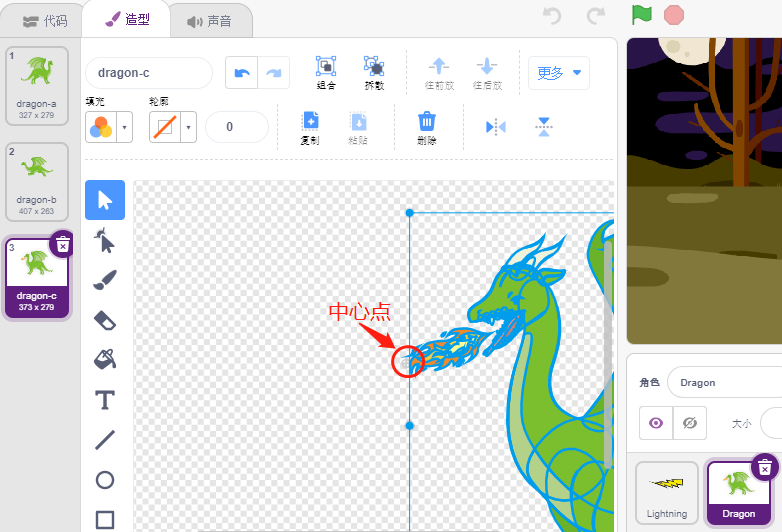

* 相应的，dragon-b也需要调整位置，让龙头和中心点重合。

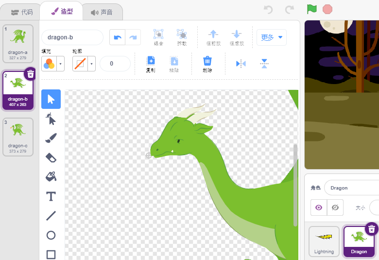

* 调整Lightning精灵的大小和方向，让画面看起来更和谐。现在为Lightning精灵的本体编写脚本，这很容易，只需要让它永远跟着Dragon精灵就可以了。此时点击绿旗，你将看到巨龙衔着闪电移动的情景。

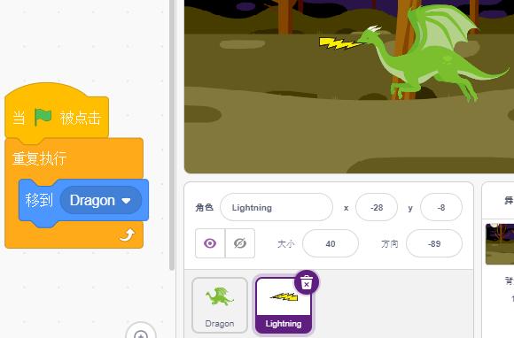

* 回到Dragon精灵，现在让它喷出闪电，注意，不是让口中衔着的闪电射出去，而是为Lightning精灵创造克隆体。

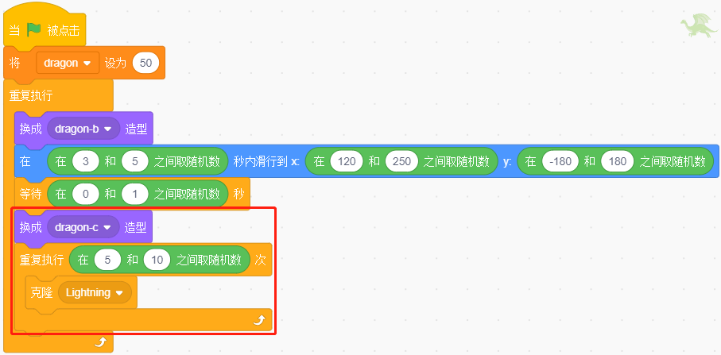

* 打开Lightning精灵，为Lightning克隆体添加功能，随机调整角度后射出，碰撞墙壁会反弹，并在一定时间后消失。

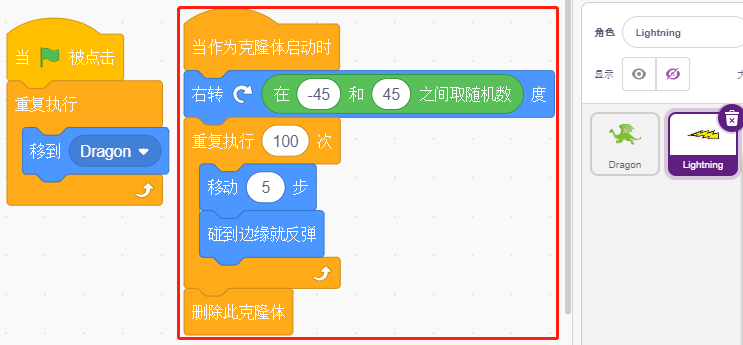

* 在Lightning精灵中，隐藏它的本体，显示克隆体。

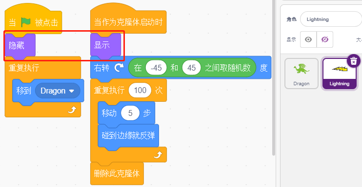

现在，巨龙可以徘徊并喷射闪电了！

**2.Wand**

* 创建一个 **Wand精灵** ，将其方向旋转至180，即指向右侧。

.. image:: img/19_wand1.png

* 为Wand精灵编写脚本，先创建变量来记录它的生命值，初始值设置为3. 随后读取Joystick的值，用来控制魔杖的移动。

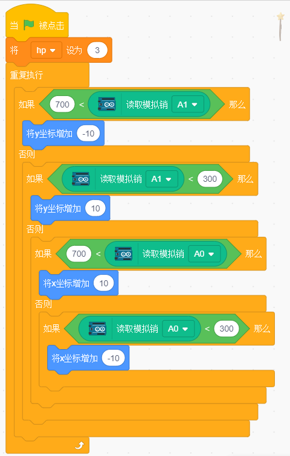

* 巨龙拥有闪电，讨伐巨龙的魔杖也拥有它的“魔法子弹”！创建一个 **Star** 精灵，调整它的大小，并编写脚本使其永远跟随Wand精灵，并且，限制星星的数量为三颗。

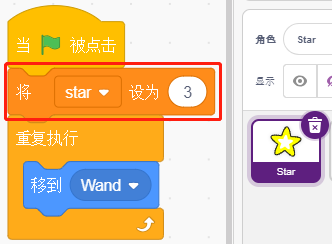

* 让魔杖自动射出星星，魔杖发射星星的方式与巨龙发射雷电的方式一样 —— 创建克隆体。

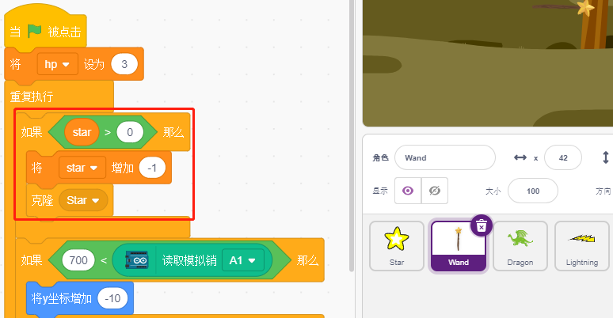

* 回到Star精灵，为它的克隆体编写脚本，令它旋转着往右射出，在超出舞台后消失并恢复星星个数。跟闪电一样，隐藏本体，显示克隆体。

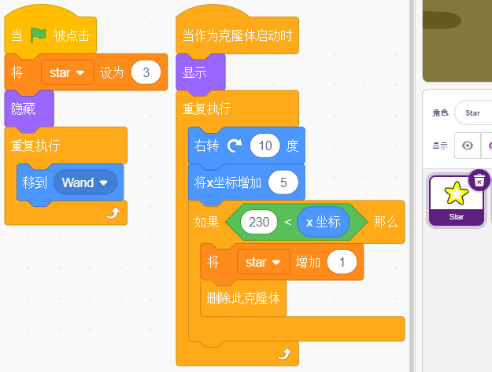

现在，我们拥有一根会射出星星子弹的魔杖了。

**3. Fight！**

魔杖和巨龙目前还是各玩各的，未能影响对方，我们要让它们战斗起来。巨龙很强壮，魔杖则是讨伐巨龙的勇者，它们之间的交互包括了以下部分：

1. 如果魔杖碰到巨龙，会被击退并且损失生命值。
2. 如果闪电击中魔杖，魔杖会损失生命值。
3. 如果星星子弹击中巨龙，巨龙则会损失生命值。

梳理清楚后，我们来继续改动各个精灵的脚本。

* 如果魔杖碰到巨龙，会被击退并且损失生命值。

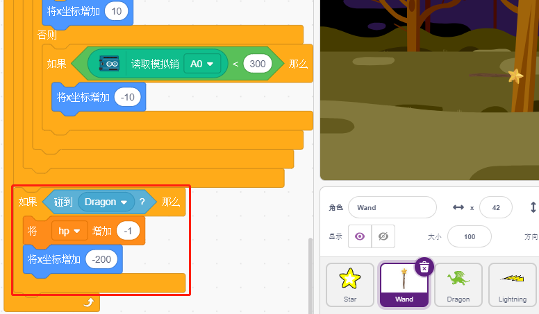

* 如果闪电（Lightning精灵的克隆体）击中魔杖，它会发出pop音效并消失，魔杖则是会损失生命值。

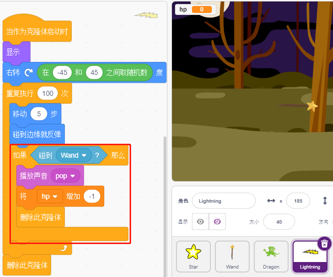

* 如果星星子弹（Star精灵的克隆体）击中巨龙，它会发出collect音效并消失，同时恢复星星子弹的计数，巨龙则是会损失生命值。

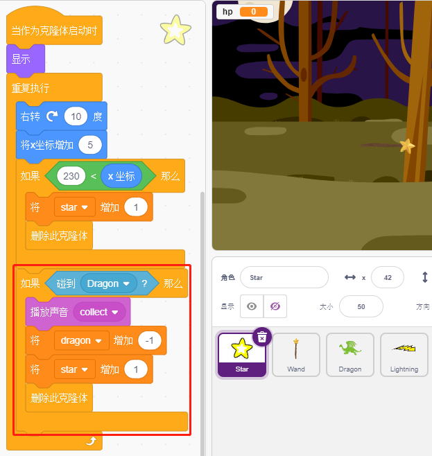

**4. 舞台**

魔杖与巨龙的战斗最终将分出胜负，我们用舞台来表示。

* 添加 **Blue Sky** 背景, 并在Blue Sky背景上写上字符 “WIN!” 来代表恶龙被杀死，黎明到来。

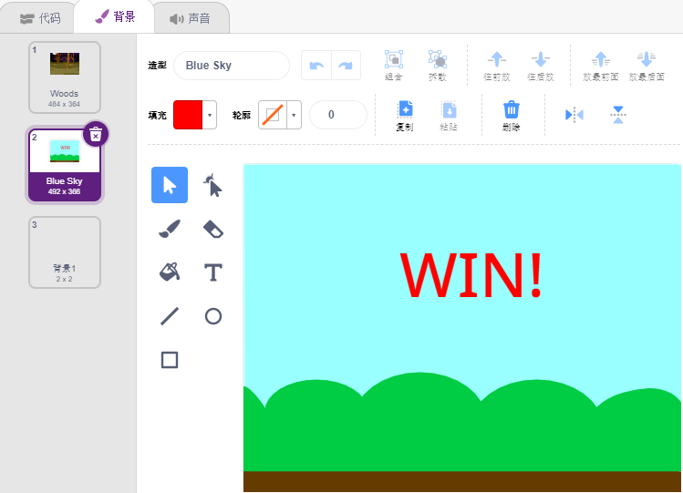

* 并将空白背景修改如下，用来代表游戏失败，一切都将陷入黑暗。

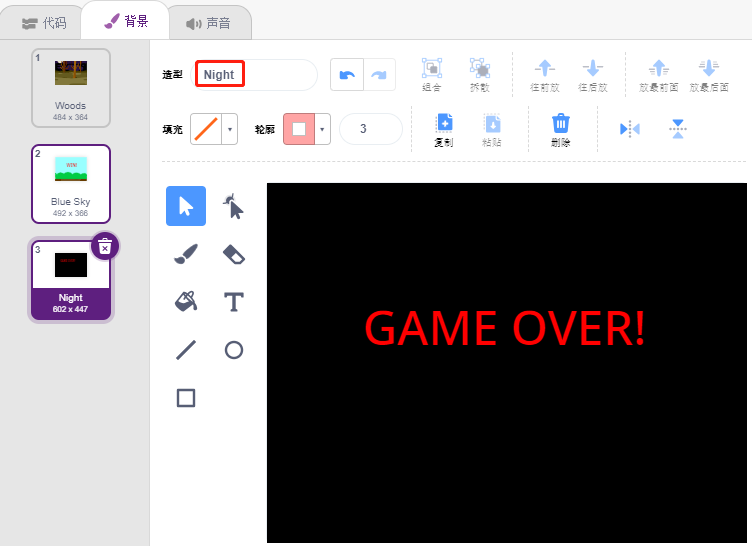

* 现在编写脚本来切换这些背景，当绿旗被点击时，切换到Woods背景；如果恶龙的生命值小于1 ，则游戏成功，将背景切换到Blue Sky；如果你的生命值小于1，则切换到Night背景，游戏失败。

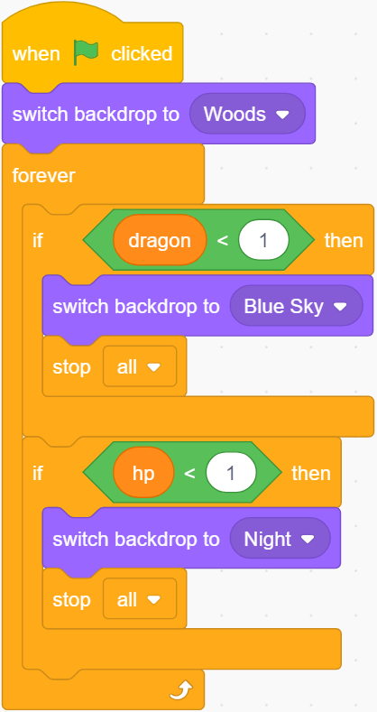