1. PictoBlox的快速使用指南
====================================

现在开始制作我们的第一个项目来学习 PictoBlox 的 2 种模式。

另外，在Arduino Uno/Mega2560上有一个内嵌的LED连接在Pin 13，我们将学习在2个不同的模式下，让这个LED闪烁。

.. image:: img/1_led.jpg
    :width: 500
    :align: center

你将学习
---------------------

- 舞台和上传模式
- 给引脚设置高低电平
- 设置时间间隔和让脚本无限循环

舞台模式
---------------

**1.连接到Arduino板**

用一根USB线将你的Arduino板子连接到电脑上，一般电脑会自动识别你的板子，最后分配一个COM端口.

打开PictoBlox, 你会看到右上角可进行模式切换。默认是 **舞台模式**，Tobi站在舞台上。

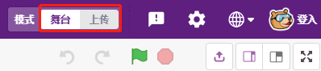

在右上角的导航栏点击 **板**。

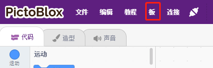

比如选择Arduino Uno

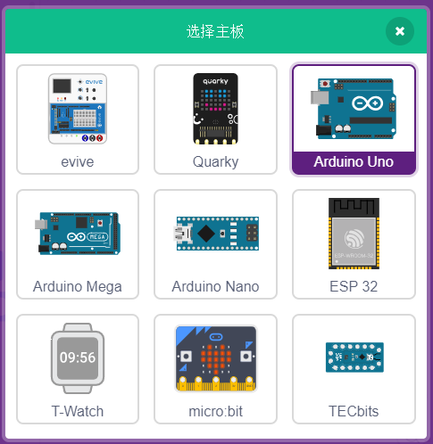

随即会弹出连接窗口让你选择特定的 **设备名称 COMxx** 来连接，连接完成后回到主页。若在使用过程中断链，你也可以重新连接。

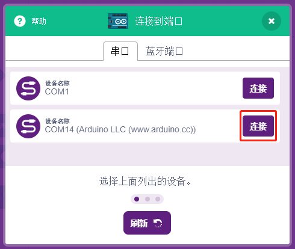

于此同时，与Arduino Uno相关的调色板，比如，Arduino的乌诺, 执行器等将出现在调色板区域中。

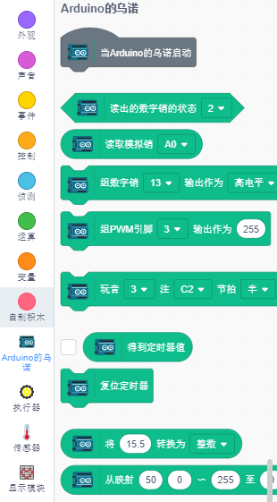

**2. 上传固件**

由于我们要在 **舞台模式** 下工作，我们必须将固件上传到板上，它将确保电路板和计算机之间的实时通信，上传固件是一个一次性过程。为此，请单击 **上传固件** 按钮。
等待一段时间后，上传成功提示将会出现。

.. note::
    如果你是第一次在PictoBlox中使用这个Arduino板子，或者是这个Arduino之前用Arduino IDE上传的代码。那你在使用前，需要点 **上传固件**。

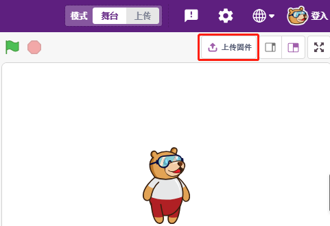

**3. 编程**

* 直接打开和运行脚本

当然，如果你想直接打开脚本运行它，你可以参考 :ref:`下载资料`，我们已经将所有脚本都已经上传。

你可以单击右上角的 **文件** -》 **打开**。

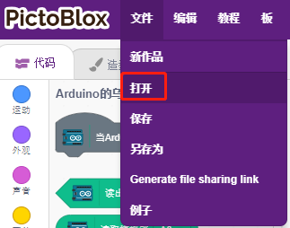

选择 **从计算机上打开**.

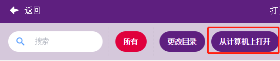

去到这个路径: ``SunFounder Uno R3学习套件\Scratch项目代码\代码`` 来打开 **1. 舞台模式.sb3**。请确保你已经参考 :ref:`下载资料` 来下载所需的代码.

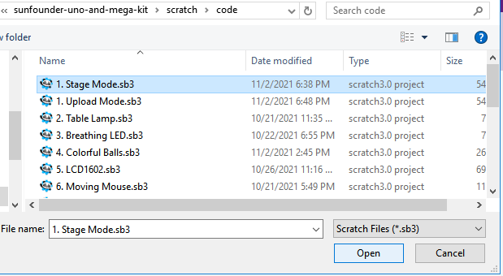

直接点击脚本运行，有些项目是点击绿旗或者点击精灵。

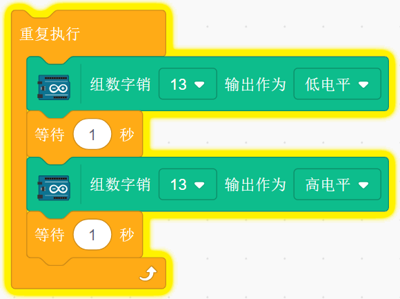

* 一步一步编程

你还可以按照以下步骤逐步编写脚本。

单击 **Arduino乌诺** 调色板。

Arduino板上的LED由数字引脚13（只有 2 个状态高或低）控制，因此将 [组数字销（）输出作为（高/低电平）] 块拖到脚本区域。

由于 LED 的默认状态是点亮的，现在将引脚 13 设置为低电平并单击此块，你将看到 LED 熄灭。

* [组数字销（）输出作为（高/低电平）]：将数字引脚（2~13）设置为（高/低）电平。

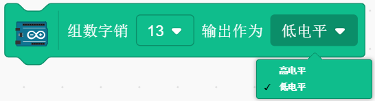

为了看到LED连续闪烁的效果，需要使用 **控制** 调色板中的[等待 1 秒]和[重复执行]块，如下图，写入后点击这些块，有黄色光晕意味着它正在运行。

* [等待 1 秒]：来自控制调色板，用于设置 2 个块之间的时间间隔。
* [重复执行]：来自控制调色板，允许脚本继续运行，除非手动暂停。

上传模式
---------------

**1.连接Arduino板**

用一根USB线将你的Arduino板子连接到电脑上，一般电脑会自动识别你的板子，最后分配一个COM端口.

在右上角的导航栏点击 **板**。

例如，选择 **Arduino Uno**.

随即会弹出连接窗口让你选择特定的 **设备名称 COMxx** 来连接，连接完成后回到主页。若在使用过程中断链，你也可以重新连接。

于此同时，与Arduino Uno相关的调色板，比如，Arduino的乌诺, 执行器等将出现在调色板区域中。

选择上传模式后，舞台区域就会替换成Arduino源码。

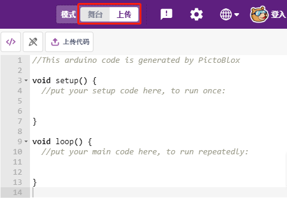

**2. 编程**

* 直接打开和运行脚本

你可以单击右上角的 **文件** -》 **打开**。

选择 **从计算机上打开**.

去到这个路径: ``SunFounder Uno R3学习套件\Scratch项目代码\代码`` 来打开 **1. 上传模式.sb3**。请确保你已经参考 :ref:`下载资料` 来下载所需的代码.

.. image:: img/0_upload.png

最后点击 **上传代码** 按钮。

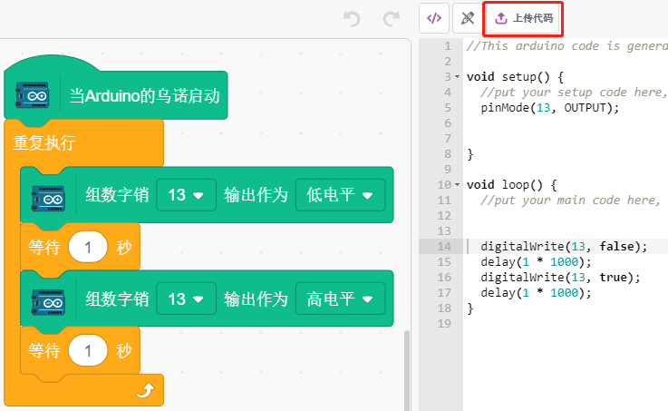

* 一步步编程

你还可以按照以下步骤逐步编写脚本。

单击 **Arduino乌诺** 调色板。

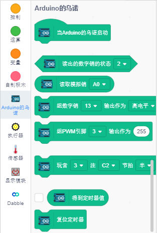

将[Arduino的乌诺启动]块拖到脚本区域，这个在上传模式中每个脚本都需要的。

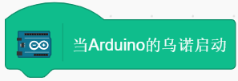

Arduino板上的LED由数字引脚13（只有 2 个状态高或低）控制，因此将 [组数字销（）输出作为（高/低电平] 块拖到脚本区域。

由于 LED 的默认状态是点亮的，现在将引脚 13 设置为低电平并单击此块，你将看到 LED 熄灭。

* [组数字销（）输出作为（高/低电平）]：将数字引脚（2~13）设置为（高/低）电平。

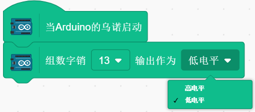

此时你将看到Arduino代码显示在右侧，如果你想要编辑这个代码，你可以将 **编辑模式** 打开。

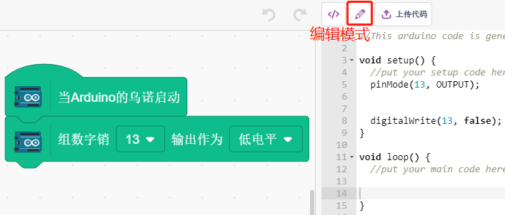

为了看到LED连续闪烁的效果，需要使用 **控制** 调色板中的[等待 1 秒]和[重复执行]块，如下图，写入后点击这些块，有黄色光晕意味着它正在运行。

* [等待 1 秒]：来自控制调色板，用于设置 2 个块之间的时间间隔。
* [重复执行]：来自控制调色板，允许脚本继续运行，除非手动暂停。

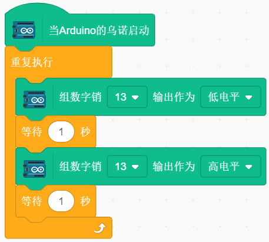

最后点击 **上传代码** 按钮。

