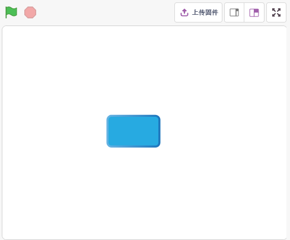
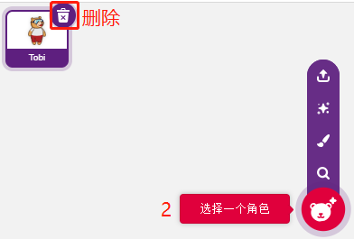
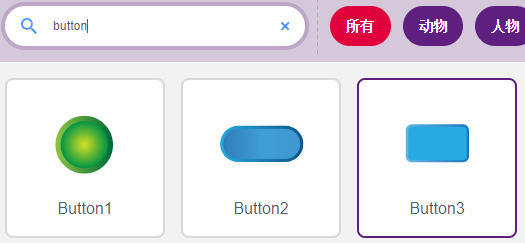
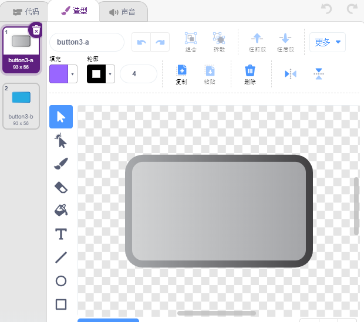
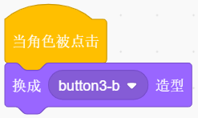

2. 台灯
================

上一个项目是在让Arduino板上内置的LED点亮，这里，我们在面包板上接一个LED，并由舞台上的精灵来控制这个LED的闪烁。

当舞台上的按键精灵被点击时，LED将闪烁5次，然后停止。

你将学习
---------------------

- 面包板，LED和电阻
- 在面包板上搭建电路
- 删除和选择精灵
- 切换造型
- 有限次数的循环

搭建电路
-----------------------

按照下图，在面包板上搭建电路。

由于LED的阳极（长的引脚）通过220Ω的电阻连接到pin 9, LED的阴极接GND。所以你给pin 9高电平就能点亮这个LED。

.. image:: img/2_circuit.png

* :ref:`面包板`
* :ref:`LED发光二极管`
* :ref:`电阻`

编程
------------------
整个编程分3个部分，第一个部分是选择想要的精灵，第二个部分是给精灵切换造型，让它看起来有点击的效果，第三个部分是让LED闪烁。

**1. 选择Button3精灵**

通过右上角的删除按钮来删除现有的Tobi精灵, 并重新选择一个精灵。

这里，我们选择 **Button3** 精灵。

点击右上角的 **造型**，你会发现Button3精灵有2个造型, 我们设定button3-a为松开状态，button3-b为按下状态。

**2. 切换造型**

当精灵被点击（事件调色板），就切换到造型为button3-b（外观调色板）。

**3. 让LED闪烁5次**

使用[重复执行（次）]块让LED闪烁5次(高-> 低的循环) ，记得13改为9,最后将造型切换回button3-a。

* [Repeat 10]: 重复block, 可自己设定重复次数，来自 **控制** 调色板。

.. image:: img/2_led_on_off.png

