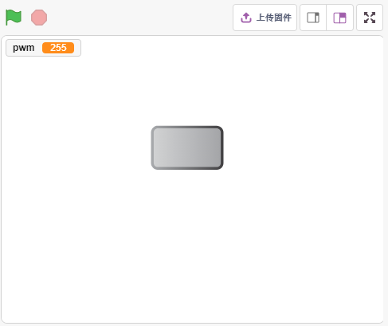
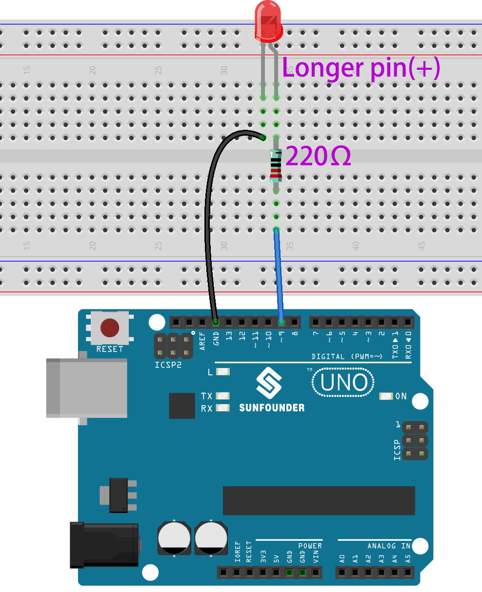
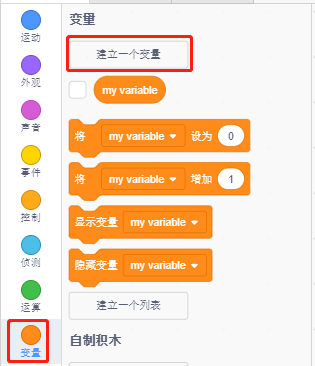
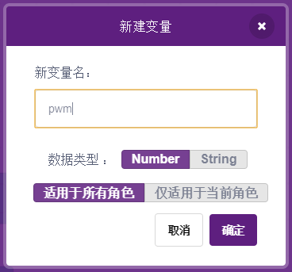
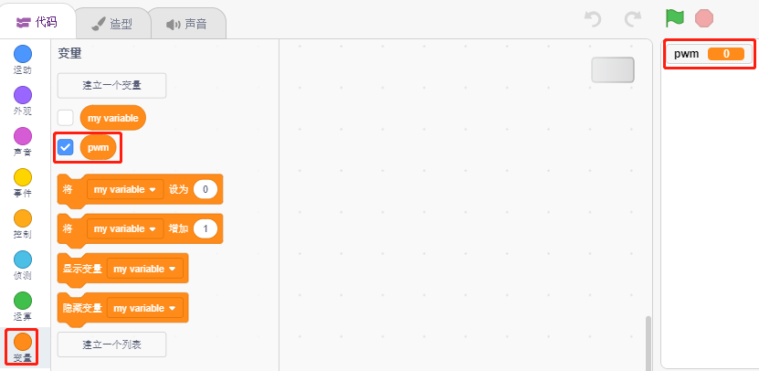
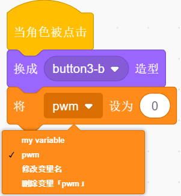
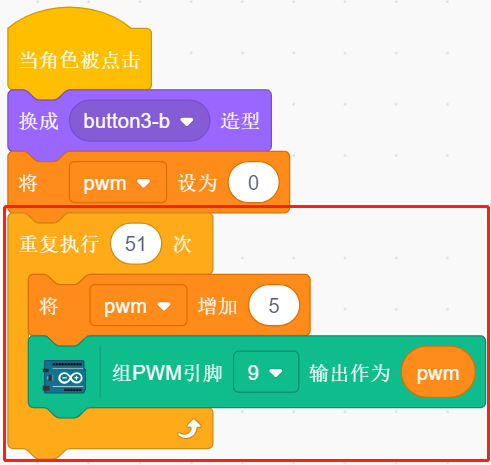
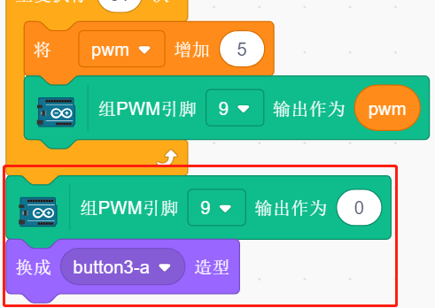

3. 呼吸灯
========================

现在用另外一种方法控制LED的亮灭，与上一个项目不同的是，这里是让LED的亮度慢慢的减弱，直到消失。

当舞台上的精灵被点击时，LED的亮度慢慢增强，然后瞬间熄灭。

你将学习
---------------------

- 设置PWM引脚的输出值
- 创建变量
- 改变精灵的亮度

搭建电路
-----------------------

这个项目用的还是上一个项目 :ref:`2. 台灯` 的电路。但相比于上一个项目直接用HIGH/LOW让LED点亮或者熄灭，这个项目用的是 PWM 信号的方式来让LED慢慢变亮或者变暗。

PWM信号值范围为0-255，在Arduno Uno板上，3, 5, 6, 9, 10, 11能够输出PWM信号；Mega2560上，2 - 13, 44 - 46能够输出PWM信号。

* :ref:`面包板`
* :ref:`LED发光二极管`
* :ref:`电阻`

编程
------------------

**1. 选择精灵**

删除默认精灵，点击精灵区域右下角的选择精灵按钮，在搜索框中输入 **button3**，然后点击添加。

.. image:: img/3_sprite.png

**2. 创建变量**

创建一个叫做pwm的变量，用来pwm变化的值。

点击 **变量** 调色板，选择 **建立一个变量**。

输入变量名字，可以是任意名字，但建议能描述它的功能。数据类型为number和适用所有角色。

创建完成后，你会看到 **pwm** 出现在 **变量** 调色板里面，并且处于勾选状态，这代表这个变量将出现在舞台上。你可以试着去掉勾选，看下舞台上pwm还是否存在。

**3. 设置初始状态**

当button3精灵被点击时，切换造型为button-b(被点击状态)，并将变量pwm的初始值设置为0.

* [将（）设为（）]: 来自变量调色板，用来设置变量的值。

**4. 让LED越来越亮**

由于pwm的范围是255，所以通过[重复执行（）次]块, 将变量pwm以5累加到255，然后放到[将（）增加（）]块中，这样就能看到在上的LED慢慢点亮。

* [将（）增加（）]: 来自变量调色板, 让变量每次改变特定的数。可以是正数或负数，正数是每次增加，负数是每次减少，比如这里是让变量pwm每次增加5.
* [组PWM引脚（）输出作为（）]：来自Arduino的乌诺调色板, 用来给pwm引脚设定输出值。

最后，将button3的造型切换回button-a，并且让PWM引脚的值为0，这样LED就会在慢慢点亮后又熄灭。

