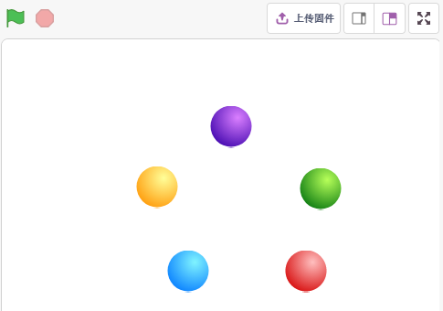
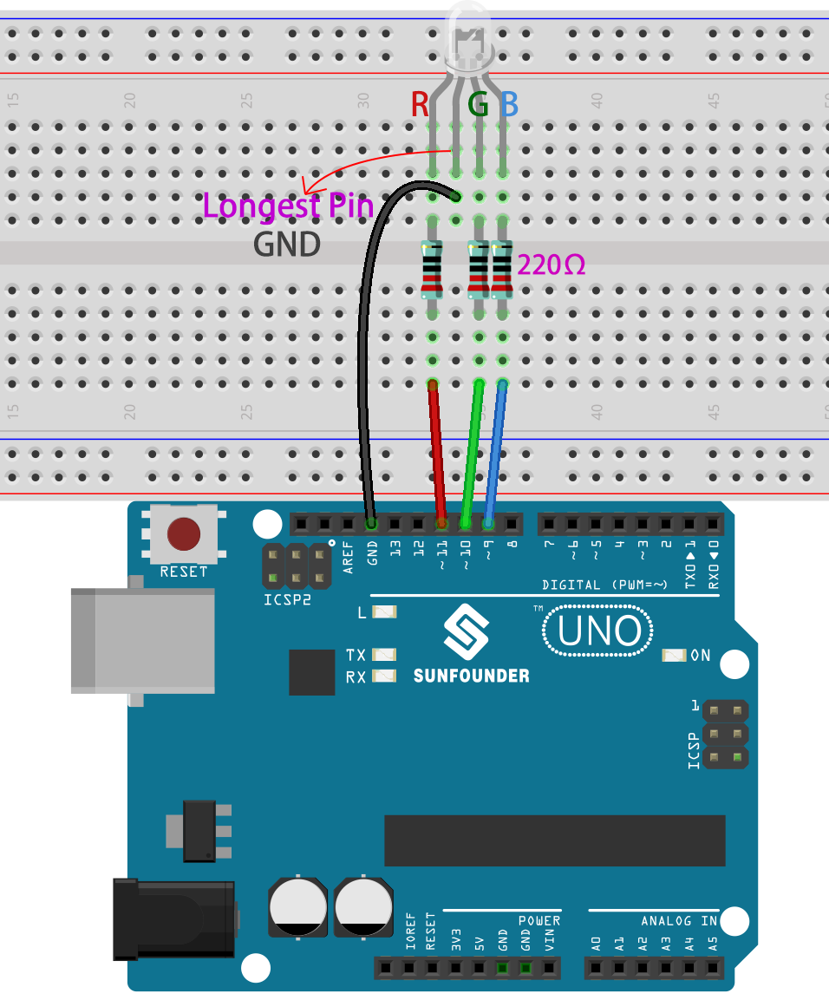
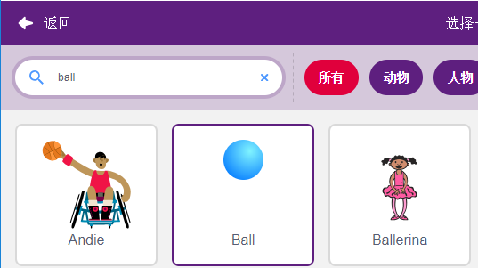
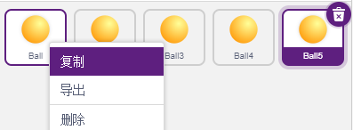
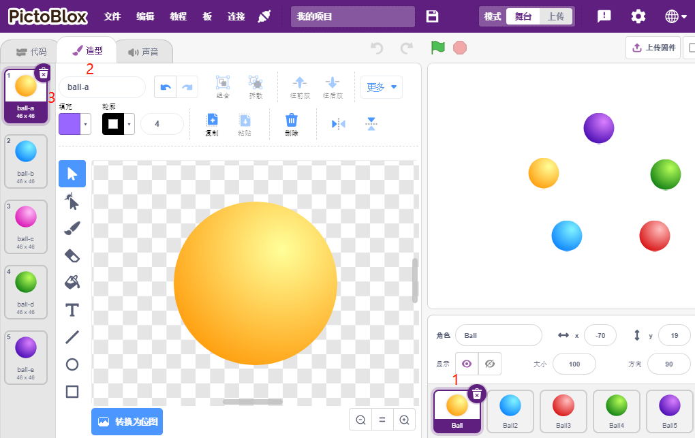
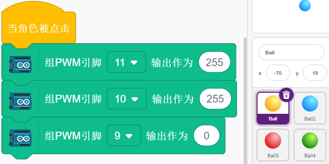
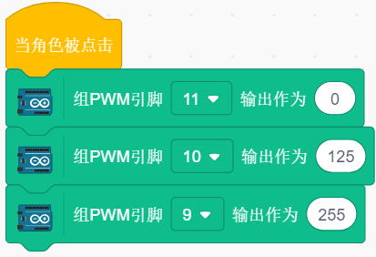
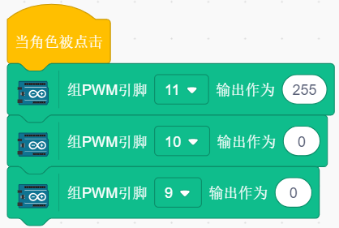
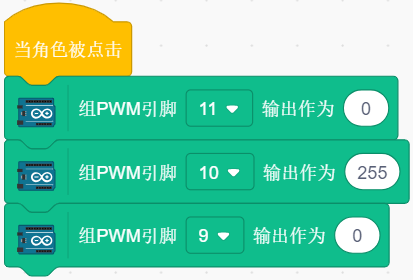
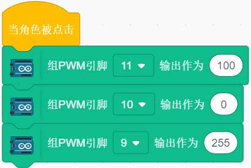

4. 彩灯
=====================

在这个项目中，我们将使 RGB LED 显示不同的颜色。

在舞台区域点击不同颜色的球会导致RGB LED显示不同颜色。

你将学习
---------------------

- RGB LED的原理
- 复制精灵及选择不同造型
- 三原色叠加

搭建电路
---------------------

RGB LED 将红、绿、蓝三种 LED 封装在透明或半透明的塑料外壳中。它可以通过改变三个引脚的输入电压并叠加来显示各种颜色，据统计，可以产生16,777,216种不同的颜色。

.. image:: img/4_rgb.png
    :width: 300

* :ref:`面包板`
* :ref:`电阻`
* :ref:`RGB LED`

编程
------------------

**1. 选择精灵**

删除默认精灵，然后选择 **Ball** 精灵。

并复制5次

为这 5 个 **Ball** 精灵选择不同的造型并将它们移动到相应的位置。

.. note::
    Ball3的造型颜色需要手动改成红色。

**2. 让RGB LED点亮相应颜色**

在理解代码之前，我们需要了解RGB颜色模型。

RGB 颜色模型是一种加色模型，其中红、绿和蓝光以各种方式叠加在一起，以再现各种颜色。

加色混色：红色加绿色产生黄色；将绿色添加到蓝色产生青色；在红色中加入蓝色会产生洋红色；将所有三种原色加在一起产生白色。

.. image:: img/4_rgb_addition.png
  :width: 400

所以使RGB LED呈黄色的脚本如下。

当 **Ball** 精灵（黄球）被点击时，我们将引脚 11 设置为高电平（红色 LED 亮起）、引脚 10 高电平（绿色 LED 亮起）和引脚 9 低电平（蓝色 LED 关闭），以便 RGB LED 亮黄色。

你可以用同样的方法给其他精灵写脚本，让RGB LED亮起相应的颜色。

**3. Ball2精灵 (浅蓝色)**

**4. Ball3精灵（红色）**

**5. Ball4精灵（绿色）**

**6. Ball5精灵（紫色）**

