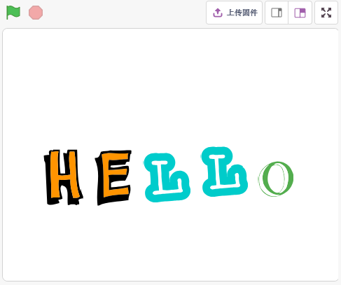
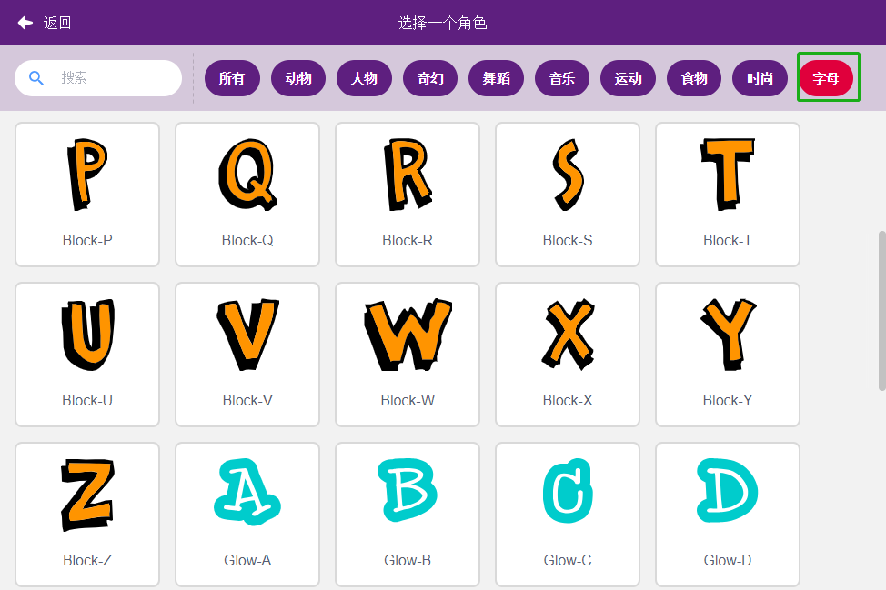
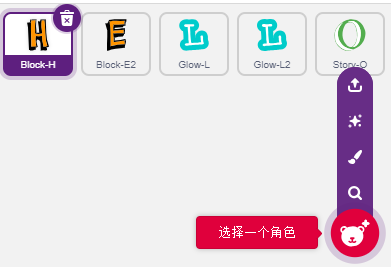
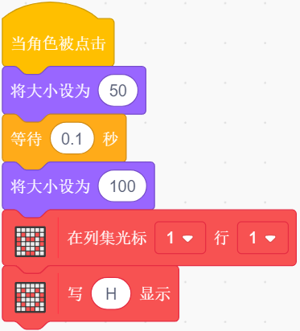
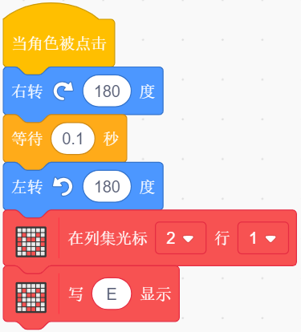
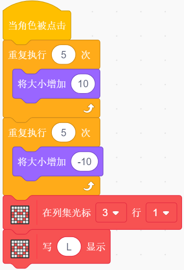
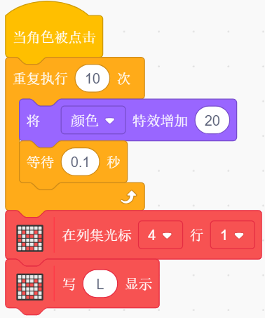
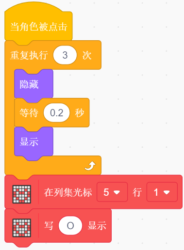

5. 跳动的字符
=================

LCD1602可以用来显示2x16个字符，现在我们让它随着舞台上的字符精灵来显示相应的字符。

当你一一点击舞台上的Hello时，它们会有不同的动画效果，LCD1602上会同时显示这些字符。

You Will Learn
---------------------

- 使用LCD1602
- 选择多个不同的精灵
- 改变精灵尺寸，转动角度，颜色和显示或隐藏。

搭建电路
---------------------

* 连接 **K** 到GND和 **A** 至3.3 V，然后将LCD1602的背光将被打开。
* 将 **VSS** 连接到GND。
* 将 **VO** 连接到电位器的中间引脚 - 你可以使用它来调整屏幕显示的对比度。
* 连接RS到D4和R / W连接到GND，该装置则可以写入字符的LCD1602。
* 将 **E** 接6引脚，LCD1602上显示的字符由 **D4-D7** 控制。

.. image:: img/5_circuit.png

* :ref:`面包板`
* :ref:`LCD1602液晶显示屏`
* :ref:`电位器`

编程
------------------

**1. 选择精灵**

删除默认精灵，点击 **选择一个角色**, 然后点击 **字母** 之后选择你想要的字符精灵。

比如我选择的是Hello，如下所示。

现在来给这些精灵设置不同的效果，并在点击的同时显示在LCD1602上。

**2. H变大缩小**

点击 **H** 精灵, 现在来为它编写脚本：

当精灵H被点击时，让它的大小缩小成50%，然后恢复，同时在LCD1602的第一行列和第一列显示H。

* [将大小设为（）]: 来自外观调色板, 用来设置精灵的尺寸，范围是0%-100%。
* [在列集光标（）行（）]: 来自显示模块调色板, 用来将光标设定在LCD1602特定的行列，以此开始显示字符。
* [写（）显示]: 来自显示模块调色板, 用来在LCD1602上显示字符或字符串。

LCD1602上的行列显示原理如图所示。

.. image:: img/5_row.png

**3. E在左右翻转**

点击 **E** 精灵, 现在来为它编写脚本：

当精灵E被点击时，让它顺时针转180度，然后逆时针转180度，这样你就能看到它左右翻转，同时在LCD1602的第一行和第2列显示H。

* [左转/右转（）度]：来自运动调色板, 用来顺时针或逆时针转动精灵角度，范围为0-360度。

**4. L在慢慢缩小和放大**

点击第一个L精灵，现在来为它编写脚本：

当精灵L被点击时，以每次增加10的速度，使用[重复执行（）次]块重复5次，将它的大小增加50，然后按照同样方法缩小回原来大小, 同时在LCD1602的第一行和第3列显示L。

* [将大小增加（）]: 来自运动调色板，用来改变精灵的尺寸。

**5. 第二个L在改变颜色**

点击第二个L精灵，现在来为它编写脚本：

当精灵L被点击时，以每次增加20的速度，使用[重复执行（）次]块重复10次，让它切换不同的颜色并回到原始的颜色. 同时在LCD1602的第一行和第4列显示L。

* [ 将颜色特效增加（）]: 用于改变颜色效果，一套造型使用该颜色效果可以呈现200种不同的配色方案，0和200是相同的颜色。

**6. O在显示和隐藏**

点击O精灵，现在来为它编写脚本：

当精灵O被点击时，它重复3次隐藏和显示过程，同时在LCD1602的第一行和第5列显示L。

* [隐藏] & [显示]：让精灵隐藏和显示。

