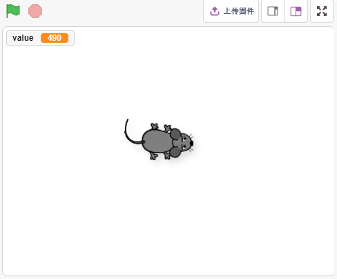
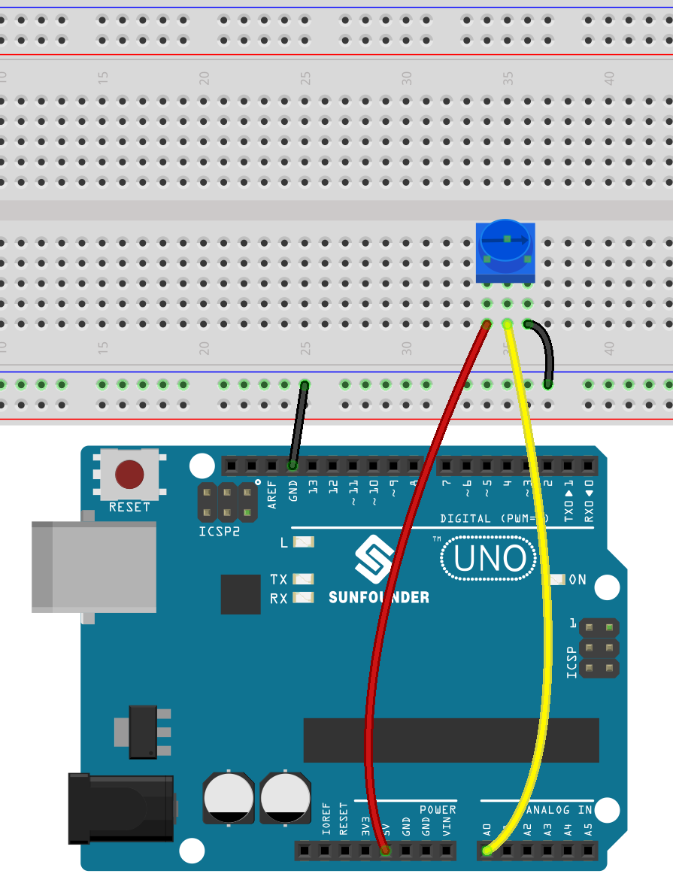
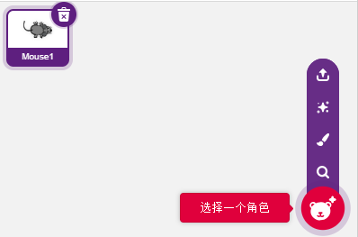
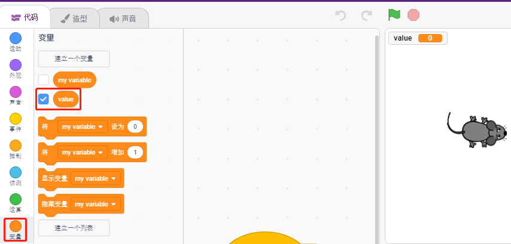
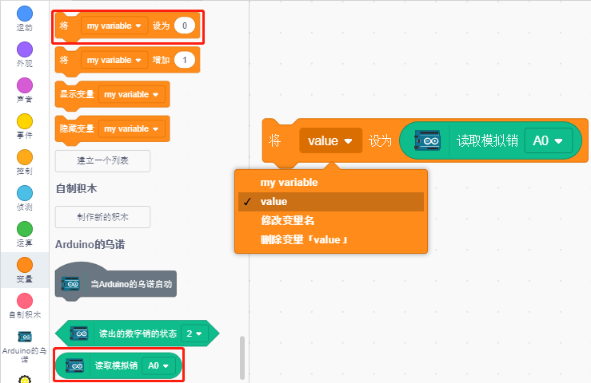
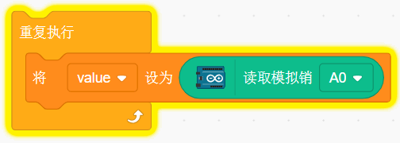
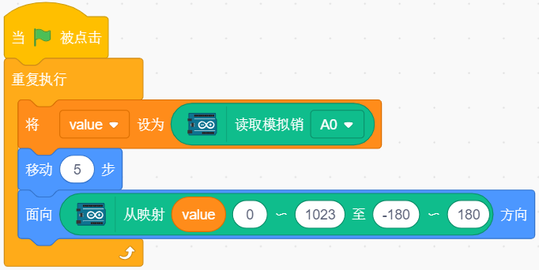

6. 移动的老鼠
===================

今天我们来制作一个由电位器控制的老鼠玩具。

当绿旗被点击时，舞台上的老鼠向前移动，当你旋转电位器，老鼠会改变移动方向。

你将学习
---------------------

- 电位器原理
- 读模拟引脚及范围
- 将一个范围映射到另外一个范围
- 移动和改变精灵方向

搭建电路
-----------------------

按照下图搭建电路，电位器是一个有3个端子的电阻元件，2侧的引脚分别接5V和GND，中间引脚接到A0，经过Arduino板的ADC转换器转换后，得到的数值范围为0-1023.

* :ref:`面包板`
* :ref:`电位器`

编程
------------------

**1. 选择mouse精灵**

删除默认精灵，点击精灵区域右下角的选择精灵按钮，在搜索框中输入 **mouse**，然后点击添加。

**2. 创建变量**

创建一个叫做value的变量，用来存放读到的电位器的值。

创建完成后，你会看到 **value** 出现在变量调色板里面，并且处于勾选状态，这代表这个变量将出现在舞台上。

**3. 读取A0的值**

将读取的A0的值存到变量value里面。

* [将（）设为（）]: 设置变量的值。
* [读取模拟销（）]: 读取A0~A5的值，范围为0-1023。

为了能够一直读取，需要用到[重复执行] 块. 点击这个脚本来将它运行，两个个方向旋转点位器，你会发现value的值范围为0-1023.

**4. 移动这个精灵**

使用[移动（）步] 块让精灵移动，运行脚本，你会看到精灵从中间移到右边。

**5. 改变精灵方向**

现在通过A0的值来改变精灵的移动方向。由于A0的值范围是0-1023，但精灵的转动方向为-180~180，所以需要用到一个[从映射（）（）~（）至（）~（）] 块。

另外在脚本开始添加[当（）被点击]来启动这个脚本。

* [面向（）方向]：设置精灵的转向角度，来自运动调色板。
* [从映射（）（）~（）至（）~（）]: 将一个范围映射到另外一个范围。

