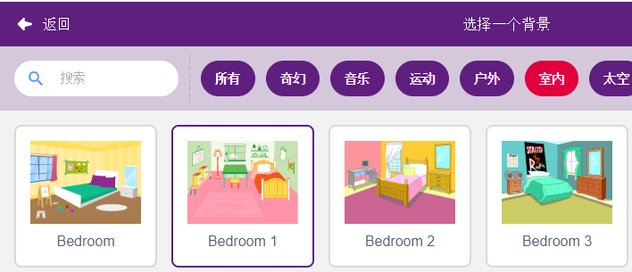

7. 门铃
======================

在这里，我们将使用按键和舞台上的铃铛来制作一个门铃。

当绿旗被点击时，你按下按键，铃铛精灵就会发出声音。

You Will Learn
---------------------

- 按键工作原理
- 读数字引脚及范围
- 创建条件判断循环
- 添加背景
- 播放声音

搭建电路
-----------------------

该按钮为4引脚的器件，因为引脚1连接到引脚1，引脚3连接到引脚4，当按下按钮时，4个引脚都连接在一起，从而闭合电路。

.. image:: img/5_buttonc.png

按照下图搭建电路：

* 将按钮左侧的其中一个引脚连接到12引脚，该引脚连接下拉电阻和0.1uF（104）电容（以消除抖动并在按钮工作时输出稳定电平）。
* 将电阻和电容的另一端连接到GND，将按钮右侧的一个引脚连接到5V。

.. image:: img/7_circuit.png

* :ref:`面包板`
* :ref:`按键`
* :ref:`电阻`
* :ref:`电容`

编程
------------------

**1. 选择背景**

点击右下角的 **选择一个角色** 按键。

选择一个室内的背景，比如选择 **Bedroom 1**.

**2. 选择精灵**

删除默认精灵，点击精灵区域右下角的 **选择一个角色** 按钮，在搜索框中输入bell，然后点击添加。

然后选择舞台上的bell精灵，将它移动到合适的位置。

**3. 按键按下，bell发出声音**

使用[如果（）那么]做一个判断语句，当读取的数字12 的值等于1，即按键按下，则播放声音 **xylo1**.

* [读出的数字销的状态（）]: 来自Arduino的乌诺调色板，用于读取数字引脚的值，结果为0或1.
* [如果（）那么]: 来自控制调色板. 如果它的布尔条件为真，它里面的块就会运行，然后所涉及的脚本将继续。如果条件为假，则块内的脚本将被忽略。条件只检查一次；如果在块内的脚本运行时条件变为假，它将继续运行直到完成。
* [播放声音（）等待播完]: 来自声音调色板, 用于播放特定的声音。

